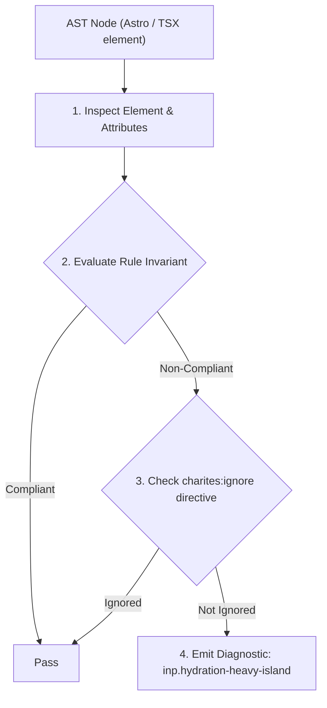
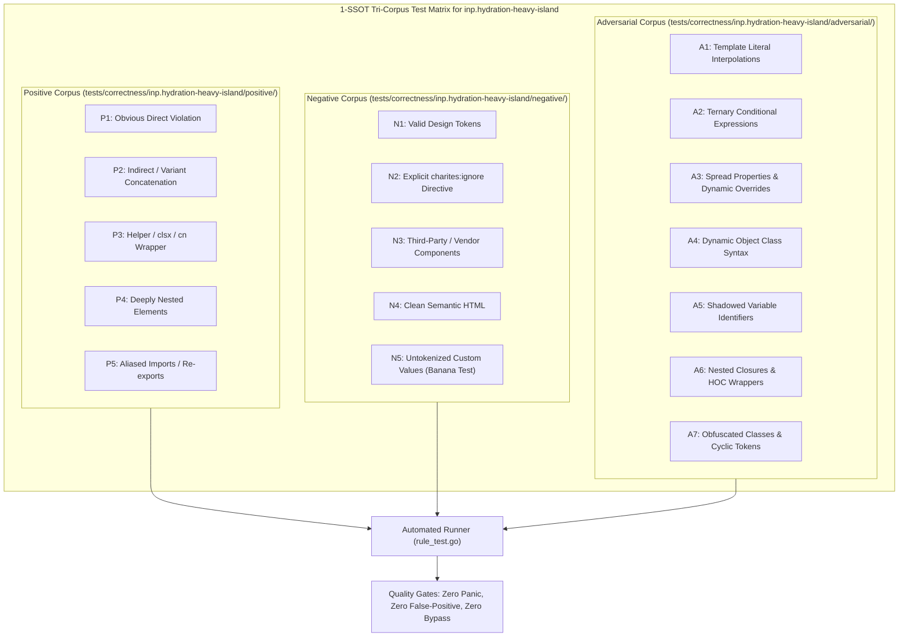

# inp.hydration-heavy-island

> **Rule ID:** `inp.hydration-heavy-island`
> **Severity:** `WARN`
> **Category:** `inp`
> **Target Standards:** Astro Zero-JS Server-Side Rendering (SSR) Architecture, React Virtual DOM Hydration Complexity & Reconciliation Budget, W3C Web Performance Working Group (Main Thread Input Delay)

---

## 1. Overview & Core Invariant

Client island wraps excessive static DOM subtree forcing heavy virtual DOM reconciliation on the client

### Core Invariant:
> **"Client-hydrated islands must remain compact and isolate only truly interactive elements; static text, articles, and decorative containers must remain in zero-JS Astro SSR."**

---
## 2. Technical Grounding & Engine Realities

Hydrating a monolithic React island forces the client browser to parse JavaScript, construct virtual DOM representations, and reconcile every DOM node against server HTML-even for completely static elements.

When developers wrap entire articles or document structures inside a single `<ArticleViewer client:load>`, hundreds of static paragraphs and headings are needlessly reconciled, consuming excessive main-thread CPU time.

By decomposing the UI and rendering static content through native Astro components (zero client JS), only individual interactive widgets (such as like buttons or comment inputs) are hydrated, keeping the main thread free for user interaction.

---
## 3. Vulnerability & Risk Taxonomy

| Risk Vector | Severity | Impact |
| :--- | :---: | :--- |
| **Virtual DOM Reconciliation Bloat** | HIGH | Large static subtrees force long synchronous VDOM tree reconciliation during island hydration. |
| **Excessive Client Bundle & Parse Overhead** | MEDIUM | Shipping static component trees to client bundles increases script evaluation time and input latency. |

---
## 4. Non-Compliant Code Patterns (Bad Examples)
### ASTRO (Static article text wrapped inside a client-hydrated island):
```astro
<ArticleViewerIsland client:load>
  <header><h1>Article Title</h1></header>
  <article>
    <p>Paragraph 1...</p>
    <p>Paragraph 2...</p>
    <p>Paragraph 3...</p>
  </article>
  <CommentButton />
</ArticleViewerIsland>
```

---
## 5. Compliant Implementation Patterns (Good Examples)
### ASTRO (Static content rendered via zero-JS Astro SSR; only interactive button is an island):
```astro
<header><h1>Article Title</h1></header>
<article>
  <p>Paragraph 1...</p>
  <p>Paragraph 2...</p>
  <p>Paragraph 3...</p>
</article>
<CommentButton client:visible />
```

---

## 6. Detection & Verification Pipeline (How The Rule Evaluates Code)
This rule evaluates source code through the standard AST inspection pipeline:



### Step-by-Step Evaluation:
1. **AST Traversal:** Visits normalized `ir.Node` structures during AST streaming.
2. **Invariant Check:** Compares node attributes against rule invariants.
3. **Directive Suppression Check:** Honors inline `charites:ignore inp.hydration-heavy-island` directives.
4. **Diagnostic Emission:** Emits compiler-grade diagnostic on invariant violation.

---

## 7. Verification & Test Harness (How The Test Works: 1-SSOT Tri-Corpus)

This rule is rigorously tested and validated across the canonical **1-SSOT Tri-Corpus** in `tests/correctness/inp.hydration-heavy-island/`:



- **Positive Fixtures (P1-P5):** Verified to trigger diagnostics at exact lines and column spans.
- **Negative Fixtures (N1-N5):** Verified to produce zero diagnostics on valid tokens and legitimate exemptions.
- **Adversarial Fixtures (A1-A7):** Verified to prevent evasion across dynamic expressions, string interpolations, and cyclic references.

---

## 8. How to Suppress (Ignore Directives)

If this pattern is required for an intentional exception, suppress the diagnostic using the canonical Charites Rule ID:

```astro
<!-- charites:ignore inp.hydration-heavy-island intentional exception -->
```

```tsx
// charites:ignore inp.hydration-heavy-island intentional exception
```

---

## 9. Configuration Reference (`charites.yaml`)

```yaml
rules:
  inp.hydration-heavy-island:
    severity: warn # error | warn | info | off
```

