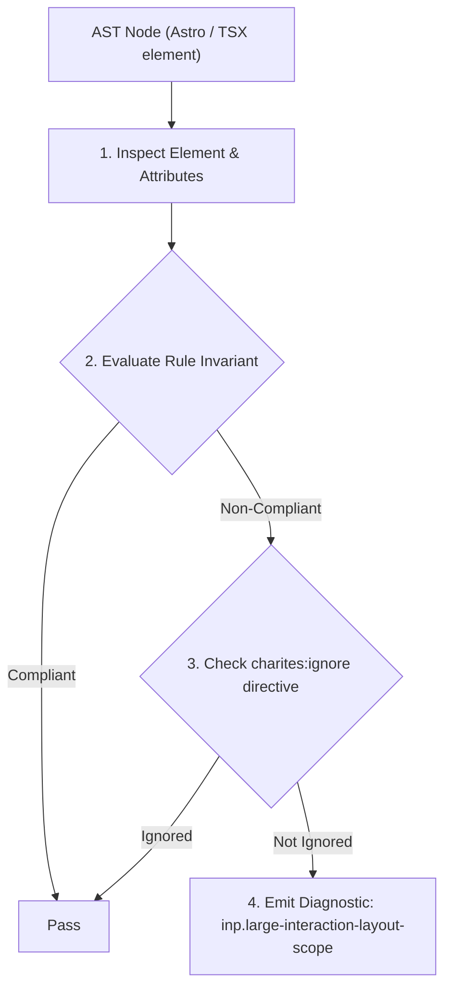
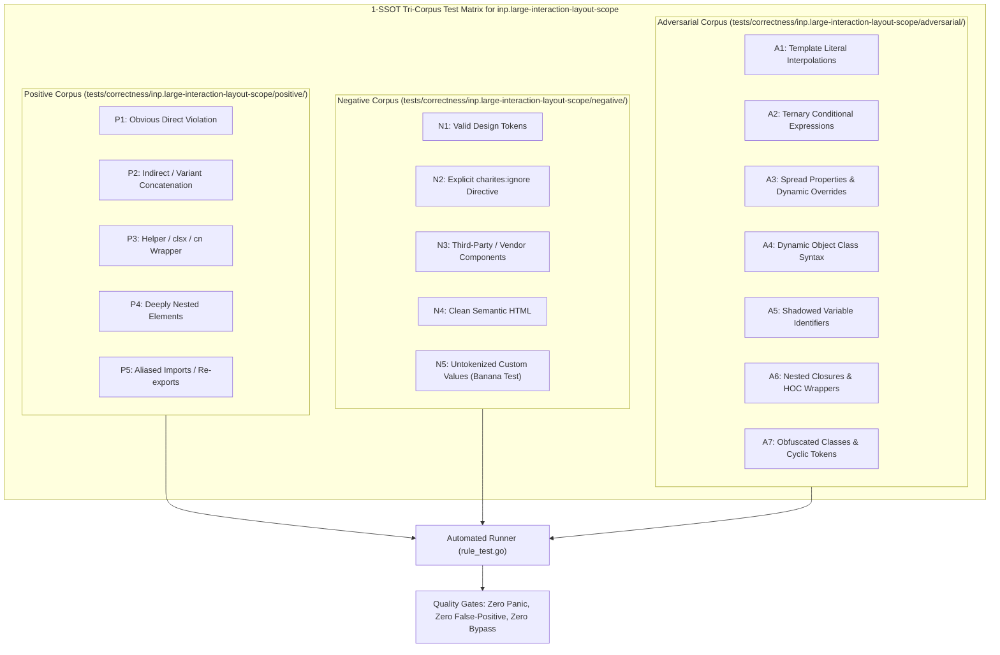

# inp.large-interaction-layout-scope

> **Rule ID:** `inp.large-interaction-layout-scope`
> **Severity:** `WARN`
> **Category:** `inp`
> **Target Standards:** Google Chrome Core Web Vitals (Interaction to Next Paint Presentation Delay), W3C CSS Containment Module Level 3 (contain: layout / contain: strict), HTML Living Standard HTMLDialogElement Top-Layer Architecture

---

## 1. Overview & Core Invariant

Interactive overlay or drawer element lacks layout containment or native dialog isolation, triggering document-wide reflow on toggle

### Core Invariant:
> **"Large interactive overlays and drawers must establish layout containment ('contain: layout') or utilize the browser top-layer ('<dialog>') to prevent whole-page layout recalculations during interactions."**

---
## 2. Technical Grounding & Engine Realities

When a large overlay, slide-over drawer, or modal toggles its visibility in the standard document flow, the browser's layout engine must invalidate ancestor and sibling boxes, triggering a full document reflow.

For complex interfaces with thousands of elements, this layout recalculation stalls the main thread and inflates Presentation Delay well past 100ms.

Using the HTML5 '<dialog>' element places the modal in the browser's isolated 'top-layer', preventing any layout impact on the document tree. Alternatively, applying CSS layout containment (e.g. 'contain-layout' or '[contain:layout]') constrains layout recalculations strictly inside the overlay container.

---
## 3. Vulnerability & Risk Taxonomy

| Risk Vector | Severity | Impact |
| :--- | :---: | :--- |
| **Document-Wide Layout Invalidation** | HIGH | Toggling modal/drawer state forces the layout engine to recalculate geometry for every element on the page. |
| **Presentation Delay Frame Drops** | HIGH | Users experience visible stutters and sluggishness when expanding or collapsing sidebars, sheets, or dialogs. |

---
## 4. Non-Compliant Code Patterns (Bad Examples)
### TSX (Unconstrained fixed drawer in normal document flow triggering document reflow):
```tsx
<div className={`fixed inset-y-0 right-0 w-96 ${isOpen ? "block" : "hidden"}`}>
  <HeavySidebar />
</div>
```

---
## 5. Compliant Implementation Patterns (Good Examples)
### TSX (Native HTML5 dialog rendered in the browser's isolated top-layer):
```tsx
<dialog ref={dialogRef} className="fixed inset-y-0 right-0 w-96">
  <HeavySidebar />
</dialog>
```
### TSX (Explicit CSS layout containment isolating reflows to the panel):
```tsx
<div className={`fixed inset-y-0 right-0 w-96 contain-layout ${isOpen ? "block" : "hidden"}`}>
  <HeavySidebar />
</div>
```

---

## 6. Detection & Verification Pipeline (How The Rule Evaluates Code)
This rule evaluates source code through the standard AST inspection pipeline:



### Step-by-Step Evaluation:
1. **AST Traversal:** Visits normalized `ir.Node` structures during AST streaming.
2. **Invariant Check:** Compares node attributes against rule invariants.
3. **Directive Suppression Check:** Honors inline `charites:ignore inp.large-interaction-layout-scope` directives.
4. **Diagnostic Emission:** Emits compiler-grade diagnostic on invariant violation.

---

## 7. Verification & Test Harness (How The Test Works: 1-SSOT Tri-Corpus)

This rule is rigorously tested and validated across the canonical **1-SSOT Tri-Corpus** in `tests/correctness/inp.large-interaction-layout-scope/`:



- **Positive Fixtures (P1-P5):** Verified to trigger diagnostics at exact lines and column spans.
- **Negative Fixtures (N1-N5):** Verified to produce zero diagnostics on valid tokens and legitimate exemptions.
- **Adversarial Fixtures (A1-A7):** Verified to prevent evasion across dynamic expressions, string interpolations, and cyclic references.

---

## 8. How to Suppress (Ignore Directives)

If this pattern is required for an intentional exception, suppress the diagnostic using the canonical Charites Rule ID:

```astro
<!-- charites:ignore inp.large-interaction-layout-scope intentional exception -->
```

```tsx
// charites:ignore inp.large-interaction-layout-scope intentional exception
```

---

## 9. Configuration Reference (`charites.yaml`)

```yaml
rules:
  inp.large-interaction-layout-scope:
    severity: warn # error | warn | info | off
```

