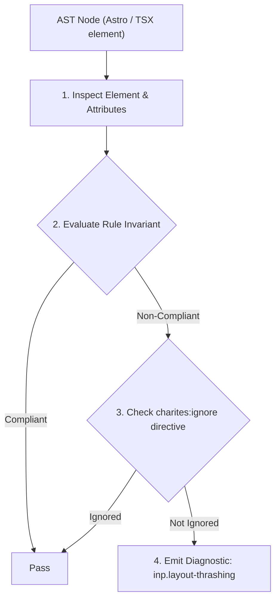
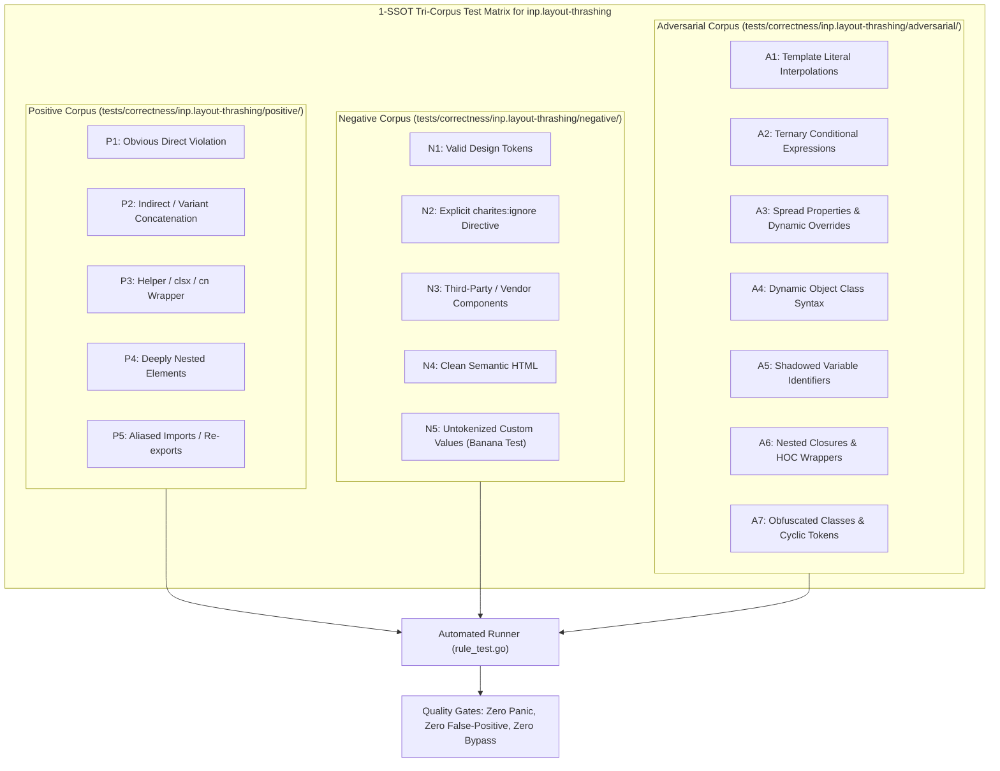

# inp.layout-thrashing

> **Rule ID:** `inp.layout-thrashing`
> **Severity:** `ERROR`
> **Category:** `inp`
> **Target Standards:** W3C Web Performance Working Group (Interaction to Next Paint - INP), Google Chrome Rendering Engine Pipeline (Forced Synchronous Layout), Browser Main-Thread Event Loop Scheduling

---

## 1. Overview & Core Invariant

Sequential DOM style mutation followed by layout geometry reading triggers forced synchronous reflow

### Core Invariant:
> **"Imperative JavaScript execution must separate layout queries from style mutations, avoiding forced synchronous reflow passes (read-then-write batching)."**

---
## 2. Technical Grounding & Engine Realities

When JavaScript mutates DOM styles or class names (e.g. 'el.style.width = ...') and subsequently reads a layout geometry property (e.g. 'el.offsetHeight' or 'getBoundingClientRect()') within the same synchronous execution block, the browser is forced to flush pending style changes and perform an immediate, blocking layout recalculation.

This phenomenon, known as 'Layout Thrashing' or 'Forced Synchronous Reflow', locks the browser main thread, preventing user interaction processing and drastically inflating Interaction to Next Paint (INP) latency.

Batching all layout reads before performing style writes, or deferring updates via 'requestAnimationFrame', prevents synchronous recalculations and keeps the main thread responsive.

---
## 3. Vulnerability & Risk Taxonomy

| Risk Vector | Severity | Impact |
| :--- | :---: | :--- |
| **Forced Synchronous Reflow Stalling** | HIGH | Synchronous layout computation blocks the main thread during interaction handling, causing dropped frames and severe INP degradation. |
| **Cascading Rendering Bottleneck** | HIGH | Interleaved write-read loops exponentially degrade interaction responsiveness on complex DOM trees. |

---
## 4. Non-Compliant Code Patterns (Bad Examples)
### TSX (Style mutation immediately followed by geometry reading (forced reflow)):
```tsx
function resizeBox(el: HTMLElement) {
  el.style.width = '200px';
  const height = el.offsetHeight; // Memaksa kalkulasi layout sinkron!
  el.style.height = (height * 2) + 'px';
}
```

---
## 5. Compliant Implementation Patterns (Good Examples)
### TSX (Read-then-write batching to prevent forced layout calculation):
```tsx
function resizeBox(el: HTMLElement) {
  const currentHeight = el.offsetHeight; // Baca di awal
  el.style.width = '200px';              // Tulis serentak
  el.style.height = (currentHeight * 2) + 'px';
}
```

---

## 6. Detection & Verification Pipeline (How The Rule Evaluates Code)
This rule evaluates source code through the standard AST inspection pipeline:



### Step-by-Step Evaluation:
1. **AST Traversal:** Visits normalized `ir.Node` structures during AST streaming.
2. **Invariant Check:** Compares node attributes against rule invariants.
3. **Directive Suppression Check:** Honors inline `charites:ignore inp.layout-thrashing` directives.
4. **Diagnostic Emission:** Emits compiler-grade diagnostic on invariant violation.

---

## 7. Verification & Test Harness (How The Test Works: 1-SSOT Tri-Corpus)

This rule is rigorously tested and validated across the canonical **1-SSOT Tri-Corpus** in `tests/correctness/inp.layout-thrashing/`:



- **Positive Fixtures (P1-P5):** Verified to trigger diagnostics at exact lines and column spans.
- **Negative Fixtures (N1-N5):** Verified to produce zero diagnostics on valid tokens and legitimate exemptions.
- **Adversarial Fixtures (A1-A7):** Verified to prevent evasion across dynamic expressions, string interpolations, and cyclic references.

---

## 8. How to Suppress (Ignore Directives)

If this pattern is required for an intentional exception, suppress the diagnostic using the canonical Charites Rule ID:

```astro
<!-- charites:ignore inp.layout-thrashing intentional exception -->
```

```tsx
// charites:ignore inp.layout-thrashing intentional exception
```

---

## 9. Configuration Reference (`charites.yaml`)

```yaml
rules:
  inp.layout-thrashing:
    severity: error # error | warn | info | off
```

