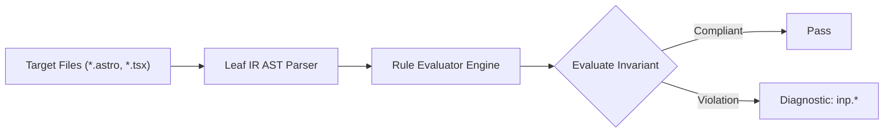

# Inp Rules (`inp`)

The `inp` category contains static analysis rules for code quality, architectural constraints, and design system governance.

---

## Category Rule Index

| Rule ID | Severity | Summary | Full Specification | Status |
| :--- | :---: | :--- | :--- | :---: |
| `inp.heavy-event-handler` | `WARN` | Interactive event handler executes heavy synchronous operations (JSON.parse, Array.sort) without cooperative yields | [`inp.heavy-event-handler`](inp.heavy-event-handler) | `enabled` |
| `inp.hydration-contention` | `WARN` | Concurrently hydrating multiple Astro client:load islands saturates the main thread and spikes input delay | [`inp.hydration-contention`](inp.hydration-contention) | `enabled` |
| `inp.hydration-heavy-island` | `WARN` | Client island wraps excessive static DOM subtree forcing heavy virtual DOM reconciliation on the client | [`inp.hydration-heavy-island`](inp.hydration-heavy-island) | `enabled` |
| `inp.layout-thrashing` | `ERROR` | Sequential DOM style mutation followed by layout geometry reading triggers forced synchronous reflow | [`inp.layout-thrashing`](inp.layout-thrashing) | `enabled` |
| `inp.missing-start-transition` | `INFO` | Secondary non-urgent state update inside interactive handler should be wrapped in startTransition to prevent input lag | [`inp.missing-start-transition`](inp.missing-start-transition) | `enabled` |
| `inp.render-blocking-script` | `WARN` | External script element without defer, async, or type="module" synchronously blocks rendering and input responsiveness | [`inp.render-blocking-script`](inp.render-blocking-script) | `enabled` |
| `inp.repeated-state-update` | `WARN` | Repeated state updater calls inside loops breaking automatic batching trigger cascading re-renders | [`inp.repeated-state-update`](inp.repeated-state-update) | `enabled` |
| `inp.unyielded-long-task` | `WARN` | Long task processing large arrays without cooperative scheduling yields stalls main-thread responsiveness | [`inp.unyielded-long-task`](inp.unyielded-long-task) | `enabled` |

---
## How the Inp Analysis Pipeline Works

The `inp` engine applies static analysis checks against component source code:

### Pipeline Flow:
1. **AST Node Traversal:** Scans target template files into normalized intermediate representation.
2. **Invariant Assertion:** Validates structural and semantic invariants.
3. **Diagnostic Reporting:** Emits structured diagnostics for non-compliant patterns.

---

## How Inp Tests Work (Verification Harness)

All rules in `inp` are verified using the canonical 1-SSOT Tri-Corpus (`tests/correctness/inp.*/`) encompassing Positive (P1-P5), Negative (N1-N5), and Adversarial (A1-A7) fixture matrices.
