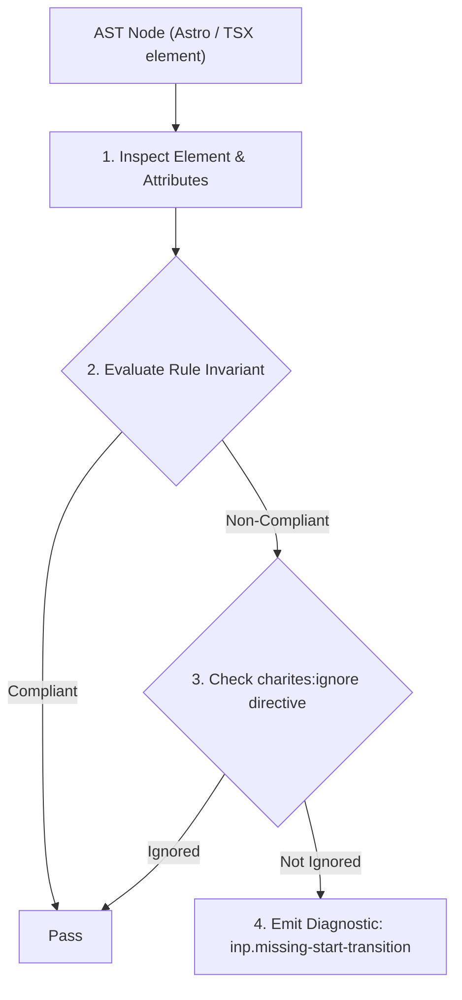
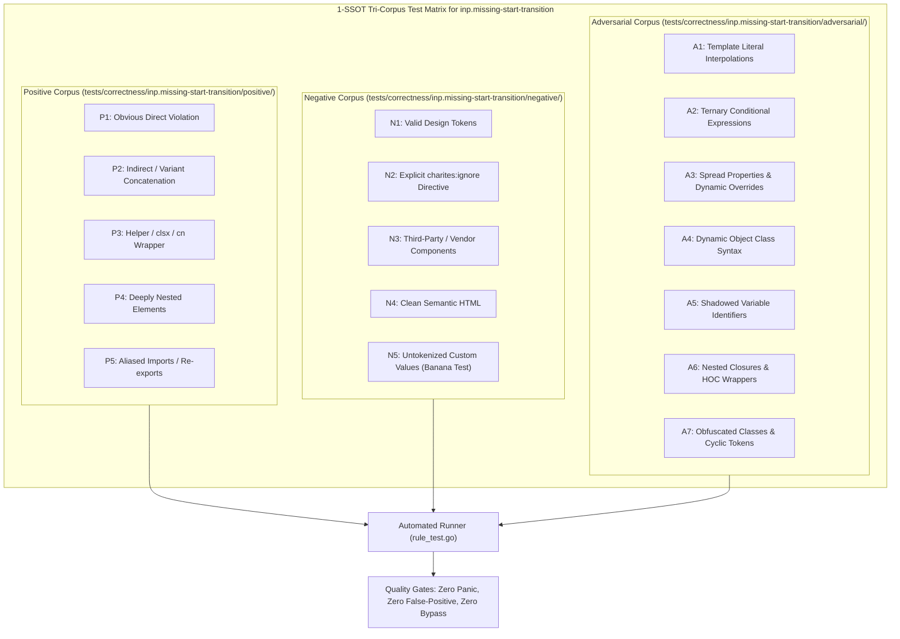

# inp.missing-start-transition

> **Rule ID:** `inp.missing-start-transition`
> **Severity:** `INFO`
> **Category:** `inp`
> **Target Standards:** React 18/19 Concurrent Mode Architecture (startTransition & Transitions API), W3C User Timing & Cooperative Scheduling Invariants, Google Chrome Core Web Vitals (Input to Paint Responsiveness)

---

## 1. Overview & Core Invariant

Secondary non-urgent state update inside interactive handler should be wrapped in startTransition to prevent input lag

### Core Invariant:
> **"Secondary non-urgent state updates triggered alongside urgent user input must be scheduled as transitions via 'React.startTransition' to preserve typing responsiveness."**

---
## 2. Technical Grounding & Engine Realities

In modern user interfaces, an interactive event (such as typing in a search bar or clicking a filter tab) often triggers two types of updates: an urgent update (updating the input text cursor) and a non-urgent secondary update (filtering a large list or fetching preview cards).

When both updates are processed synchronously without transitions, React treats the expensive secondary re-render with the same high priority as the keystroke, blocking the main thread and causing noticeable keystroke stutter.

Wrapping secondary updates in 'React.startTransition' informs the scheduler that the secondary render is interruptible. React will immediately paint the user's keystroke, keeping INP low while deferring list rendering.

---
## 3. Vulnerability & Risk Taxonomy

| Risk Vector | Severity | Impact |
| :--- | :---: | :--- |
| **Keystroke Input Lag** | MEDIUM | Synchronous secondary re-renders block subsequent keystroke frames, creating sluggish typing feedback. |
| **Main Thread Presentation Delays** | LOW | The browser cannot acknowledge user interactions within the 200ms INP threshold. |

---
## 4. Non-Compliant Code Patterns (Bad Examples)
### TSX (Synchronously combining urgent input setter with heavy list filtering):
```tsx
function handleSearch(e: React.ChangeEvent<HTMLInputElement>) {
  setSearchQuery(e.target.value);
  setFilteredLargeList(expensiveFilter(e.target.value));
}
```

---
## 5. Compliant Implementation Patterns (Good Examples)
### TSX (Urgent input text is updated immediately; secondary list is wrapped in startTransition):
```tsx
function handleSearch(e: React.ChangeEvent<HTMLInputElement>) {
  setSearchQuery(e.target.value);
  React.startTransition(() => {
    setFilteredLargeList(expensiveFilter(e.target.value));
  });
}
```

---

## 6. Detection & Verification Pipeline (How The Rule Evaluates Code)
This rule evaluates source code through the standard AST inspection pipeline:



### Step-by-Step Evaluation:
1. **AST Traversal:** Visits normalized `ir.Node` structures during AST streaming.
2. **Invariant Check:** Compares node attributes against rule invariants.
3. **Directive Suppression Check:** Honors inline `charites:ignore inp.missing-start-transition` directives.
4. **Diagnostic Emission:** Emits compiler-grade diagnostic on invariant violation.

---

## 7. Verification & Test Harness (How The Test Works: 1-SSOT Tri-Corpus)

This rule is rigorously tested and validated across the canonical **1-SSOT Tri-Corpus** in `tests/correctness/inp.missing-start-transition/`:



- **Positive Fixtures (P1-P5):** Verified to trigger diagnostics at exact lines and column spans.
- **Negative Fixtures (N1-N5):** Verified to produce zero diagnostics on valid tokens and legitimate exemptions.
- **Adversarial Fixtures (A1-A7):** Verified to prevent evasion across dynamic expressions, string interpolations, and cyclic references.

---

## 8. How to Suppress (Ignore Directives)

If this pattern is required for an intentional exception, suppress the diagnostic using the canonical Charites Rule ID:

```astro
<!-- charites:ignore inp.missing-start-transition intentional exception -->
```

```tsx
// charites:ignore inp.missing-start-transition intentional exception
```

---

## 9. Configuration Reference (`charites.yaml`)

```yaml
rules:
  inp.missing-start-transition:
    severity: info # error | warn | info | off
```

