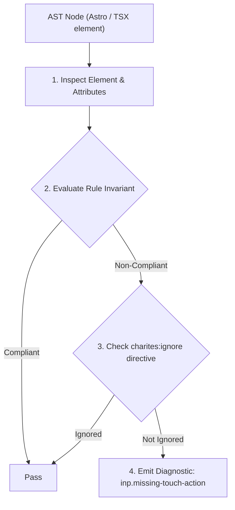
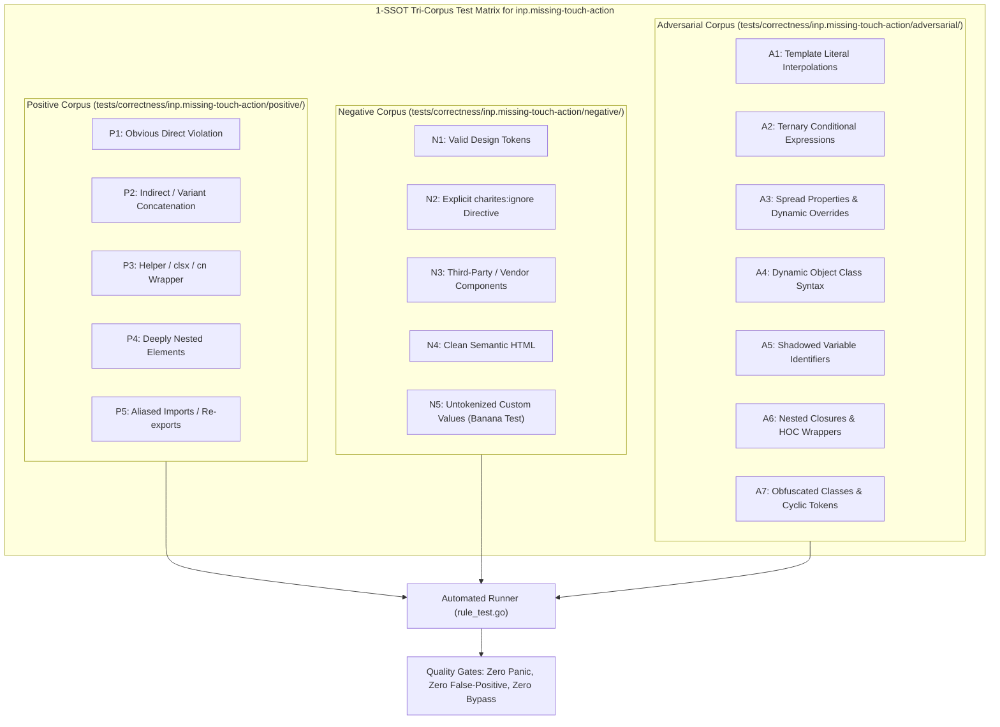

# inp.missing-touch-action

> **Rule ID:** `inp.missing-touch-action`
> **Severity:** `WARN`
> **Category:** `inp`
> **Target Standards:** Google Chrome Core Web Vitals (Interaction to Next Paint Input Delay), W3C Pointer Events Level 3 (touch-action property), Tailwind CSS v4 Touch Action Utilities (touch-pan-y, touch-none)

---

## 1. Overview & Core Invariant

Interactive element with custom pointer or touch gesture handlers lacks an explicit touch-action CSS policy

### Core Invariant:
> **"Interactive elements implementing custom touch or pointer gesture handlers must declare an explicit 'touch-action' CSS policy ('touch-none', 'touch-pan-y', etc.) to eliminate browser gesture disambiguation delay on the compositor thread."**

---
## 2. Technical Grounding & Engine Realities

When a user touches an element with custom gesture handlers (such as 'onPointerDown' or 'onTouchStart'), the browser compositor thread cannot know whether the gesture will be handled by JavaScript or defaulted to native panning/zooming.

The browser must wait for the JavaScript event handler to execute or call 'preventDefault()', introducing a 100ms-300ms gesture disambiguation delay into every touch interaction.

Declaring an explicit CSS 'touch-action' policy (e.g. 'touch-none' for free drag handles or canvas widgets, or 'touch-pan-y' for horizontal swipe carousels) immediately signals the compositor thread to route or bypass native scrolling instantly without waiting for JavaScript.

---
## 3. Vulnerability & Risk Taxonomy

| Risk Vector | Severity | Impact |
| :--- | :---: | :--- |
| **Compositor Gesture Disambiguation Delay** | HIGH | Touch gestures suffer 100ms-300ms latency while the browser waits to resolve potential scrolling conflicts. |
| **Scroll Contention & Touch Stutter** | MEDIUM | Custom drag widgets conflict with native vertical viewport scrolling on mobile touchscreens. |

---
## 4. Non-Compliant Code Patterns (Bad Examples)
### TSX (Custom drag handle without CSS touch-action policy):
```tsx
<div onPointerDown={handleDragStart} onPointerMove={handleDragMove} className="w-full h-48 bg-muted">
  <DragHandle />
</div>
```

---
## 5. Compliant Implementation Patterns (Good Examples)
### TSX (Explicit touch-none utility routing all gestures directly to custom handler):
```tsx
<div onPointerDown={handleDragStart} onPointerMove={handleDragMove} className="w-full h-48 bg-muted touch-none">
  <DragHandle />
</div>
```
### TSX (Horizontal swipe carousel declaring vertical panning freedom):
```tsx
<div onTouchStart={handleSwipeStart} className="flex overflow-x-auto touch-pan-y">
  <CarouselSlide />
</div>
```

---

## 6. Detection & Verification Pipeline (How The Rule Evaluates Code)
This rule evaluates source code through the standard AST inspection pipeline:



### Step-by-Step Evaluation:
1. **AST Traversal:** Visits normalized `ir.Node` structures during AST streaming.
2. **Invariant Check:** Compares node attributes against rule invariants.
3. **Directive Suppression Check:** Honors inline `charites:ignore inp.missing-touch-action` directives.
4. **Diagnostic Emission:** Emits compiler-grade diagnostic on invariant violation.

---

## 7. Verification & Test Harness (How The Test Works: 1-SSOT Tri-Corpus)

This rule is rigorously tested and validated across the canonical **1-SSOT Tri-Corpus** in `tests/correctness/inp.missing-touch-action/`:



- **Positive Fixtures (P1-P5):** Verified to trigger diagnostics at exact lines and column spans.
- **Negative Fixtures (N1-N5):** Verified to produce zero diagnostics on valid tokens and legitimate exemptions.
- **Adversarial Fixtures (A1-A7):** Verified to prevent evasion across dynamic expressions, string interpolations, and cyclic references.

---

## 8. How to Suppress (Ignore Directives)

If this pattern is required for an intentional exception, suppress the diagnostic using the canonical Charites Rule ID:

```astro
<!-- charites:ignore inp.missing-touch-action intentional exception -->
```

```tsx
// charites:ignore inp.missing-touch-action intentional exception
```

---

## 9. Configuration Reference (`charites.yaml`)

```yaml
rules:
  inp.missing-touch-action:
    severity: warn # error | warn | info | off
```

