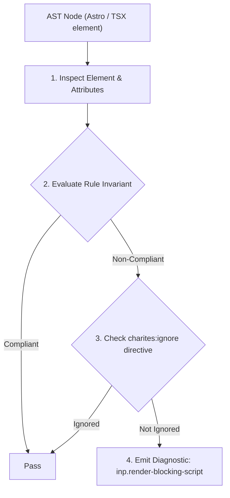
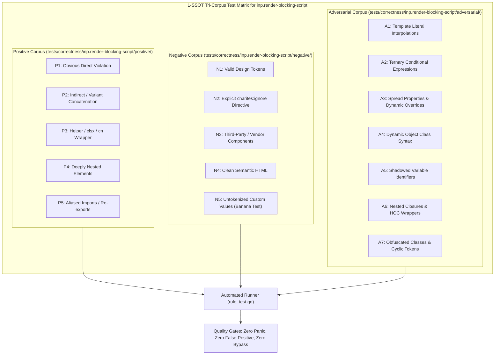

# inp.render-blocking-script

> **Rule ID:** `inp.render-blocking-script`
> **Severity:** `WARN`
> **Category:** `inp`
> **Target Standards:** HTML Living Standard (The script element & execution pipeline), W3C Web Performance & Navigation Timing Specification, Google Chrome Core Web Vitals (Eliminating Render-Blocking Resources)

---

## 1. Overview & Core Invariant

External script element without defer, async, or type="module" synchronously blocks rendering and input responsiveness

### Core Invariant:
> **"External script elements must declare 'defer', 'async', or 'type="module"' to avoid synchronously blocking HTML parsing and main-thread readiness."**

---
## 2. Technical Grounding & Engine Realities

When the browser encounters a synchronous `<script src="...">` tag, it must pause HTML parsing, establish a network connection, download the script, and execute it before resuming document rendering.

In Astro, standard `<script>` tags are automatically bundled into deferred ES modules. However, scripts marked with `is:inline` or raw external scripts in HTML document heads bypass bundling and execute synchronously.

Adding 'defer' or 'type="module"' ensures the script is downloaded in the background and executed without halting the parser, keeping the browser immediately receptive to early user taps and clicks.

---
## 3. Vulnerability & Risk Taxonomy

| Risk Vector | Severity | Impact |
| :--- | :---: | :--- |
| **Synchronous Parser Halting** | HIGH | HTML parsing and initial rendering are paused until external scripts download and execute. |
| **Delayed Main-Thread Input Availability** | MEDIUM | The browser input event loop is delayed, resulting in unacknowledged early user taps. |

---
## 4. Non-Compliant Code Patterns (Bad Examples)
### ASTRO (Synchronous external inline script blocking HTML parser):
```astro
<script is:inline src="https://analytics.example.com/heavy-bundle.js"></script>
```

---
## 5. Compliant Implementation Patterns (Good Examples)
### ASTRO (External inline script deferred to prevent parser blocking):
```astro
<script is:inline src="https://analytics.example.com/heavy-bundle.js" defer></script>
```

---

## 6. Detection & Verification Pipeline (How The Rule Evaluates Code)
This rule evaluates source code through the standard AST inspection pipeline:



### Step-by-Step Evaluation:
1. **AST Traversal:** Visits normalized `ir.Node` structures during AST streaming.
2. **Invariant Check:** Compares node attributes against rule invariants.
3. **Directive Suppression Check:** Honors inline `charites:ignore inp.render-blocking-script` directives.
4. **Diagnostic Emission:** Emits compiler-grade diagnostic on invariant violation.

---

## 7. Verification & Test Harness (How The Test Works: 1-SSOT Tri-Corpus)

This rule is rigorously tested and validated across the canonical **1-SSOT Tri-Corpus** in `tests/correctness/inp.render-blocking-script/`:



- **Positive Fixtures (P1-P5):** Verified to trigger diagnostics at exact lines and column spans.
- **Negative Fixtures (N1-N5):** Verified to produce zero diagnostics on valid tokens and legitimate exemptions.
- **Adversarial Fixtures (A1-A7):** Verified to prevent evasion across dynamic expressions, string interpolations, and cyclic references.

---

## 8. How to Suppress (Ignore Directives)

If this pattern is required for an intentional exception, suppress the diagnostic using the canonical Charites Rule ID:

```astro
<!-- charites:ignore inp.render-blocking-script intentional exception -->
```

```tsx
// charites:ignore inp.render-blocking-script intentional exception
```

---

## 9. Configuration Reference (`charites.yaml`)

```yaml
rules:
  inp.render-blocking-script:
    severity: warn # error | warn | info | off
```

