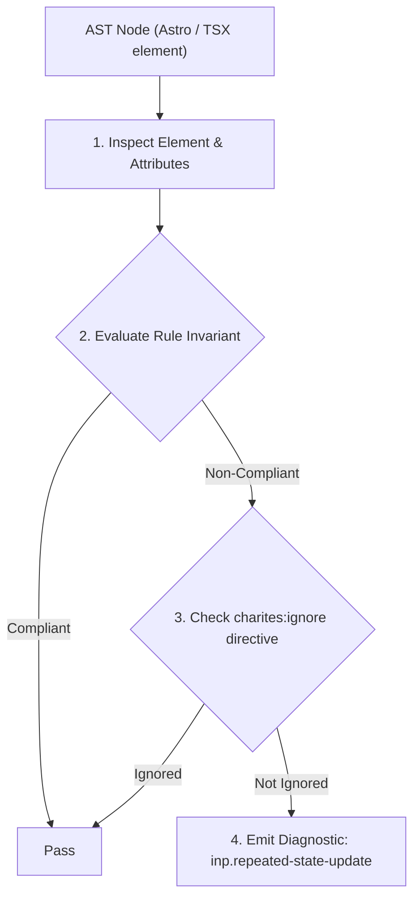
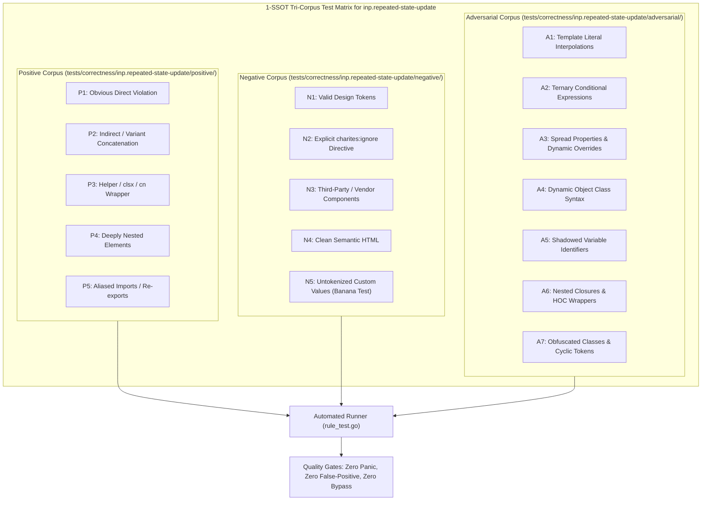

# inp.repeated-state-update

> **Rule ID:** `inp.repeated-state-update`
> **Severity:** `WARN`
> **Category:** `inp`
> **Target Standards:** React 18+ Automatic Batching Specification, W3C Web Performance Working Group (Interaction to Next Paint - INP), Concurrent React Scheduling & Reconciliation Cost

---

## 1. Overview & Core Invariant

Repeated state updater calls inside loops breaking automatic batching trigger cascading re-renders

### Core Invariant:
> **"React state setters must not be repeatedly invoked within loop iterations that break automatic batching (such as asynchronous loops containing 'await' or 'flushSync')."**

---
## 2. Technical Grounding & Engine Realities

While React 18 automatically batches multiple state updates within standard synchronous handlers, asynchronous loops (e.g. 'for ... of' with 'await' inside) or explicit 'flushSync' blocks break automatic batching.

Calling a state updater on every iteration of an asynchronous loop causes React to trigger a full re-render, VDOM diffing, and reconciliation cycle on every microtask tick.

This creates an enormous render queue backlog on the main thread, stalling user interactions and causing high Interaction to Next Paint (INP) latency.

Accumulating results locally into an array and issuing a single state update after the loop completes ensures a single, batched render pass.

---
## 3. Vulnerability & Risk Taxonomy

| Risk Vector | Severity | Impact |
| :--- | :---: | :--- |
| **Per-Iteration Re-render Cascades** | HIGH | Each iteration of an async loop schedules a separate render pass, saturating the React scheduler and freezing UI input. |
| **Presentation Delay Ballooning** | MEDIUM | Successive re-renders continuously postpone the browser paint phase, severely degrading INP. |

---
## 4. Non-Compliant Code Patterns (Bad Examples)
### TSX (State updater called on each iteration of an async loop):
```tsx
for (const item of items) {
  const detail = await fetchDetail(item.id);
  setItems(prev => [...prev, detail]); // Memicu re-render pada setiap iterasi!
}
```

---
## 5. Compliant Implementation Patterns (Good Examples)
### TSX (Accumulating all results and updating state once after loop completion):
```tsx
const results = [];
for (const item of items) {
  results.push(await fetchDetail(item.id));
}
setItems(prev => [...prev, ...results]); // Hanya satu siklus render
```

---

## 6. Detection & Verification Pipeline (How The Rule Evaluates Code)
This rule evaluates source code through the standard AST inspection pipeline:



### Step-by-Step Evaluation:
1. **AST Traversal:** Visits normalized `ir.Node` structures during AST streaming.
2. **Invariant Check:** Compares node attributes against rule invariants.
3. **Directive Suppression Check:** Honors inline `charites:ignore inp.repeated-state-update` directives.
4. **Diagnostic Emission:** Emits compiler-grade diagnostic on invariant violation.

---

## 7. Verification & Test Harness (How The Test Works: 1-SSOT Tri-Corpus)

This rule is rigorously tested and validated across the canonical **1-SSOT Tri-Corpus** in `tests/correctness/inp.repeated-state-update/`:



- **Positive Fixtures (P1-P5):** Verified to trigger diagnostics at exact lines and column spans.
- **Negative Fixtures (N1-N5):** Verified to produce zero diagnostics on valid tokens and legitimate exemptions.
- **Adversarial Fixtures (A1-A7):** Verified to prevent evasion across dynamic expressions, string interpolations, and cyclic references.

---

## 8. How to Suppress (Ignore Directives)

If this pattern is required for an intentional exception, suppress the diagnostic using the canonical Charites Rule ID:

```astro
<!-- charites:ignore inp.repeated-state-update intentional exception -->
```

```tsx
// charites:ignore inp.repeated-state-update intentional exception
```

---

## 9. Configuration Reference (`charites.yaml`)

```yaml
rules:
  inp.repeated-state-update:
    severity: warn # error | warn | info | off
```

