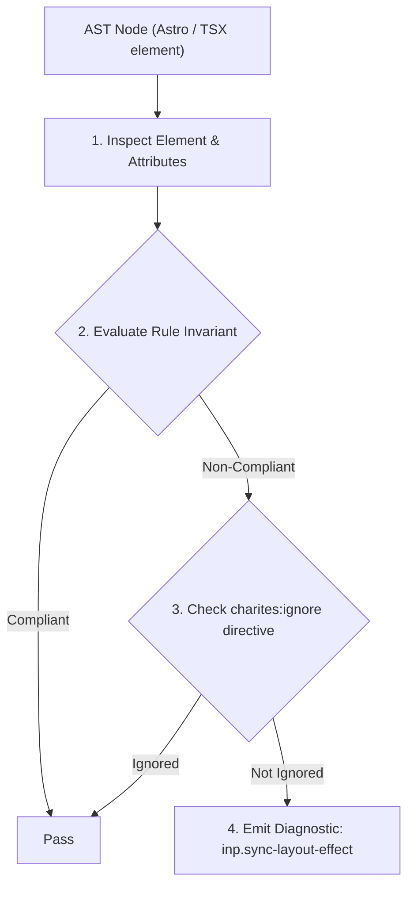
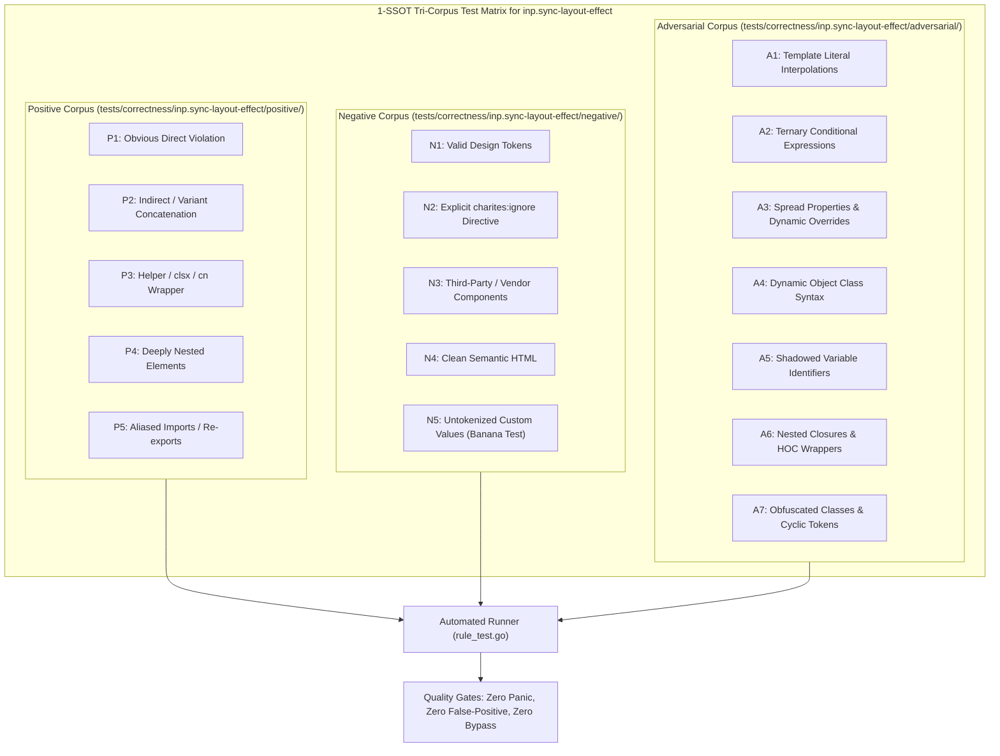

# inp.sync-layout-effect

> **Rule ID:** `inp.sync-layout-effect`
> **Severity:** `WARN`
> **Category:** `inp`
> **Target Standards:** React useLayoutEffect Pre-Paint Execution Model, W3C Presentation Timing & Frame Pipeline Invariants, Google Chrome Core Web Vitals (INP Presentation Delay Optimization)

---

## 1. Overview & Core Invariant

Synchronous non-geometrical computation in useLayoutEffect blocks browser paint and inflates presentation delay

### Core Invariant:
> **"The 'useLayoutEffect' hook must be reserved strictly for synchronous DOM measurements; data fetching and non-geometrical state updates must reside in 'useEffect'."**

---
## 2. Technical Grounding & Engine Realities

Unlike 'useEffect' which runs asynchronously after the browser paints the screen, 'useLayoutEffect' fires synchronously immediately after React commits DOM mutations, *before* the browser renders pixels to the screen.

Executing non-geometrical operations (such as data fetching, localStorage I/O, or secondary state cascades) within 'useLayoutEffect' delays the browser paint phase directly, locking the main thread and dramatically increasing Presentation Delay.

Developers should restrict 'useLayoutEffect' exclusively to reading layout properties (e.g. 'getBoundingClientRect') to position popovers or tooltips without flicker, moving all other logic to 'useEffect'.

---
## 3. Vulnerability & Risk Taxonomy

| Risk Vector | Severity | Impact |
| :--- | :---: | :--- |
| **Browser Paint Phase Halting** | HIGH | Frame rendering is synchronously blocked while non-layout logic executes in useLayoutEffect. |
| **Presentation Delay Spikes** | HIGH | Visual acknowledgment of user interactions is delayed by hundreds of milliseconds, breaching the 200ms INP threshold. |

---
## 4. Non-Compliant Code Patterns (Bad Examples)
### TSX (Data fetching inside useLayoutEffect blocks the browser paint phase):
```tsx
useLayoutEffect(() => {
  fetchUserData(userId).then(setData);
}, [userId]);
```

---
## 5. Compliant Implementation Patterns (Good Examples)
### TSX (Data fetching moved to useEffect; browser paints pixels without delay):
```tsx
useEffect(() => {
  fetchUserData(userId).then(setData);
}, [userId]);
```

---

## 6. Detection & Verification Pipeline (How The Rule Evaluates Code)
This rule evaluates source code through the standard AST inspection pipeline:



### Step-by-Step Evaluation:
1. **AST Traversal:** Visits normalized `ir.Node` structures during AST streaming.
2. **Invariant Check:** Compares node attributes against rule invariants.
3. **Directive Suppression Check:** Honors inline `charites:ignore inp.sync-layout-effect` directives.
4. **Diagnostic Emission:** Emits compiler-grade diagnostic on invariant violation.

---

## 7. Verification & Test Harness (How The Test Works: 1-SSOT Tri-Corpus)

This rule is rigorously tested and validated across the canonical **1-SSOT Tri-Corpus** in `tests/correctness/inp.sync-layout-effect/`:



- **Positive Fixtures (P1-P5):** Verified to trigger diagnostics at exact lines and column spans.
- **Negative Fixtures (N1-N5):** Verified to produce zero diagnostics on valid tokens and legitimate exemptions.
- **Adversarial Fixtures (A1-A7):** Verified to prevent evasion across dynamic expressions, string interpolations, and cyclic references.

---

## 8. How to Suppress (Ignore Directives)

If this pattern is required for an intentional exception, suppress the diagnostic using the canonical Charites Rule ID:

```astro
<!-- charites:ignore inp.sync-layout-effect intentional exception -->
```

```tsx
// charites:ignore inp.sync-layout-effect intentional exception
```

---

## 9. Configuration Reference (`charites.yaml`)

```yaml
rules:
  inp.sync-layout-effect:
    severity: warn # error | warn | info | off
```

