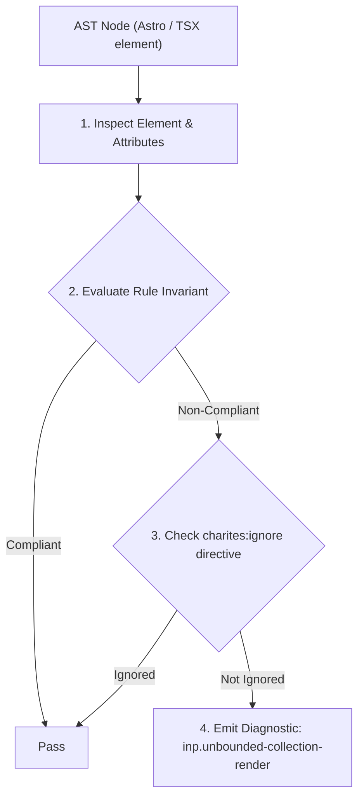
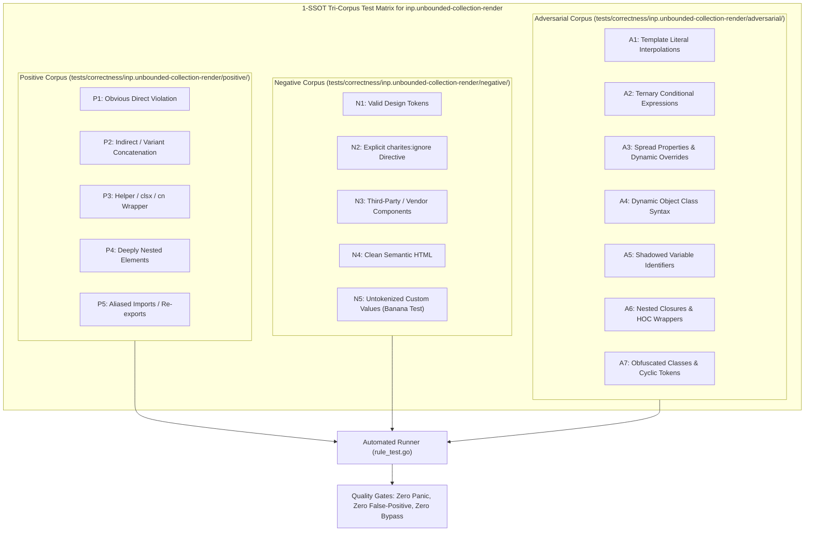

# inp.unbounded-collection-render

> **Rule ID:** `inp.unbounded-collection-render`
> **Severity:** `WARN`
> **Category:** `inp`
> **Target Standards:** Google Chrome Core Web Vitals (Interaction to Next Paint Presentation Delay), W3C DOM Performance & Rendering Subsystem Scaling, React Virtual List Windowing Patterns (@tanstack/react-virtual)

---

## 1. Overview & Core Invariant

Scrollable collection container renders unbounded dynamic data via .map() without window virtualization or pagination limits

### Core Invariant:
> **"Scrollable collection containers must not render arbitrarily large dynamic collections directly into the DOM; virtualization windowing or explicit pagination limits must be applied to cap active DOM node count."**

---
## 2. Technical Grounding & Engine Realities

When dynamic lists or tables render an unbounded number of items directly via '.map()', every item creates multiple nested DOM elements.

In scrollable containers, users scroll while interacting. If hundreds or thousands of DOM nodes reside in the tree, every user interaction triggers recalculations across the massive DOM tree, inflating browser Presentation Delay well beyond the 200ms INP threshold.

Window virtualization (e.g. '@tanstack/react-virtual') or explicit pagination (e.g. '.slice(0, 20)') limits rendered elements strictly to the visible viewport, keeping the DOM lightweight and presentation latency minimal.

---
## 3. Vulnerability & Risk Taxonomy

| Risk Vector | Severity | Impact |
| :--- | :---: | :--- |
| **DOM Node Count Explosion** | HIGH | Massive collections mapped directly to DOM cause layout tree bloat, degrading styling calculations and memory usage. |
| **Excessive Presentation Delay** | HIGH | Browser rendering engine spends excessive frame time recalibrating off-screen nodes during user interactions. |

---
## 4. Non-Compliant Code Patterns (Bad Examples)
### TSX (Scrollable container rendering full dynamic collection without virtualization or limits):
```tsx
<div className="h-96 overflow-y-auto">
  {dynamicDataFromApi.map(item => (
    <InteractiveItemRow key={item.id} data={item} onSelect={handleSelect} />
  ))}
</div>
```

---
## 5. Compliant Implementation Patterns (Good Examples)
### TSX (Virtual list windowing rendering only visible items in viewport):
```tsx
<div ref={parentRef} className="h-96 overflow-y-auto">
  <div style={{ height: `${rowVirtualizer.getTotalSize()}px` }}>
    {rowVirtualizer.getVirtualItems().map(virtualRow => (
      <InteractiveItemRow key={virtualRow.index} data={dynamicDataFromApi[virtualRow.index]} />
    ))}
  </div>
</div>
```

---

## 6. Detection & Verification Pipeline (How The Rule Evaluates Code)
This rule evaluates source code through the standard AST inspection pipeline:



### Step-by-Step Evaluation:
1. **AST Traversal:** Visits normalized `ir.Node` structures during AST streaming.
2. **Invariant Check:** Compares node attributes against rule invariants.
3. **Directive Suppression Check:** Honors inline `charites:ignore inp.unbounded-collection-render` directives.
4. **Diagnostic Emission:** Emits compiler-grade diagnostic on invariant violation.

---

## 7. Verification & Test Harness (How The Test Works: 1-SSOT Tri-Corpus)

This rule is rigorously tested and validated across the canonical **1-SSOT Tri-Corpus** in `tests/correctness/inp.unbounded-collection-render/`:



- **Positive Fixtures (P1-P5):** Verified to trigger diagnostics at exact lines and column spans.
- **Negative Fixtures (N1-N5):** Verified to produce zero diagnostics on valid tokens and legitimate exemptions.
- **Adversarial Fixtures (A1-A7):** Verified to prevent evasion across dynamic expressions, string interpolations, and cyclic references.

---

## 8. How to Suppress (Ignore Directives)

If this pattern is required for an intentional exception, suppress the diagnostic using the canonical Charites Rule ID:

```astro
<!-- charites:ignore inp.unbounded-collection-render intentional exception -->
```

```tsx
// charites:ignore inp.unbounded-collection-render intentional exception
```

---

## 9. Configuration Reference (`charites.yaml`)

```yaml
rules:
  inp.unbounded-collection-render:
    severity: warn # error | warn | info | off
```

