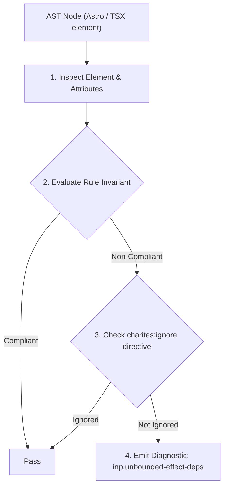
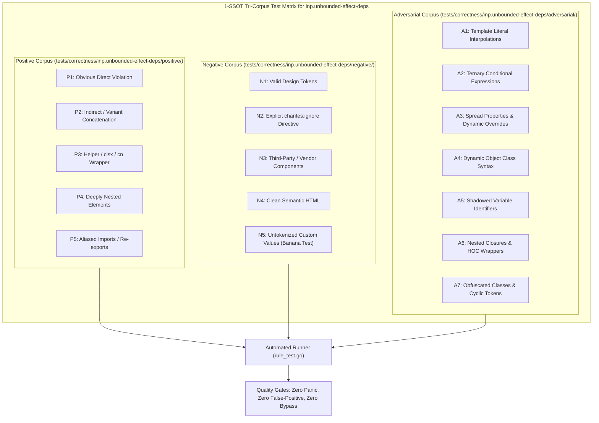

# inp.unbounded-effect-deps

> **Rule ID:** `inp.unbounded-effect-deps`
> **Severity:** `ERROR`
> **Category:** `inp`
> **Target Standards:** React Hooks Specification & Dependency Determinism, W3C Cooperative Scheduling & Frame Budget Invariants, Google Chrome Core Web Vitals (Input Presentation Delay)

---

## 1. Overview & Core Invariant

Lifecycle hook useEffect/useLayoutEffect is missing a dependency array, triggering unbounded re-executions on every render

### Core Invariant:
> **"React lifecycle hooks (useEffect, useLayoutEffect) must explicitly declare a dependency array as their second argument to prevent uncontrolled execution on every render cycle."**

---
## 2. Technical Grounding & Engine Realities

When 'useEffect' or 'useLayoutEffect' is invoked with only a callback and no second argument, React executes the effect after *every single render*.

Any state update, parent re-render, or user keystroke causes the entire effect callback to run again. If the effect queries DOM elements, reads layout properties, or synchronizes subscriptions, the main thread is constantly saturated by unnecessary computations.

Providing an explicit dependency array ('[]' for mount-only, or '[deps...]') restricts execution strictly to when dependencies change, protecting interaction frame rate.

---
## 3. Vulnerability & Risk Taxonomy

| Risk Vector | Severity | Impact |
| :--- | :---: | :--- |
| **Every-Render Effect Re-execution** | CRITICAL | Effects fire repeatedly on every keystroke or state change, causing severe CPU spikes and input lag. |
| **Infinite Render Loops** | HIGH | If an unbounded effect updates state, it causes an immediate infinite re-render loop that locks the browser tab. |

---
## 4. Non-Compliant Code Patterns (Bad Examples)
### TSX (useEffect without a dependency array executes on every render):
```tsx
useEffect(() => {
  recomputeHeavyLayout();
});
```

---
## 5. Compliant Implementation Patterns (Good Examples)
### TSX (Explicit empty dependency array ensures execution only on mount):
```tsx
useEffect(() => {
  recomputeHeavyLayout();
}, []);
```

---

## 6. Detection & Verification Pipeline (How The Rule Evaluates Code)
This rule evaluates source code through the standard AST inspection pipeline:



### Step-by-Step Evaluation:
1. **AST Traversal:** Visits normalized `ir.Node` structures during AST streaming.
2. **Invariant Check:** Compares node attributes against rule invariants.
3. **Directive Suppression Check:** Honors inline `charites:ignore inp.unbounded-effect-deps` directives.
4. **Diagnostic Emission:** Emits compiler-grade diagnostic on invariant violation.

---

## 7. Verification & Test Harness (How The Test Works: 1-SSOT Tri-Corpus)

This rule is rigorously tested and validated across the canonical **1-SSOT Tri-Corpus** in `tests/correctness/inp.unbounded-effect-deps/`:



- **Positive Fixtures (P1-P5):** Verified to trigger diagnostics at exact lines and column spans.
- **Negative Fixtures (N1-N5):** Verified to produce zero diagnostics on valid tokens and legitimate exemptions.
- **Adversarial Fixtures (A1-A7):** Verified to prevent evasion across dynamic expressions, string interpolations, and cyclic references.

---

## 8. How to Suppress (Ignore Directives)

If this pattern is required for an intentional exception, suppress the diagnostic using the canonical Charites Rule ID:

```astro
<!-- charites:ignore inp.unbounded-effect-deps intentional exception -->
```

```tsx
// charites:ignore inp.unbounded-effect-deps intentional exception
```

---

## 9. Configuration Reference (`charites.yaml`)

```yaml
rules:
  inp.unbounded-effect-deps:
    severity: error # error | warn | info | off
```

