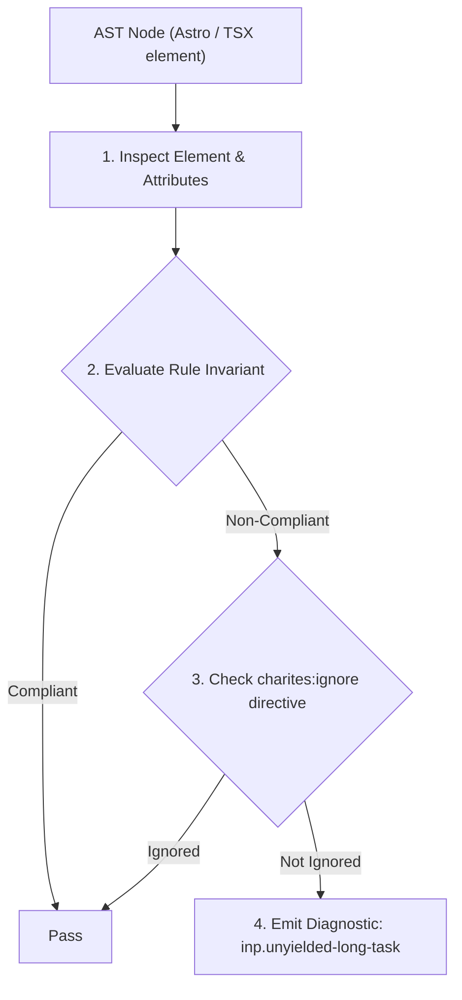
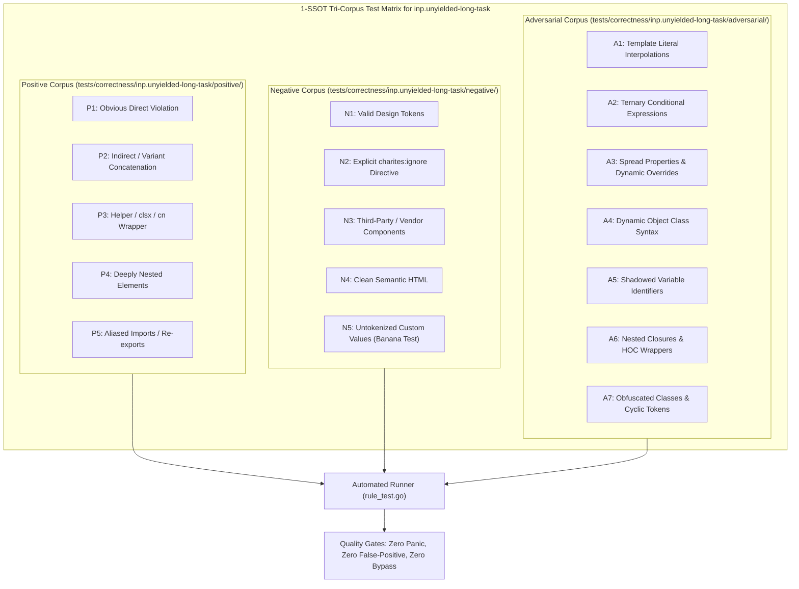

# inp.unyielded-long-task

> **Rule ID:** `inp.unyielded-long-task`
> **Severity:** `WARN`
> **Category:** `inp`
> **Target Standards:** W3C Cooperative Scheduling Controller (scheduler.yield), Google Chrome Core Web Vitals (Long Tasks & Input Responsiveness), Main-Thread Cooperative Concurrency Invariants

---

## 1. Overview & Core Invariant

Long task processing large arrays without cooperative scheduling yields stalls main-thread responsiveness

### Core Invariant:
> **"Long execution tasks triggered by or affecting user interactions must periodically yield control to the browser event loop via cooperative scheduling boundaries."**

---
## 2. Technical Grounding & Engine Realities

Long tasks running uninterrupted on the main thread (> 50ms) prevent the browser from acknowledging new user inputs (clicks, keypresses, taps) or rendering visual updates.

When user actions initiate extensive batch computations, running the entire process synchronously locks the page until completion, producing high Interaction to Next Paint (INP) latency.

By periodically pausing execution using modern cooperative scheduling: 'await (window.scheduler?.yield?.() ?? new Promise(r => setTimeout(r, 0)))', the browser is given immediate opportunities to handle pending user inputs and paint frames before continuing task work.

---
## 3. Vulnerability & Risk Taxonomy

| Risk Vector | Severity | Impact |
| :--- | :---: | :--- |
| **Main-Thread Input Starvation** | HIGH | Long uninterrupted execution loops starve the browser input queue, leaving pages unresponsive during batch processing. |
| **High INP & Dropped Frames** | MEDIUM | Presentation of user feedback is blocked for hundreds of milliseconds, breaching the 200ms INP threshold. |

---
## 4. Non-Compliant Code Patterns (Bad Examples)
### TS (Long calculation loop over large dataset without cooperative yield):
```ts
function processLargeArray(items: string[]) {
  for (let i = 0; i < items.length; i++) {
    heavyCalculation(items[i]);
  }
}
```

---
## 5. Compliant Implementation Patterns (Good Examples)
### TS (Periodic cooperative yielding to maintain input responsiveness):
```ts
async function processLargeArray(items: string[]) {
  for (let i = 0; i < items.length; i++) {
    heavyCalculation(items[i]);
    if (i % 50 === 0) {
      await (window.scheduler?.yield?.() ?? new Promise(r => setTimeout(r, 0)));
    }
  }
}
```

---

## 6. Detection & Verification Pipeline (How The Rule Evaluates Code)
This rule evaluates source code through the standard AST inspection pipeline:



### Step-by-Step Evaluation:
1. **AST Traversal:** Visits normalized `ir.Node` structures during AST streaming.
2. **Invariant Check:** Compares node attributes against rule invariants.
3. **Directive Suppression Check:** Honors inline `charites:ignore inp.unyielded-long-task` directives.
4. **Diagnostic Emission:** Emits compiler-grade diagnostic on invariant violation.

---

## 7. Verification & Test Harness (How The Test Works: 1-SSOT Tri-Corpus)

This rule is rigorously tested and validated across the canonical **1-SSOT Tri-Corpus** in `tests/correctness/inp.unyielded-long-task/`:



- **Positive Fixtures (P1-P5):** Verified to trigger diagnostics at exact lines and column spans.
- **Negative Fixtures (N1-N5):** Verified to produce zero diagnostics on valid tokens and legitimate exemptions.
- **Adversarial Fixtures (A1-A7):** Verified to prevent evasion across dynamic expressions, string interpolations, and cyclic references.

---

## 8. How to Suppress (Ignore Directives)

If this pattern is required for an intentional exception, suppress the diagnostic using the canonical Charites Rule ID:

```astro
<!-- charites:ignore inp.unyielded-long-task intentional exception -->
```

```tsx
// charites:ignore inp.unyielded-long-task intentional exception
```

---

## 9. Configuration Reference (`charites.yaml`)

```yaml
rules:
  inp.unyielded-long-task:
    severity: warn # error | warn | info | off
```

