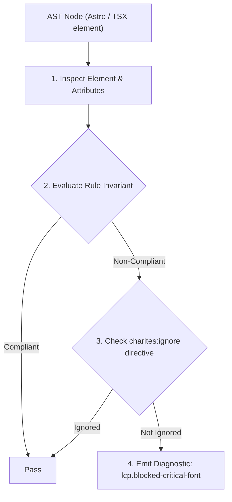
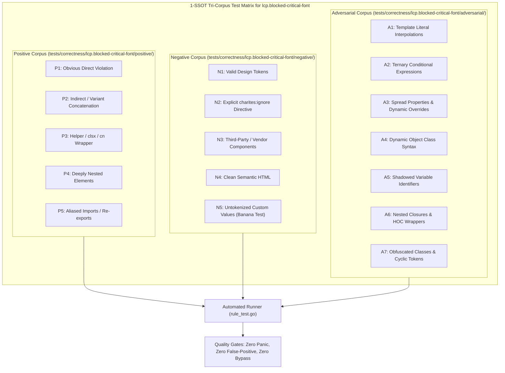

# lcp.blocked-critical-font

> **Rule ID:** `lcp.blocked-critical-font`
> **Severity:** `WARN`
> **Category:** `lcp`
> **Target Standards:** Google Chrome Core Web Vitals (Largest Contentful Paint Text Block Paint), W3C CSS Fonts Module Level 4 (font-display descriptor specification), Web Performance Working Group FOIT Minimization Guidelines

---

## 1. Overview & Core Invariant

Custom '@font-face' declaration lacks 'font-display: swap' or 'font-display: optional', risking FOIT (Flash of Invisible Text) and delaying LCP text paint

### Core Invariant:
> **"Custom @font-face declarations for web fonts must specify 'font-display: swap' or 'font-display: optional' to prevent Flash of Invisible Text (FOIT) on LCP text blocks."**

---
## 2. Technical Grounding & Engine Realities

When a browser discovers text styled with a custom web font, it evaluates the @font-face 'font-display' descriptor.

By default ('font-display: auto' or 'font-display: block'), modern browsers enter a 3-second 'block period' during which text is rendered with invisible transparent glyphs while the font binary is fetched from the network.

If the primary heading (<h1> or hero banner text) is the LCP candidate, this block period directly delays the Largest Contentful Paint until font download completes.

Specifying 'font-display: swap' enables immediate text rendering with a system fallback font followed by an in-place swap once the custom font arrives.

---
## 3. Vulnerability & Risk Taxonomy

| Risk Vector | Severity | Impact |
| :--- | :---: | :--- |
| **Flash of Invisible Text (FOIT)** | HIGH | LCP candidate text remains completely invisible for up to 3000ms on cellular or high-latency networks. |
| **Element Render Delay Inflation** | MEDIUM | Directly inflates LCP duration by coupling text paint to third-party or remote font network latency. |

---
## 4. Non-Compliant Code Patterns (Bad Examples)
### CSS (Custom @font-face without font-display causing FOIT on hero headings):
```css
@font-face {
  font-family: 'CabinetGrotesk';
  src: url('/fonts/cabinet.woff2') format('woff2');
}
h1 {
  font-family: 'CabinetGrotesk', sans-serif;
}
```

---
## 5. Compliant Implementation Patterns (Good Examples)
### CSS (Custom @font-face configured with font-display: swap to ensure immediate text rendering):
```css
@font-face {
  font-family: 'CabinetGrotesk';
  src: url('/fonts/cabinet.woff2') format('woff2');
  font-display: swap;
}
h1 {
  font-family: 'CabinetGrotesk', sans-serif;
}
```

---

## 6. Detection & Verification Pipeline (How The Rule Evaluates Code)
This rule evaluates source code through the standard AST inspection pipeline:



### Step-by-Step Evaluation:
1. **AST Traversal:** Visits normalized `ir.Node` structures during AST streaming.
2. **Invariant Check:** Compares node attributes against rule invariants.
3. **Directive Suppression Check:** Honors inline `charites:ignore lcp.blocked-critical-font` directives.
4. **Diagnostic Emission:** Emits compiler-grade diagnostic on invariant violation.

---

## 7. Verification & Test Harness (How The Test Works: 1-SSOT Tri-Corpus)

This rule is rigorously tested and validated across the canonical **1-SSOT Tri-Corpus** in `tests/correctness/lcp.blocked-critical-font/`:



- **Positive Fixtures (P1-P5):** Verified to trigger diagnostics at exact lines and column spans.
- **Negative Fixtures (N1-N5):** Verified to produce zero diagnostics on valid tokens and legitimate exemptions.
- **Adversarial Fixtures (A1-A7):** Verified to prevent evasion across dynamic expressions, string interpolations, and cyclic references.

---

## 8. How to Suppress (Ignore Directives)

If this pattern is required for an intentional exception, suppress the diagnostic using the canonical Charites Rule ID:

```astro
<!-- charites:ignore lcp.blocked-critical-font intentional exception -->
```

```tsx
// charites:ignore lcp.blocked-critical-font intentional exception
```

---

## 9. Configuration Reference (`charites.yaml`)

```yaml
rules:
  lcp.blocked-critical-font:
    severity: warn # error | warn | info | off
```

