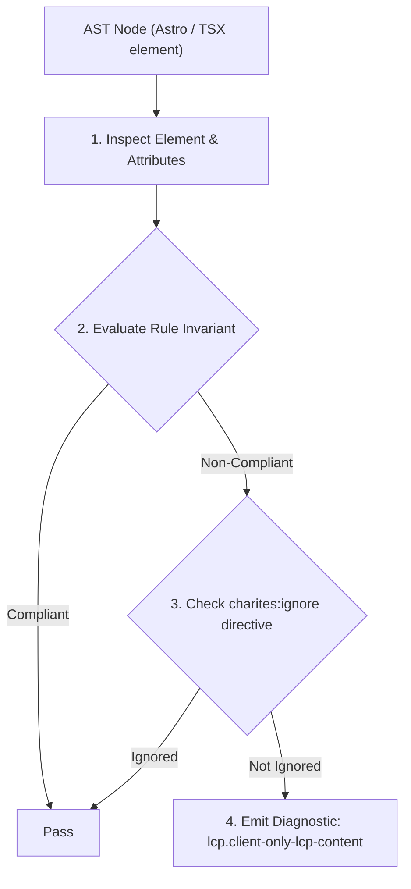
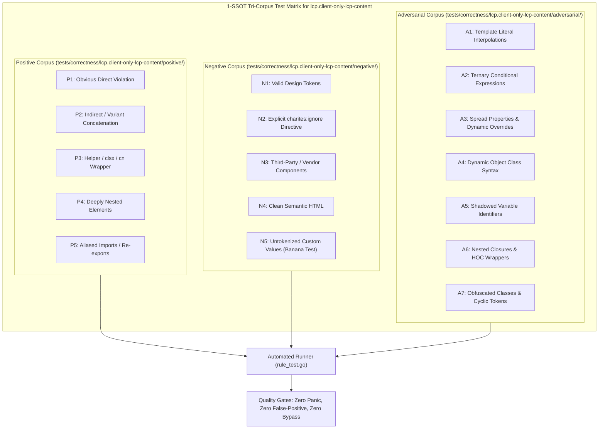

# lcp.client-only-lcp-content

> **Rule ID:** `lcp.client-only-lcp-content`
> **Severity:** `WARN`
> **Category:** `lcp`
> **Target Standards:** Google Chrome Core Web Vitals (Largest Contentful Paint Resource Load Delay), Astro Island Architecture & Client Directives Specification, W3C Web Performance Working Group SSR Invariants

---

## 1. Overview & Core Invariant

Above-the-fold hero island declared with 'client:only' without an SSR fallback slot, eliminating server HTML and delaying LCP until client-side bundle execution

### Core Invariant:
> **"Above-the-fold hero island components must not bypass server-side rendering with 'client:only' unless an SSR 'slot="fallback"' is provided, ensuring initial HTML contains renderable LCP content."**

---
## 2. Technical Grounding & Engine Realities

In Astro's island architecture, declaring 'client:only' completely skips server-side rendering of the target component, emitting an empty placeholder container into the initial server HTML.

When an above-the-fold hero banner or primary heading is wrapped in 'client:only', the browser receives zero LCP content in the initial HTML stream. The browser cannot discover or render the hero element until all client-side JavaScript bundles are fetched, parsed, and executed.

To preserve fast LCP, developers should use 'client:load' (which renders initial HTML on the server and hydrates on the client) or provide a server-rendered fallback slot using '<div slot="fallback">...</div>'.

---
## 3. Vulnerability & Risk Taxonomy

| Risk Vector | Severity | Impact |
| :--- | :---: | :--- |
| **Complete SSR Elimination on Critical Path** | CRITICAL | LCP candidate is entirely absent from initial server HTML response, turning server-rendered Astro pages into slow client-rendered SPAs. |
| **Resource Load Delay Explosion** | HIGH | Hero rendering is blocked behind full JS download, parsing, and execution, inflating LCP by 600ms-2500ms on low-end devices. |

---
## 4. Non-Compliant Code Patterns (Bad Examples)
### ASTRO (Hero interactive island rendered with client:only without an SSR fallback slot):
```astro
---
import HeroInteractive from '../components/HeroInteractive.tsx';
---
<main>
  <HeroInteractive client:only="react" />
</main>
```

---
## 5. Compliant Implementation Patterns (Good Examples)
### ASTRO (Option 1: Using client:load to render initial HTML on the server):
```astro
---
import HeroInteractive from '../components/HeroInteractive.tsx';
---
<main>
  <HeroInteractive client:load />
</main>
```
### ASTRO (Option 2: Providing an SSR fallback slot when client:only is strictly necessary):
```astro
---
import HeroInteractive from '../components/HeroInteractive.tsx';
---
<main>
  <HeroInteractive client:only="react">
    <div slot="fallback" class="hero-skeleton">
      <h1>Welcome to Our Platform</h1>
    </div>
  </HeroInteractive>
</main>
```

---

## 6. Detection & Verification Pipeline (How The Rule Evaluates Code)
This rule evaluates source code through the standard AST inspection pipeline:



### Step-by-Step Evaluation:
1. **AST Traversal:** Visits normalized `ir.Node` structures during AST streaming.
2. **Invariant Check:** Compares node attributes against rule invariants.
3. **Directive Suppression Check:** Honors inline `charites:ignore lcp.client-only-lcp-content` directives.
4. **Diagnostic Emission:** Emits compiler-grade diagnostic on invariant violation.

---

## 7. Verification & Test Harness (How The Test Works: 1-SSOT Tri-Corpus)

This rule is rigorously tested and validated across the canonical **1-SSOT Tri-Corpus** in `tests/correctness/lcp.client-only-lcp-content/`:



- **Positive Fixtures (P1-P5):** Verified to trigger diagnostics at exact lines and column spans.
- **Negative Fixtures (N1-N5):** Verified to produce zero diagnostics on valid tokens and legitimate exemptions.
- **Adversarial Fixtures (A1-A7):** Verified to prevent evasion across dynamic expressions, string interpolations, and cyclic references.

---

## 8. How to Suppress (Ignore Directives)

If this pattern is required for an intentional exception, suppress the diagnostic using the canonical Charites Rule ID:

```astro
<!-- charites:ignore lcp.client-only-lcp-content intentional exception -->
```

```tsx
// charites:ignore lcp.client-only-lcp-content intentional exception
```

---

## 9. Configuration Reference (`charites.yaml`)

```yaml
rules:
  lcp.client-only-lcp-content:
    severity: warn # error | warn | info | off
```

