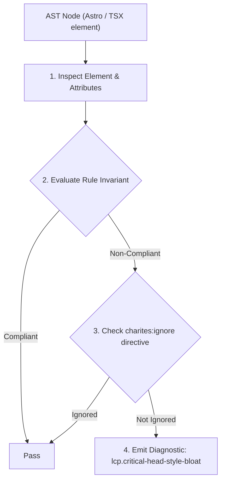
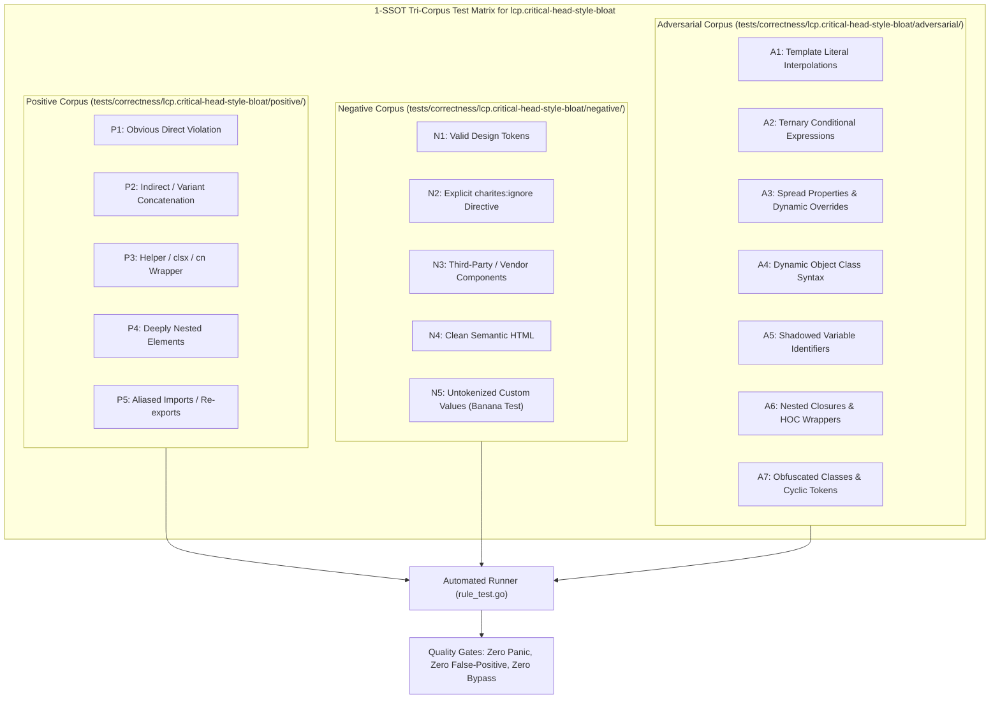

# lcp.critical-head-style-bloat

> **Rule ID:** `lcp.critical-head-style-bloat`
> **Severity:** `WARN`
> **Category:** `lcp`
> **Target Standards:** Google Chrome Core Web Vitals (Largest Contentful Paint Time to First Byte & Render Delay), W3C CSS Cascading and Inheritance Level 5, Web Performance Working Group Critical CSS Separation Invariants

---

## 1. Overview & Core Invariant

Inline '<style>' in '<head>' contains non-critical CSS selectors (footer, modal, dialog), inflating initial HTML payload and delaying LCP paint

### Core Invariant:
> **"Inline '<style>' tags inside the document '<head>' should contain only essential Critical CSS required to render the above-the-fold viewport; non-critical styles must be extracted to cacheable external stylesheets."**

---
## 2. Technical Grounding & Engine Realities

Inlining Critical CSS directly into the HTML `<head>` is an established optimization to eliminate the render-blocking stylesheet network round-trip for initial viewport elements.

However, when monolithic application styles (such as footer links, modal overlays, dialog drawers, and below-the-fold widgets) are bundled indiscriminately into `<head>` styles, the initial HTML payload balloons in size.

Because HTML is streamed over TCP in 14KB chunks, bloated inline styles consume early round-trips before the browser even discovers hero `` or heading elements, inflating TTFB and Element Render Delay without the benefit of browser HTTP caching.

---
## 3. Vulnerability & Risk Taxonomy

| Risk Vector | Severity | Impact |
| :--- | :---: | :--- |
| **Initial HTML Payload Bloat** | HIGH | Inflates HTML document transfer size, exhausting early TCP slow-start congestion windows before hero media tags are parsed. |
| **Loss of HTTP Caching Efficiency** | MEDIUM | Inline CSS cannot be cached by the browser cache or CDN edge nodes across subsequent page navigations. |

---
## 4. Non-Compliant Code Patterns (Bad Examples)
### HTML (Monolithic style in head bundling footer and modal CSS rules):
```html
<head>
  <style>
    .footer-links { color: #6b7280; font-size: 0.875rem; }
    .admin-modal-overlay { display: none; position: fixed; inset: 0; }
  </style>
</head>
```

---
## 5. Compliant Implementation Patterns (Good Examples)
### HTML (Head style strictly limited to above-the-fold critical hero layout):
```html
<head>
  <style>
    .hero-container { min-height: 480px; display: flex; }
  </style>
  <link rel="stylesheet" href="/assets/main.css" />
</head>
```

---

## 6. Detection & Verification Pipeline (How The Rule Evaluates Code)
This rule evaluates source code through the standard AST inspection pipeline:



### Step-by-Step Evaluation:
1. **AST Traversal:** Visits normalized `ir.Node` structures during AST streaming.
2. **Invariant Check:** Compares node attributes against rule invariants.
3. **Directive Suppression Check:** Honors inline `charites:ignore lcp.critical-head-style-bloat` directives.
4. **Diagnostic Emission:** Emits compiler-grade diagnostic on invariant violation.

---

## 7. Verification & Test Harness (How The Test Works: 1-SSOT Tri-Corpus)

This rule is rigorously tested and validated across the canonical **1-SSOT Tri-Corpus** in `tests/correctness/lcp.critical-head-style-bloat/`:



- **Positive Fixtures (P1-P5):** Verified to trigger diagnostics at exact lines and column spans.
- **Negative Fixtures (N1-N5):** Verified to produce zero diagnostics on valid tokens and legitimate exemptions.
- **Adversarial Fixtures (A1-A7):** Verified to prevent evasion across dynamic expressions, string interpolations, and cyclic references.

---

## 8. How to Suppress (Ignore Directives)

If this pattern is required for an intentional exception, suppress the diagnostic using the canonical Charites Rule ID:

```astro
<!-- charites:ignore lcp.critical-head-style-bloat intentional exception -->
```

```tsx
// charites:ignore lcp.critical-head-style-bloat intentional exception
```

---

## 9. Configuration Reference (`charites.yaml`)

```yaml
rules:
  lcp.critical-head-style-bloat:
    severity: warn # error | warn | info | off
```

