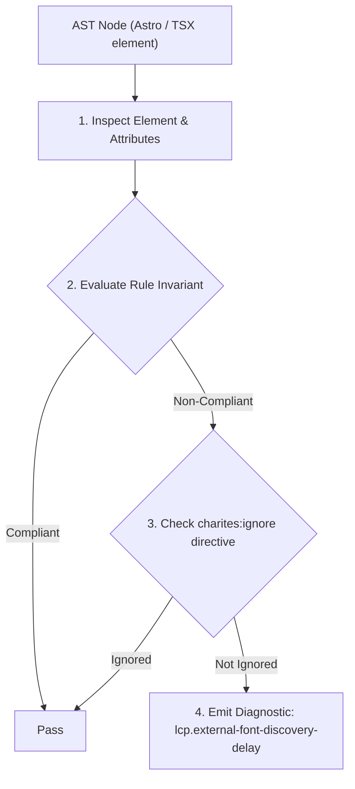
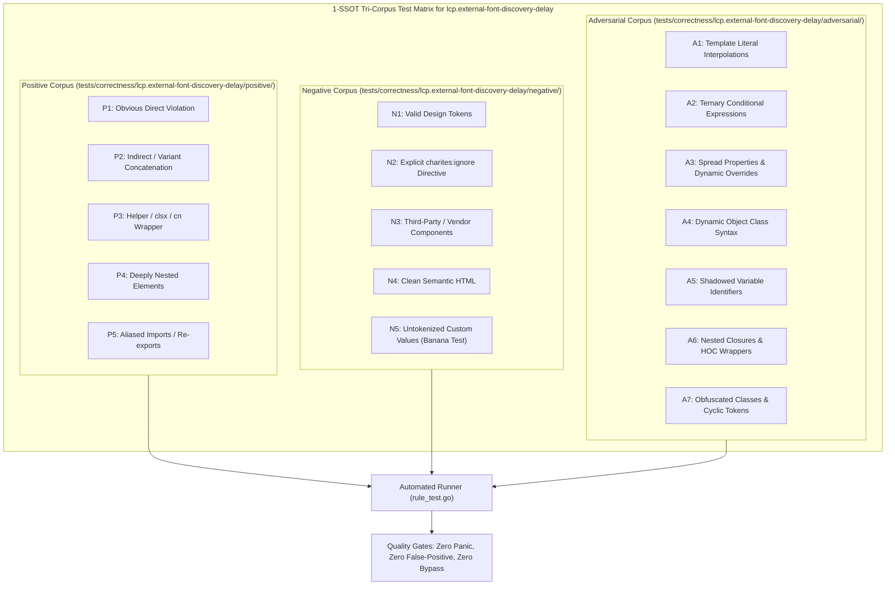

# lcp.external-font-discovery-delay

> **Rule ID:** `lcp.external-font-discovery-delay`
> **Severity:** `WARN`
> **Category:** `lcp`
> **Target Standards:** Google Chrome Core Web Vitals (Largest Contentful Paint Resource Load Delay), W3C Resource Hints (preconnect and dns-prefetch specification), Web Performance Working Group Connection Handshake Optimization Invariants

---

## 1. Overview & Core Invariant

External font stylesheet loaded without '<link rel="preconnect">' hints, adding 200ms-400ms connection handshake latency to LCP font discovery

### Core Invariant:
> **"External cross-origin font stylesheets must be preceded by '<link rel="preconnect">' hints to eliminate DNS, TCP, and TLS handshake round-trips before font binaries are requested."**

---
## 2. Technical Grounding & Engine Realities

Loading web fonts from third-party CDNs (such as Google Fonts or Adobe Typekit) involves a multi-origin dependency chain: the CSS stylesheet is fetched from one domain (e.g. 'fonts.googleapis.com'), while the font binaries (.woff2) are hosted on a separate storage origin (e.g. 'fonts.gstatic.com').

Without preconnect hints, the browser cannot initiate the DNS resolution, TCP three-way handshake, and TLS negotiation with the font storage origin until the stylesheet is completely downloaded and parsed.

Adding '<link rel="preconnect" href="https://fonts.gstatic.com" crossorigin>' allows the browser to perform socket setup in parallel during initial document streaming, shaving 200ms-400ms off LCP font discovery.

---
## 3. Vulnerability & Risk Taxonomy

| Risk Vector | Severity | Impact |
| :--- | :---: | :--- |
| **Connection Handshake Serialization** | HIGH | Sequential DNS/TCP/TLS handshakes to external font origins add 200ms-400ms round-trip latency to critical text LCP. |
| **Cellular Network Latency Amplification** | MEDIUM | On mobile 3G/4G networks with high RTT (Round Trip Time), serialized connection setup severely degrades user perceptual paint times. |

---
## 4. Non-Compliant Code Patterns (Bad Examples)
### HTML (External Google Fonts imported without preconnect hints to stylesheet and font binary origins):
```html
<head>
  <link rel="stylesheet" href="https://fonts.googleapis.com/css2?family=Plus+Jakarta+Sans:wght@700&display=swap" />
</head>
```

---
## 5. Compliant Implementation Patterns (Good Examples)
### HTML (Preconnect hints declared early to pre-warm DNS and TLS sockets before stylesheet parsing):
```html
<head>
  <link rel="preconnect" href="https://fonts.googleapis.com" />
  <link rel="preconnect" href="https://fonts.gstatic.com" crossorigin />
  <link rel="stylesheet" href="https://fonts.googleapis.com/css2?family=Plus+Jakarta+Sans:wght@700&display=swap" />
</head>
```

---

## 6. Detection & Verification Pipeline (How The Rule Evaluates Code)
This rule evaluates source code through the standard AST inspection pipeline:



### Step-by-Step Evaluation:
1. **AST Traversal:** Visits normalized `ir.Node` structures during AST streaming.
2. **Invariant Check:** Compares node attributes against rule invariants.
3. **Directive Suppression Check:** Honors inline `charites:ignore lcp.external-font-discovery-delay` directives.
4. **Diagnostic Emission:** Emits compiler-grade diagnostic on invariant violation.

---

## 7. Verification & Test Harness (How The Test Works: 1-SSOT Tri-Corpus)

This rule is rigorously tested and validated across the canonical **1-SSOT Tri-Corpus** in `tests/correctness/lcp.external-font-discovery-delay/`:



- **Positive Fixtures (P1-P5):** Verified to trigger diagnostics at exact lines and column spans.
- **Negative Fixtures (N1-N5):** Verified to produce zero diagnostics on valid tokens and legitimate exemptions.
- **Adversarial Fixtures (A1-A7):** Verified to prevent evasion across dynamic expressions, string interpolations, and cyclic references.

---

## 8. How to Suppress (Ignore Directives)

If this pattern is required for an intentional exception, suppress the diagnostic using the canonical Charites Rule ID:

```astro
<!-- charites:ignore lcp.external-font-discovery-delay intentional exception -->
```

```tsx
// charites:ignore lcp.external-font-discovery-delay intentional exception
```

---

## 9. Configuration Reference (`charites.yaml`)

```yaml
rules:
  lcp.external-font-discovery-delay:
    severity: warn # error | warn | info | off
```

