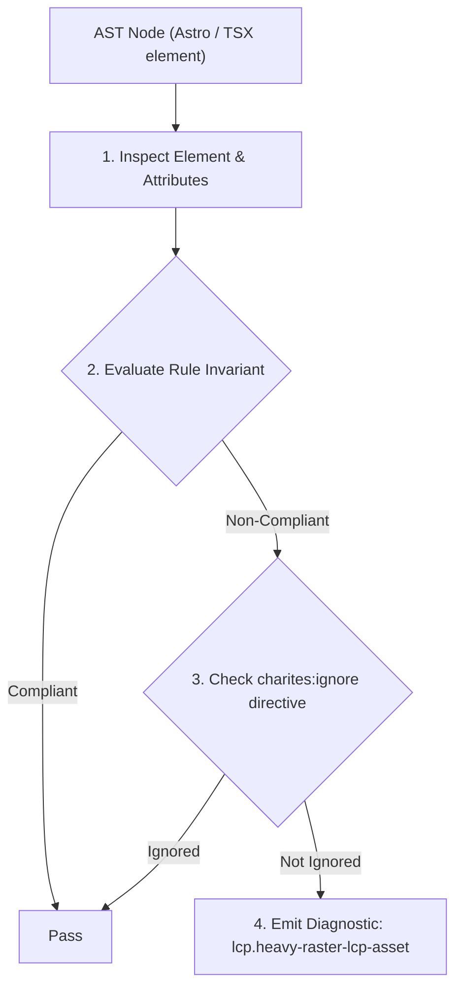
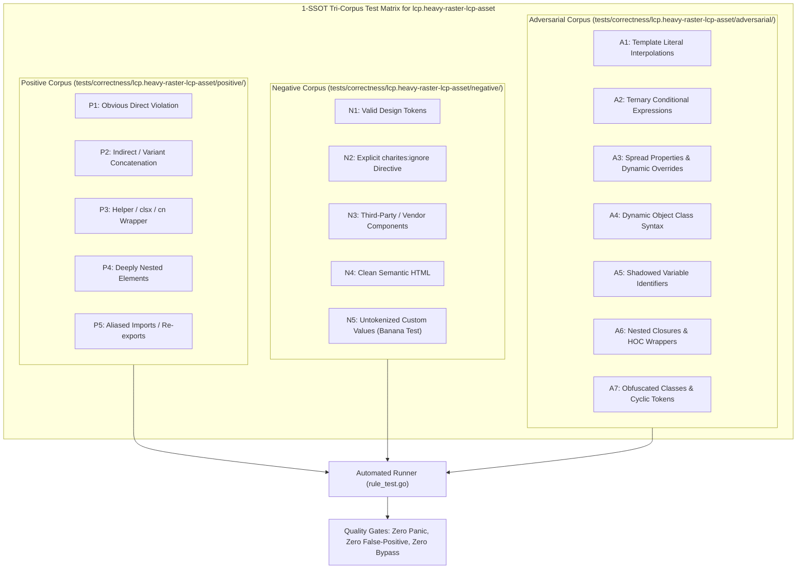

# lcp.heavy-raster-lcp-asset

> **Rule ID:** `lcp.heavy-raster-lcp-asset`
> **Severity:** `WARN`
> **Category:** `lcp`
> **Target Standards:** Google Chrome Core Web Vitals (Largest Contentful Paint Resource Load Duration), W3C Web Performance Working Group Media Optimization Guidelines, IETF AVIF / WebP Image Compression Standards

---

## 1. Overview & Core Invariant

LCP candidate image uses legacy uncompressed raster format (.png, .bmp, .tiff, .gif); modern formats like WebP or AVIF should be served to reduce transfer size

### Core Invariant:
> **"Above-the-fold LCP candidate images must utilize next-generation compressed formats (WebP, AVIF) rather than legacy uncompressed raster formats (.png, .bmp, .tiff, .gif) to minimize byte transfer payload."**

---
## 2. Technical Grounding & Engine Realities

Serving high-resolution photographs or hero imagery in legacy raster formats such as PNG or uncompressed BMP results in massive byte payloads (often 2MB-5MB per image).

Next-generation formats such as WebP and AVIF provide superior lossy and lossless compression algorithms, reducing image file sizes by 30% to 70% compared to PNG and JPEG without perceptual visual degradation.

For above-the-fold hero images that dictate the LCP metric, reducing file transfer size directly accelerates the Resource Load Duration phase over bandwidth-constrained networks.

---
## 3. Vulnerability & Risk Taxonomy

| Risk Vector | Severity | Impact |
| :--- | :---: | :--- |
| **Resource Load Duration Delay** | HIGH | Downloading uncompressed 2MB-5MB PNG/BMP images over 4G/cellular connections introduces 800ms-3000ms delay to LCP. |
| **Memory Footprint & GPU Texture Pressure** | MEDIUM | Large uncompressed raster graphics consume excessive client RAM and GPU texture memory during decode and compositing. |

---
## 4. Non-Compliant Code Patterns (Bad Examples)
### TSX (Critical hero image served as an uncompressed 3MB PNG file):
```tsx
<section className="hero-section" data-perf-role="hero">
  
</section>
```

---
## 5. Compliant Implementation Patterns (Good Examples)
### TSX (Hero image converted to compressed modern WebP format):
```tsx
<section className="hero-section" data-perf-role="hero">
  
</section>
```

---

## 6. Detection & Verification Pipeline (How The Rule Evaluates Code)
This rule evaluates source code through the standard AST inspection pipeline:



### Step-by-Step Evaluation:
1. **AST Traversal:** Visits normalized `ir.Node` structures during AST streaming.
2. **Invariant Check:** Compares node attributes against rule invariants.
3. **Directive Suppression Check:** Honors inline `charites:ignore lcp.heavy-raster-lcp-asset` directives.
4. **Diagnostic Emission:** Emits compiler-grade diagnostic on invariant violation.

---

## 7. Verification & Test Harness (How The Test Works: 1-SSOT Tri-Corpus)

This rule is rigorously tested and validated across the canonical **1-SSOT Tri-Corpus** in `tests/correctness/lcp.heavy-raster-lcp-asset/`:



- **Positive Fixtures (P1-P5):** Verified to trigger diagnostics at exact lines and column spans.
- **Negative Fixtures (N1-N5):** Verified to produce zero diagnostics on valid tokens and legitimate exemptions.
- **Adversarial Fixtures (A1-A7):** Verified to prevent evasion across dynamic expressions, string interpolations, and cyclic references.

---

## 8. How to Suppress (Ignore Directives)

If this pattern is required for an intentional exception, suppress the diagnostic using the canonical Charites Rule ID:

```astro
<!-- charites:ignore lcp.heavy-raster-lcp-asset intentional exception -->
```

```tsx
// charites:ignore lcp.heavy-raster-lcp-asset intentional exception
```

---

## 9. Configuration Reference (`charites.yaml`)

```yaml
rules:
  lcp.heavy-raster-lcp-asset:
    severity: warn # error | warn | info | off
```

