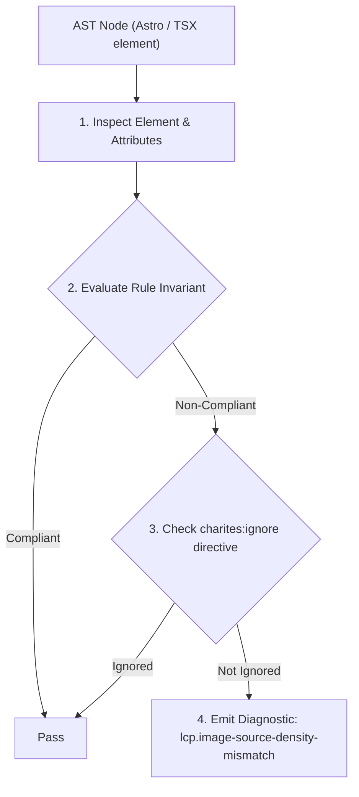
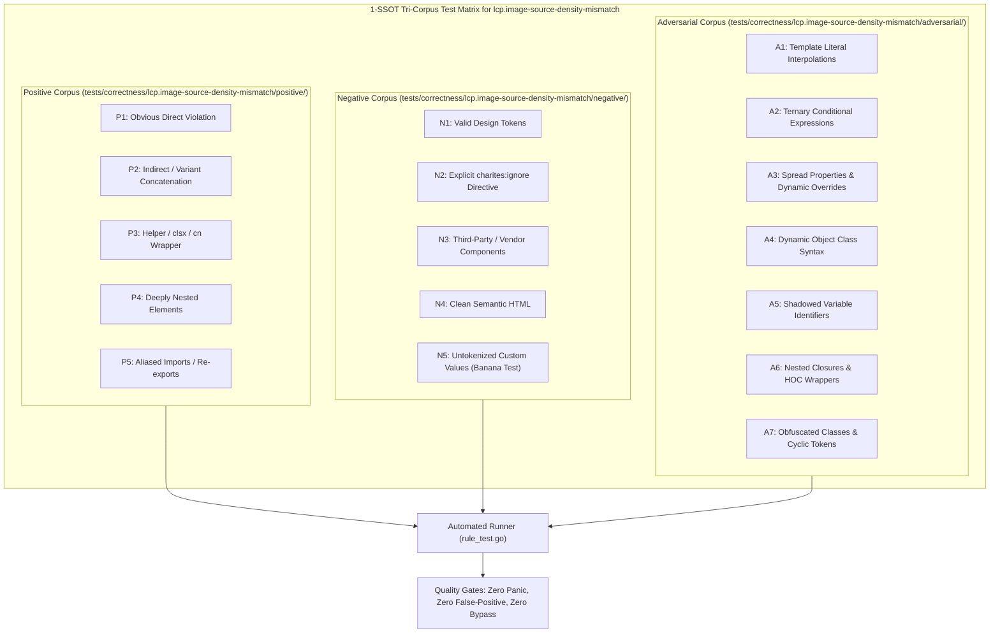

# lcp.image-source-density-mismatch

> **Rule ID:** `lcp.image-source-density-mismatch`
> **Severity:** `INFO`
> **Category:** `lcp`
> **Target Standards:** Google Chrome Core Web Vitals (Largest Contentful Paint Resource Optimization), HTML Living Standard Pixel Density Descriptors (1x, 2x), W3C Web Performance Working Group High-DPI Media Guidelines

---

## 1. Overview & Core Invariant

Fixed-dimension LCP candidate image lacks aligned '1x, 2x' pixel density descriptors in 'srcset', risking blurry rendering or unoptimized asset delivery on high-DPI screens

### Core Invariant:
> **"Fixed-dimension LCP candidate images must specify aligned '1x' and '2x' pixel density descriptors in 'srcset' to prevent blurry rendering on high-DPI displays while avoiding oversized single asset downloads on standard displays."**

---
## 2. Technical Grounding & Engine Realities

Fixed-dimension images (such as brand masthead logos, author avatar badges, or feature icons with fixed width and height) do not scale fluidly with viewport width.

Serving a single resolution asset forces high-DPI (Retina) screens to upscale lower-resolution images, causing visual blurriness, or forces standard 1x screens to download an unnecessarily large 2x/3x asset.

Providing a 'srcset' attribute with '1x' and '2x' density descriptors enables the browser to automatically select the optimal resolution based on the device pixel ratio (DPR).

---
## 3. Vulnerability & Risk Taxonomy

| Risk Vector | Severity | Impact |
| :--- | :---: | :--- |
| **Visual Degradation on High-DPI Screens** | MEDIUM | Single 1x assets appear blurry or pixelated on modern smartphone and laptop displays with DPR >= 2. |
| **Wasted Bandwidth on Standard Displays** | LOW | Single 2x assets download double the required byte payload on standard 1x displays. |

---
## 4. Non-Compliant Code Patterns (Bad Examples)
### TSX (Fixed-dimension logo in hero masthead loading a single oversized 2000px asset without 1x/2x descriptors):
```tsx
<header data-perf-role="hero">
  
</header>
```

---
## 5. Compliant Implementation Patterns (Good Examples)
### TSX (Fixed-dimension logo configured with 1x and 2x pixel density descriptors):
```tsx
<header data-perf-role="hero">
  
</header>
```

---

## 6. Detection & Verification Pipeline (How The Rule Evaluates Code)
This rule evaluates source code through the standard AST inspection pipeline:



### Step-by-Step Evaluation:
1. **AST Traversal:** Visits normalized `ir.Node` structures during AST streaming.
2. **Invariant Check:** Compares node attributes against rule invariants.
3. **Directive Suppression Check:** Honors inline `charites:ignore lcp.image-source-density-mismatch` directives.
4. **Diagnostic Emission:** Emits compiler-grade diagnostic on invariant violation.

---

## 7. Verification & Test Harness (How The Test Works: 1-SSOT Tri-Corpus)

This rule is rigorously tested and validated across the canonical **1-SSOT Tri-Corpus** in `tests/correctness/lcp.image-source-density-mismatch/`:



- **Positive Fixtures (P1-P5):** Verified to trigger diagnostics at exact lines and column spans.
- **Negative Fixtures (N1-N5):** Verified to produce zero diagnostics on valid tokens and legitimate exemptions.
- **Adversarial Fixtures (A1-A7):** Verified to prevent evasion across dynamic expressions, string interpolations, and cyclic references.

---

## 8. How to Suppress (Ignore Directives)

If this pattern is required for an intentional exception, suppress the diagnostic using the canonical Charites Rule ID:

```astro
<!-- charites:ignore lcp.image-source-density-mismatch intentional exception -->
```

```tsx
// charites:ignore lcp.image-source-density-mismatch intentional exception
```

---

## 9. Configuration Reference (`charites.yaml`)

```yaml
rules:
  lcp.image-source-density-mismatch:
    severity: info # error | warn | info | off
```

