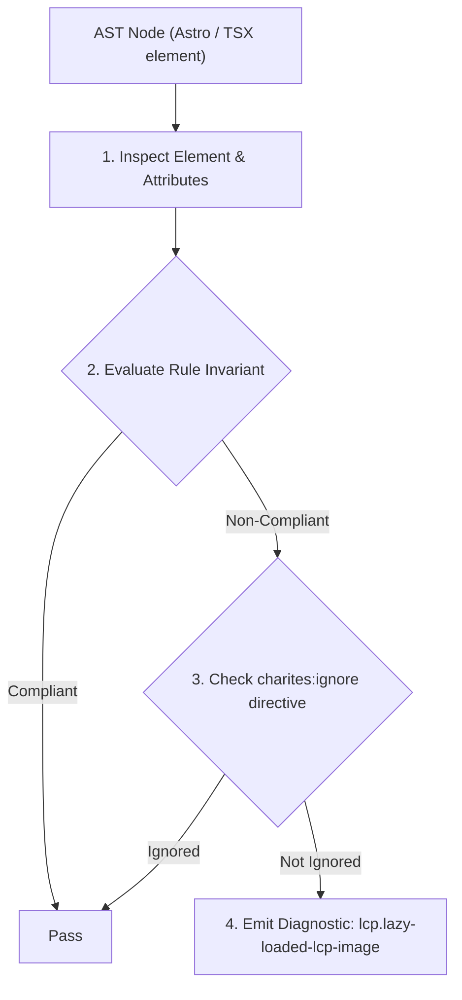
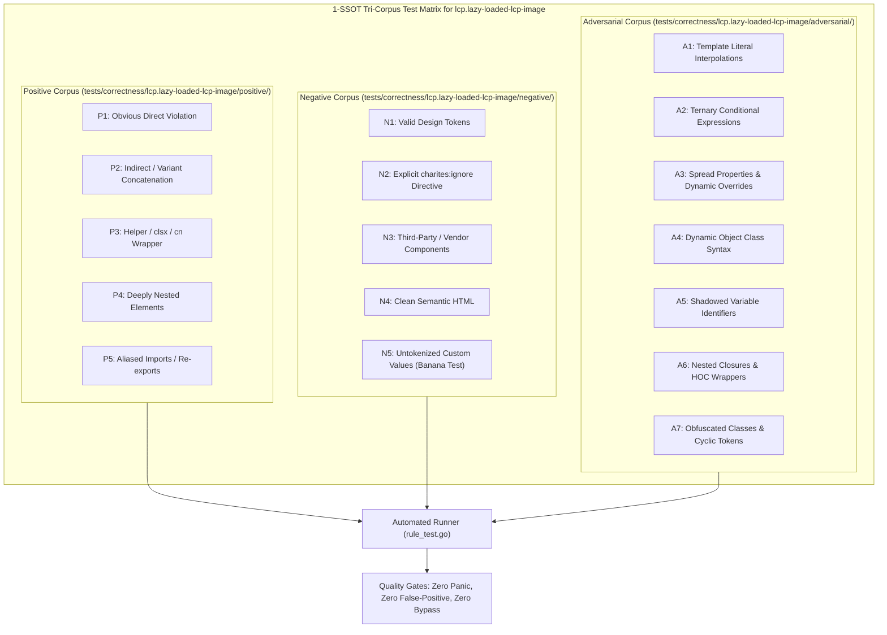

# lcp.lazy-loaded-lcp-image

> **Rule ID:** `lcp.lazy-loaded-lcp-image`
> **Severity:** `ERROR`
> **Category:** `lcp`
> **Target Standards:** Google Chrome Core Web Vitals (Largest Contentful Paint Resource Load Delay), HTML Living Standard Lazy Loading Specification, W3C Web Performance Working Group Invariants

---

## 1. Overview & Core Invariant

Critical above-the-fold LCP candidate image has loading="lazy", delaying resource discovery and load initiation

### Core Invariant:
> **"Above-the-fold LCP candidate images must not be configured with loading='lazy'; lazy loading defers image download until layout completion, directly adding hundreds of milliseconds to LCP."**

---
## 2. Technical Grounding & Engine Realities

When a browser encounters an '' with 'loading="lazy"', it deliberately pauses fetching the image resource until the page layout is calculated and the element is verified to be within or near the viewport.

For hero images and above-the-fold content that constitute the Largest Contentful Paint (LCP), this artificial pause wastes the initial network idle period. The browser speculative preload scanner is effectively blocked from fetching the hero asset early.

Removing 'loading="lazy"' or declaring 'loading="eager"' combined with 'fetchpriority="high"' allows the browser to initiate the network download immediately upon parsing the HTML token.

---
## 3. Vulnerability & Risk Taxonomy

| Risk Vector | Severity | Impact |
| :--- | :---: | :--- |
| **Resource Load Delay Inflation** | CRITICAL | Hero image download is postponed until stylesheet download, CSS parsing, and layout pass complete, adding 200ms-800ms to LCP. |
| **Speculative Preload Scanner Suppression** | HIGH | The browser's high-speed HTML lookahead parser skips downloading the hero asset during early stream processing. |

---
## 4. Non-Compliant Code Patterns (Bad Examples)
### TSX (Above-the-fold hero banner image configured with loading='lazy'):
```tsx
<section className="hero-section" data-perf-role="hero">
  <h1>Welcome to Our Platform</h1>
  
</section>
```

---
## 5. Compliant Implementation Patterns (Good Examples)
### TSX (Hero image configured with loading='eager' and high fetch priority):
```tsx
<section className="hero-section" data-perf-role="hero">
  <h1>Welcome to Our Platform</h1>
  
</section>
```

---

## 6. Detection & Verification Pipeline (How The Rule Evaluates Code)
This rule evaluates source code through the standard AST inspection pipeline:



### Step-by-Step Evaluation:
1. **AST Traversal:** Visits normalized `ir.Node` structures during AST streaming.
2. **Invariant Check:** Compares node attributes against rule invariants.
3. **Directive Suppression Check:** Honors inline `charites:ignore lcp.lazy-loaded-lcp-image` directives.
4. **Diagnostic Emission:** Emits compiler-grade diagnostic on invariant violation.

---

## 7. Verification & Test Harness (How The Test Works: 1-SSOT Tri-Corpus)

This rule is rigorously tested and validated across the canonical **1-SSOT Tri-Corpus** in `tests/correctness/lcp.lazy-loaded-lcp-image/`:



- **Positive Fixtures (P1-P5):** Verified to trigger diagnostics at exact lines and column spans.
- **Negative Fixtures (N1-N5):** Verified to produce zero diagnostics on valid tokens and legitimate exemptions.
- **Adversarial Fixtures (A1-A7):** Verified to prevent evasion across dynamic expressions, string interpolations, and cyclic references.

---

## 8. How to Suppress (Ignore Directives)

If this pattern is required for an intentional exception, suppress the diagnostic using the canonical Charites Rule ID:

```astro
<!-- charites:ignore lcp.lazy-loaded-lcp-image intentional exception -->
```

```tsx
// charites:ignore lcp.lazy-loaded-lcp-image intentional exception
```

---

## 9. Configuration Reference (`charites.yaml`)

```yaml
rules:
  lcp.lazy-loaded-lcp-image:
    severity: error # error | warn | info | off
```

