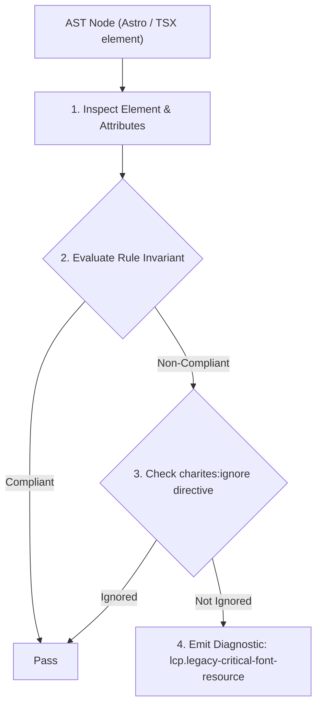
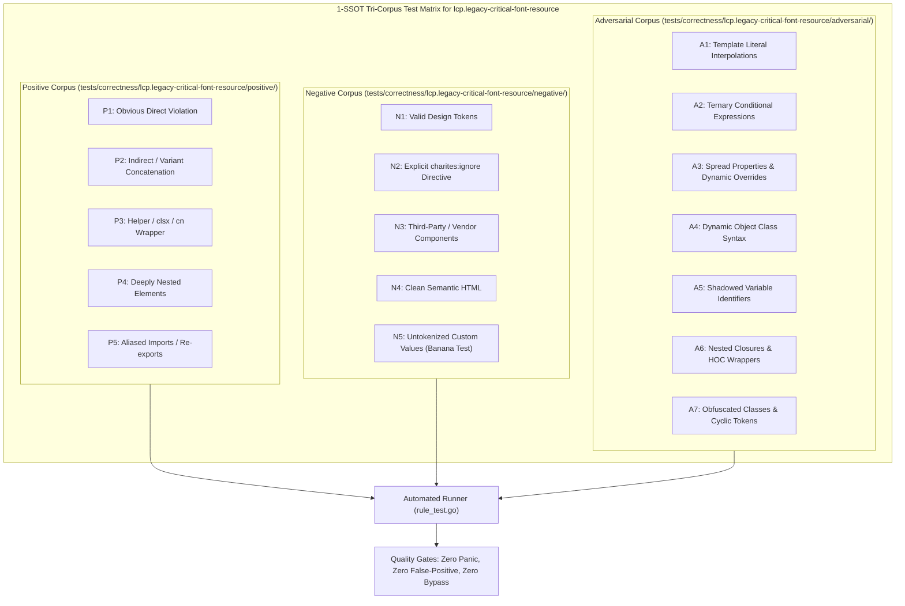

# lcp.legacy-critical-font-resource

> **Rule ID:** `lcp.legacy-critical-font-resource`
> **Severity:** `WARN`
> **Category:** `lcp`
> **Target Standards:** Google Chrome Core Web Vitals (Largest Contentful Paint Resource Load Duration), W3C WOFF File Format 2.0 (WOFF2) Recommendation, IETF Brotli Compressed Data Format Specification

---

## 1. Overview & Core Invariant

Custom '@font-face' declaration provides only legacy uncompressed font formats (.ttf, .otf, .eot) or deprioritizes WOFF2 in 'src:', inflating byte transfer payload

### Core Invariant:
> **"Custom @font-face declarations for web fonts must specify the modern WOFF2 format as the first item in the 'src' descriptor to maximize compression efficiency."**

---
## 2. Technical Grounding & Engine Realities

Legacy font formats such as raw TrueType (.ttf), OpenType (.otf), and Embedded OpenType (.eot) lack modern compression algorithms, resulting in file sizes ranging from 200KB to 800KB per font weight.

WOFF2 utilizes the Brotli compression algorithm, reducing font binary size by 50% to 80% compared to TTF/OTF and approximately 30% compared to WOFF 1.0 without loss of font hinting or OpenType layout features.

Browsers evaluate 'src' declarations in sequential order. Declaring WOFF2 first guarantees that modern browsers download the most compressed variant, accelerating the Resource Load Duration of LCP text elements.

---
## 3. Vulnerability & Risk Taxonomy

| Risk Vector | Severity | Impact |
| :--- | :---: | :--- |
| **Massive Font Transfer Payload** | HIGH | Downloading uncompressed 500KB+ TTF/OTF font files inflates Resource Load Duration on mobile networks. |
| **Bandwidth Competition with Hero Media** | MEDIUM | Bulky font files compete for socket bandwidth against hero images and critical CSS stylesheets during early page loading. |

---
## 4. Non-Compliant Code Patterns (Bad Examples)
### CSS (Font declaration only provides raw uncompressed TTF format):
```css
@font-face {
  font-family: 'HeadingDisplay';
  src: url('/fonts/heading.ttf') format('truetype');
  font-display: swap;
}
```

---
## 5. Compliant Implementation Patterns (Good Examples)
### CSS (WOFF2 declared as primary format with progressive TTF fallback):
```css
@font-face {
  font-family: 'HeadingDisplay';
  src: url('/fonts/heading.woff2') format('woff2'),
       url('/fonts/heading.ttf') format('truetype');
  font-display: swap;
}
```

---

## 6. Detection & Verification Pipeline (How The Rule Evaluates Code)
This rule evaluates source code through the standard AST inspection pipeline:



### Step-by-Step Evaluation:
1. **AST Traversal:** Visits normalized `ir.Node` structures during AST streaming.
2. **Invariant Check:** Compares node attributes against rule invariants.
3. **Directive Suppression Check:** Honors inline `charites:ignore lcp.legacy-critical-font-resource` directives.
4. **Diagnostic Emission:** Emits compiler-grade diagnostic on invariant violation.

---

## 7. Verification & Test Harness (How The Test Works: 1-SSOT Tri-Corpus)

This rule is rigorously tested and validated across the canonical **1-SSOT Tri-Corpus** in `tests/correctness/lcp.legacy-critical-font-resource/`:



- **Positive Fixtures (P1-P5):** Verified to trigger diagnostics at exact lines and column spans.
- **Negative Fixtures (N1-N5):** Verified to produce zero diagnostics on valid tokens and legitimate exemptions.
- **Adversarial Fixtures (A1-A7):** Verified to prevent evasion across dynamic expressions, string interpolations, and cyclic references.

---

## 8. How to Suppress (Ignore Directives)

If this pattern is required for an intentional exception, suppress the diagnostic using the canonical Charites Rule ID:

```astro
<!-- charites:ignore lcp.legacy-critical-font-resource intentional exception -->
```

```tsx
// charites:ignore lcp.legacy-critical-font-resource intentional exception
```

---

## 9. Configuration Reference (`charites.yaml`)

```yaml
rules:
  lcp.legacy-critical-font-resource:
    severity: warn # error | warn | info | off
```

