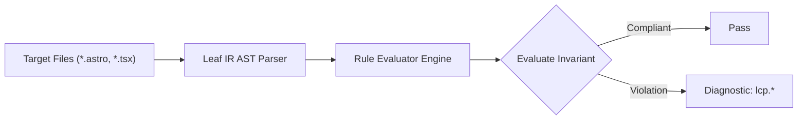

# Lcp Rules (`lcp`)

The `lcp` category contains static analysis rules for code quality, architectural constraints, and design system governance.

---

## Category Rule Index

| Rule ID | Severity | Summary | Full Specification | Status |
| :--- | :---: | :--- | :--- | :---: |
| `lcp.blocked-critical-font` | `WARN` | Custom '@font-face' declaration lacks 'font-display: swap' or 'font-display: optional', risking FOIT (Flash of Invisible Text) and delaying LCP text paint | [`lcp.blocked-critical-font`](lcp.blocked-critical-font) | `enabled` |
| `lcp.client-only-lcp-content` | `WARN` | Above-the-fold hero island declared with 'client:only' without an SSR fallback slot, eliminating server HTML and delaying LCP until client-side bundle execution | [`lcp.client-only-lcp-content`](lcp.client-only-lcp-content) | `enabled` |
| `lcp.critical-head-style-bloat` | `WARN` | Inline '<style>' in '<head>' contains non-critical CSS selectors (footer, modal, dialog), inflating initial HTML payload and delaying LCP paint | [`lcp.critical-head-style-bloat`](lcp.critical-head-style-bloat) | `enabled` |
| `lcp.external-font-discovery-delay` | `WARN` | External font stylesheet loaded without '<link rel="preconnect">' hints, adding 200ms-400ms connection handshake latency to LCP font discovery | [`lcp.external-font-discovery-delay`](lcp.external-font-discovery-delay) | `enabled` |
| `lcp.heavy-raster-lcp-asset` | `WARN` | LCP candidate image uses legacy uncompressed raster format (.png, .bmp, .tiff, .gif); modern formats like WebP or AVIF should be served to reduce transfer size | [`lcp.heavy-raster-lcp-asset`](lcp.heavy-raster-lcp-asset) | `enabled` |
| `lcp.image-source-density-mismatch` | `INFO` | Fixed-dimension LCP candidate image lacks aligned '1x, 2x' pixel density descriptors in 'srcset', risking blurry rendering or unoptimized asset delivery on high-DPI screens | [`lcp.image-source-density-mismatch`](lcp.image-source-density-mismatch) | `enabled` |
| `lcp.lazy-loaded-lcp-image` | `ERROR` | Critical above-the-fold LCP candidate image has loading="lazy", delaying resource discovery and load initiation | [`lcp.lazy-loaded-lcp-image`](lcp.lazy-loaded-lcp-image) | `enabled` |
| `lcp.lcp-content-visibility-suppression` | `ERROR` | Above-the-fold hero container specifies 'content-visibility: auto' or 'content-auto', suppressing initial paint and severely inflating LCP | [`lcp.lcp-content-visibility-suppression`](lcp.lcp-content-visibility-suppression) | `enabled` |
| `lcp.legacy-critical-font-resource` | `WARN` | Custom '@font-face' declaration provides only legacy uncompressed font formats (.ttf, .otf, .eot) or deprioritizes WOFF2 in 'src:', inflating byte transfer payload | [`lcp.legacy-critical-font-resource`](lcp.legacy-critical-font-resource) | `enabled` |
| `lcp.missing-critical-origin-hint` | `INFO` | Critical LCP visual asset loaded from third-party CDN origin without '<link rel="preconnect">' connection hint in '<head>' | [`lcp.missing-critical-origin-hint`](lcp.missing-critical-origin-hint) | `enabled` |
| `lcp.missing-lcp-image-preload` | `INFO` | Delayed-discovery LCP image lacks <link rel="preload" as="image"> in document head to initiate early asset transfer | [`lcp.missing-lcp-image-preload`](lcp.missing-lcp-image-preload) | `enabled` |
| `lcp.oversized-lcp-resource-selection` | `WARN` | Fluid responsive LCP candidate image lacks responsive 'srcset' and 'sizes' attributes, forcing mobile viewports to download oversized desktop assets | [`lcp.oversized-lcp-resource-selection`](lcp.oversized-lcp-resource-selection) | `enabled` |
| `lcp.preload-font-cors-mismatch` | `ERROR` | Font preload '<link rel="preload" as="font">' lacks 'crossorigin' attribute, triggering browser cache discard and double network downloads | [`lcp.preload-font-cors-mismatch`](lcp.preload-font-cors-mismatch) | `enabled` |
| `lcp.render-blocking-head-script` | `WARN` | External script in '<head>' without 'defer', 'async', or 'type="module"' synchronously blocks HTML parser and delays LCP candidate paint | [`lcp.render-blocking-head-script`](lcp.render-blocking-head-script) | `enabled` |
| `lcp.undiscoverable-lcp-image` | `WARN` | Above-the-fold hero container loads primary image via CSS background without <link rel="preload"> in document head | [`lcp.undiscoverable-lcp-image`](lcp.undiscoverable-lcp-image) | `enabled` |
| `lcp.unhinted-lcp-image-priority` | `WARN` | Above-the-fold LCP candidate image lacks fetchpriority="high", delaying bandwidth allocation in early network stream | [`lcp.unhinted-lcp-image-priority`](lcp.unhinted-lcp-image-priority) | `enabled` |

---
## How the Lcp Analysis Pipeline Works

The `lcp` engine applies static analysis checks against component source code:

### Pipeline Flow:
1. **AST Node Traversal:** Scans target template files into normalized intermediate representation.
2. **Invariant Assertion:** Validates structural and semantic invariants.
3. **Diagnostic Reporting:** Emits structured diagnostics for non-compliant patterns.

---

## How Lcp Tests Work (Verification Harness)

All rules in `lcp` are verified using the canonical 1-SSOT Tri-Corpus (`tests/correctness/lcp.*/`) encompassing Positive (P1-P5), Negative (N1-N5), and Adversarial (A1-A7) fixture matrices.
