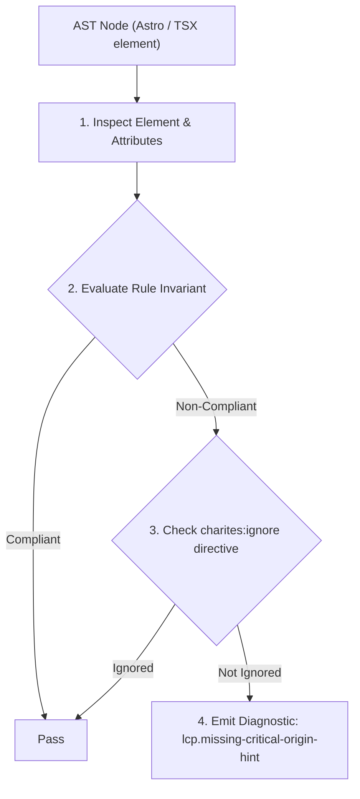
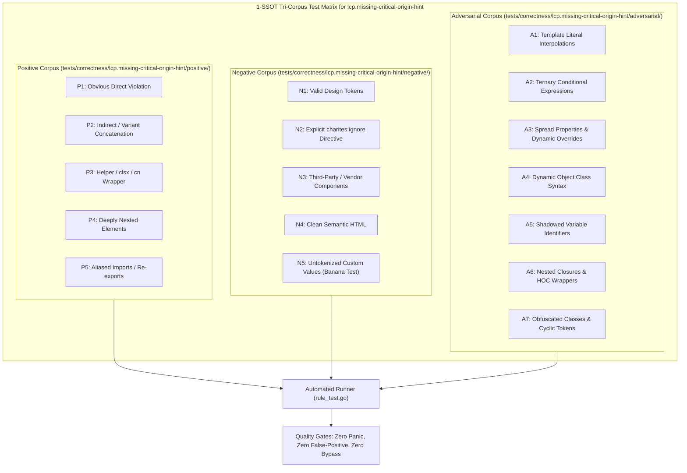

# lcp.missing-critical-origin-hint

> **Rule ID:** `lcp.missing-critical-origin-hint`
> **Severity:** `INFO`
> **Category:** `lcp`
> **Target Standards:** Google Chrome Core Web Vitals (Largest Contentful Paint Resource Load Delay), W3C Resource Hints (preconnect and dns-prefetch specification), Web Performance Working Group Network Socket Pre-warming Guidelines

---

## 1. Overview & Core Invariant

Critical LCP visual asset loaded from third-party CDN origin without '<link rel="preconnect">' connection hint in '<head>'

### Core Invariant:
> **"Critical visual LCP assets hosted on external cross-origin domains should have an early '<link rel="preconnect">' hint in '<head>' to eliminate DNS, TCP, and TLS socket handshake round-trips."**

---
## 2. Technical Grounding & Engine Realities

When an above-the-fold hero image is loaded from a third-party domain (e.g. 'images.unsplash.com', 'cdn.shopify.com', or 'res.cloudinary.com'), the browser cannot initiate the network connection until the `` tag is discovered and parsed.

Establishing a new HTTPS connection to an external origin requires three sequential round-trips: DNS resolution, TCP three-way handshake, and TLS cryptographic negotiation, adding 150ms to 400ms of idle latency on cellular connections.

Declaring `<link rel="preconnect" href="https://images.unsplash.com" />` in `<head>` instructs the browser to open the socket in the background during early HTML document streaming.

---
## 3. Vulnerability & Risk Taxonomy

| Risk Vector | Severity | Impact |
| :--- | :---: | :--- |
| **Connection Handshake Latency Spike** | MEDIUM | Adds 150ms-400ms of socket negotiation delay to LCP Resource Load Delay before image bytes start streaming. |
| **Cellular Round-Trip Time Penalty** | LOW | Multi-RTT connection setup noticeably degrades mobile performance metrics in emerging market networks. |

---
## 4. Non-Compliant Code Patterns (Bad Examples)
### HTML (Critical hero image loaded from external CDN without preconnect hint in head):
```html
<head>
  <title>Product Showcase</title>
</head>
<body>
  
</body>
```

---
## 5. Compliant Implementation Patterns (Good Examples)
### HTML (Preconnect hint declared in head to pre-warm CDN connection sockets early):
```html
<head>
  <title>Product Showcase</title>
  <link rel="preconnect" href="https://images.unsplash.com" />
</head>
<body>
  
</body>
```

---

## 6. Detection & Verification Pipeline (How The Rule Evaluates Code)
This rule evaluates source code through the standard AST inspection pipeline:



### Step-by-Step Evaluation:
1. **AST Traversal:** Visits normalized `ir.Node` structures during AST streaming.
2. **Invariant Check:** Compares node attributes against rule invariants.
3. **Directive Suppression Check:** Honors inline `charites:ignore lcp.missing-critical-origin-hint` directives.
4. **Diagnostic Emission:** Emits compiler-grade diagnostic on invariant violation.

---

## 7. Verification & Test Harness (How The Test Works: 1-SSOT Tri-Corpus)

This rule is rigorously tested and validated across the canonical **1-SSOT Tri-Corpus** in `tests/correctness/lcp.missing-critical-origin-hint/`:



- **Positive Fixtures (P1-P5):** Verified to trigger diagnostics at exact lines and column spans.
- **Negative Fixtures (N1-N5):** Verified to produce zero diagnostics on valid tokens and legitimate exemptions.
- **Adversarial Fixtures (A1-A7):** Verified to prevent evasion across dynamic expressions, string interpolations, and cyclic references.

---

## 8. How to Suppress (Ignore Directives)

If this pattern is required for an intentional exception, suppress the diagnostic using the canonical Charites Rule ID:

```astro
<!-- charites:ignore lcp.missing-critical-origin-hint intentional exception -->
```

```tsx
// charites:ignore lcp.missing-critical-origin-hint intentional exception
```

---

## 9. Configuration Reference (`charites.yaml`)

```yaml
rules:
  lcp.missing-critical-origin-hint:
    severity: info # error | warn | info | off
```

