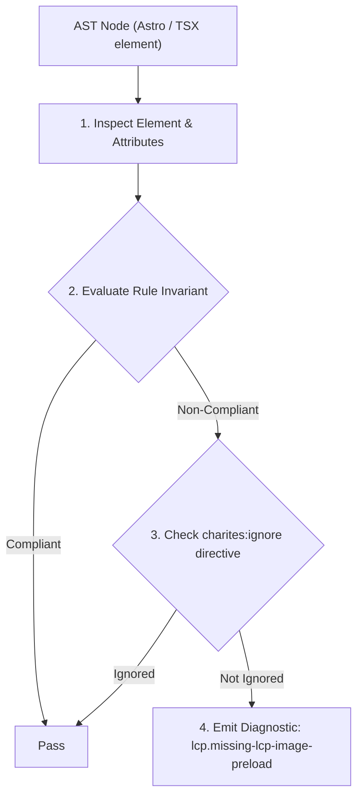
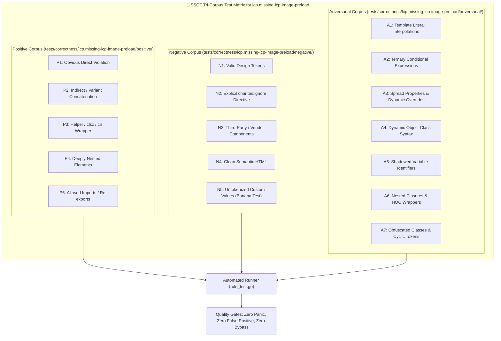

# lcp.missing-lcp-image-preload

> **Rule ID:** `lcp.missing-lcp-image-preload`
> **Severity:** `INFO`
> **Category:** `lcp`
> **Target Standards:** Google Chrome Core Web Vitals (Largest Contentful Paint Resource Load Delay), W3C Preload Specification (<link rel="preload" as="image">), Document Layout Graph & Early Resource Discovery Optimization

---

## 1. Overview & Core Invariant

Delayed-discovery LCP image lacks <link rel="preload" as="image"> in document head to initiate early asset transfer

### Core Invariant:
> **"LCP candidate media elements that suffer delayed discovery (dynamic data attributes, client script hydration, or CSS backgrounds) should be preloaded in '<head>' with 'fetchpriority="high"'."**

---
## 2. Technical Grounding & Engine Realities

When an LCP image cannot be immediately parsed from a direct '' element in the server-rendered HTML stream (for example, when its URL is stored in a dynamic data attribute 'data-bg-src', rendered by a client island, or defined via CSS background), its network fetch is delayed.

Injecting '<link rel="preload" as="image" href="..." fetchpriority="high">' inside '<head>' compensates for this discovery delay by instructing the browser lookahead scanner to initiate connection and download immediately during initial document streaming.

---
## 3. Vulnerability & Risk Taxonomy

| Risk Vector | Severity | Impact |
| :--- | :---: | :--- |
| **Delayed Resource Discovery** | MEDIUM | Image download is postponed until JavaScript hydration or style resolution finishes, inflating LCP. |
| **Initial Viewport Flash** | LOW | Late arrival of visual hero media causes prolonged empty or placeholder hero appearance. |

---
## 4. Non-Compliant Code Patterns (Bad Examples)
### ASTRO (Hero container with dynamic data-bg-src without preload in document head):
```astro
<head>
  <title>Product Gallery</title>
</head>
<body>
  <div id="hero-root" data-perf-role="hero" data-bg-src="https://cdn.example.com/promo.webp"></div>
</body>
```

---
## 5. Compliant Implementation Patterns (Good Examples)
### ASTRO (Document head preloading the hero image asset with high fetch priority):
```astro
<head>
  <title>Product Gallery</title>
  <link rel="preload" as="image" href="https://cdn.example.com/promo.webp" fetchpriority="high" />
</head>
<body>
  <div id="hero-root" data-perf-role="hero" data-bg-src="https://cdn.example.com/promo.webp"></div>
</body>
```

---

## 6. Detection & Verification Pipeline (How The Rule Evaluates Code)
This rule evaluates source code through the standard AST inspection pipeline:



### Step-by-Step Evaluation:
1. **AST Traversal:** Visits normalized `ir.Node` structures during AST streaming.
2. **Invariant Check:** Compares node attributes against rule invariants.
3. **Directive Suppression Check:** Honors inline `charites:ignore lcp.missing-lcp-image-preload` directives.
4. **Diagnostic Emission:** Emits compiler-grade diagnostic on invariant violation.

---

## 7. Verification & Test Harness (How The Test Works: 1-SSOT Tri-Corpus)

This rule is rigorously tested and validated across the canonical **1-SSOT Tri-Corpus** in `tests/correctness/lcp.missing-lcp-image-preload/`:



- **Positive Fixtures (P1-P5):** Verified to trigger diagnostics at exact lines and column spans.
- **Negative Fixtures (N1-N5):** Verified to produce zero diagnostics on valid tokens and legitimate exemptions.
- **Adversarial Fixtures (A1-A7):** Verified to prevent evasion across dynamic expressions, string interpolations, and cyclic references.

---

## 8. How to Suppress (Ignore Directives)

If this pattern is required for an intentional exception, suppress the diagnostic using the canonical Charites Rule ID:

```astro
<!-- charites:ignore lcp.missing-lcp-image-preload intentional exception -->
```

```tsx
// charites:ignore lcp.missing-lcp-image-preload intentional exception
```

---

## 9. Configuration Reference (`charites.yaml`)

```yaml
rules:
  lcp.missing-lcp-image-preload:
    severity: info # error | warn | info | off
```

