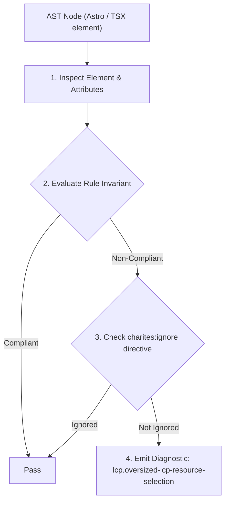
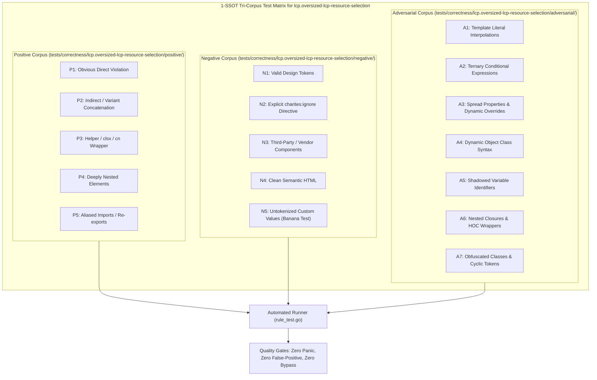

# lcp.oversized-lcp-resource-selection

> **Rule ID:** `lcp.oversized-lcp-resource-selection`
> **Severity:** `WARN`
> **Category:** `lcp`
> **Target Standards:** Google Chrome Core Web Vitals (Largest Contentful Paint Resource Load Duration), Responsive Images Community Group (RICG) Responsive Images Specification, HTML Living Standard srcset and sizes Attributes Specification

---

## 1. Overview & Core Invariant

Fluid responsive LCP candidate image lacks responsive 'srcset' and 'sizes' attributes, forcing mobile viewports to download oversized desktop assets

### Core Invariant:
> **"Fluid responsive LCP candidate images must provide responsive 'srcset' with width descriptors and a 'sizes' attribute to prevent mobile devices from downloading oversized desktop assets."**

---
## 2. Technical Grounding & Engine Realities

When a fluid image (such as a full-width hero banner) only specifies a single large 'src' attribute, mobile devices with small viewports are forced to download the same high-resolution asset designed for 4K desktop screens.

This unnecessary byte payload directly prolongs the Resource Load Duration component of LCP over cellular networks.

By providing a 'srcset' attribute with width descriptors (e.g. '400w, 800w, 1200w') alongside a matching 'sizes' attribute (or using the '<Image />' component from 'astro:assets'), the browser can accurately select the optimal image variant for the user's viewport and device pixel ratio.

---
## 3. Vulnerability & Risk Taxonomy

| Risk Vector | Severity | Impact |
| :--- | :---: | :--- |
| **Resource Load Duration Bloat** | HIGH | Mobile devices download 2MB-5MB desktop-resolution assets over cellular connections, adding 500ms-2500ms to LCP. |
| **Excess Mobile Data Consumption** | MEDIUM | Users on metered cellular data plans consume excessive bandwidth downloading unneeded pixels. |

---
## 4. Non-Compliant Code Patterns (Bad Examples)
### TSX (Fluid hero image only provides a single massive desktop asset without srcset and sizes):
```tsx
<section className="hero-section" data-perf-role="hero">
  
</section>
```

---
## 5. Compliant Implementation Patterns (Good Examples)
### TSX (Fluid hero image configured with responsive srcset width descriptors and sizes attribute):
```tsx
<section className="hero-section" data-perf-role="hero">
  
</section>
```

---

## 6. Detection & Verification Pipeline (How The Rule Evaluates Code)
This rule evaluates source code through the standard AST inspection pipeline:



### Step-by-Step Evaluation:
1. **AST Traversal:** Visits normalized `ir.Node` structures during AST streaming.
2. **Invariant Check:** Compares node attributes against rule invariants.
3. **Directive Suppression Check:** Honors inline `charites:ignore lcp.oversized-lcp-resource-selection` directives.
4. **Diagnostic Emission:** Emits compiler-grade diagnostic on invariant violation.

---

## 7. Verification & Test Harness (How The Test Works: 1-SSOT Tri-Corpus)

This rule is rigorously tested and validated across the canonical **1-SSOT Tri-Corpus** in `tests/correctness/lcp.oversized-lcp-resource-selection/`:



- **Positive Fixtures (P1-P5):** Verified to trigger diagnostics at exact lines and column spans.
- **Negative Fixtures (N1-N5):** Verified to produce zero diagnostics on valid tokens and legitimate exemptions.
- **Adversarial Fixtures (A1-A7):** Verified to prevent evasion across dynamic expressions, string interpolations, and cyclic references.

---

## 8. How to Suppress (Ignore Directives)

If this pattern is required for an intentional exception, suppress the diagnostic using the canonical Charites Rule ID:

```astro
<!-- charites:ignore lcp.oversized-lcp-resource-selection intentional exception -->
```

```tsx
// charites:ignore lcp.oversized-lcp-resource-selection intentional exception
```

---

## 9. Configuration Reference (`charites.yaml`)

```yaml
rules:
  lcp.oversized-lcp-resource-selection:
    severity: warn # error | warn | info | off
```

