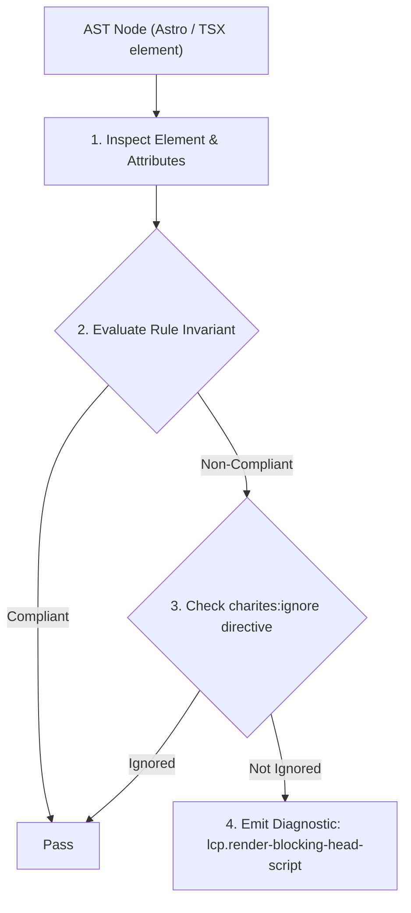
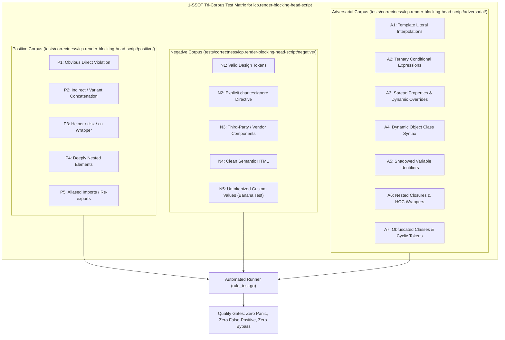

# lcp.render-blocking-head-script

> **Rule ID:** `lcp.render-blocking-head-script`
> **Severity:** `WARN`
> **Category:** `lcp`
> **Target Standards:** Google Chrome Core Web Vitals (Largest Contentful Paint Element Render Delay), HTML Living Standard (The script element & parser-blocking execution pipeline), W3C Web Performance Working Group Critical Path Minimization Guidelines

---

## 1. Overview & Core Invariant

External script in '<head>' without 'defer', 'async', or 'type="module"' synchronously blocks HTML parser and delays LCP candidate paint

### Core Invariant:
> **"External scripts declared in the document '<head>' must specify 'defer', 'async', or 'type="module"' to prevent halting HTML tokenization and per-frame rendering before the LCP candidate is displayed."**

---
## 2. Technical Grounding & Engine Realities

When the browser HTML parser encounters a synchronous `<script src="...">` tag in the `<head>`, it must halt DOM construction, initiate a TCP/TLS connection to the script origin, download the JavaScript payload, and execute it before resuming document rendering.

In Astro, standard `<script>` tags are automatically processed by the bundler into deferred ES modules. However, external scripts tagged with `is:inline` or raw `<script src>` tags in document layouts bypass bundling and execute synchronously.

Adding 'defer' or 'type="module"' allows the browser to download the script in parallel in the background while continuing HTML parsing and per-frame rendering of the hero LCP element.

---
## 3. Vulnerability & Risk Taxonomy

| Risk Vector | Severity | Impact |
| :--- | :---: | :--- |
| **Synchronous HTML Parser Halting** | HIGH | Halts DOM construction and suppresses layout passes, directly inflating LCP Element Render Delay by the full script network latency. |
| **Head-of-Line Network Contention** | MEDIUM | Competes with critical hero media and external stylesheets for initial HTTP connection bandwidth. |

---
## 4. Non-Compliant Code Patterns (Bad Examples)
### ASTRO (Synchronous external inline script blocking HTML parsing in document head):
```astro
<head>
  <script is:inline src="https://analytics.example.com/tracker.js"></script>
</head>
```

---
## 5. Compliant Implementation Patterns (Good Examples)
### ASTRO (External inline script deferred to allow non-blocking HTML parsing):
```astro
<head>
  <script is:inline src="https://analytics.example.com/tracker.js" defer></script>
</head>
```

---

## 6. Detection & Verification Pipeline (How The Rule Evaluates Code)
This rule evaluates source code through the standard AST inspection pipeline:



### Step-by-Step Evaluation:
1. **AST Traversal:** Visits normalized `ir.Node` structures during AST streaming.
2. **Invariant Check:** Compares node attributes against rule invariants.
3. **Directive Suppression Check:** Honors inline `charites:ignore lcp.render-blocking-head-script` directives.
4. **Diagnostic Emission:** Emits compiler-grade diagnostic on invariant violation.

---

## 7. Verification & Test Harness (How The Test Works: 1-SSOT Tri-Corpus)

This rule is rigorously tested and validated across the canonical **1-SSOT Tri-Corpus** in `tests/correctness/lcp.render-blocking-head-script/`:



- **Positive Fixtures (P1-P5):** Verified to trigger diagnostics at exact lines and column spans.
- **Negative Fixtures (N1-N5):** Verified to produce zero diagnostics on valid tokens and legitimate exemptions.
- **Adversarial Fixtures (A1-A7):** Verified to prevent evasion across dynamic expressions, string interpolations, and cyclic references.

---

## 8. How to Suppress (Ignore Directives)

If this pattern is required for an intentional exception, suppress the diagnostic using the canonical Charites Rule ID:

```astro
<!-- charites:ignore lcp.render-blocking-head-script intentional exception -->
```

```tsx
// charites:ignore lcp.render-blocking-head-script intentional exception
```

---

## 9. Configuration Reference (`charites.yaml`)

```yaml
rules:
  lcp.render-blocking-head-script:
    severity: warn # error | warn | info | off
```

