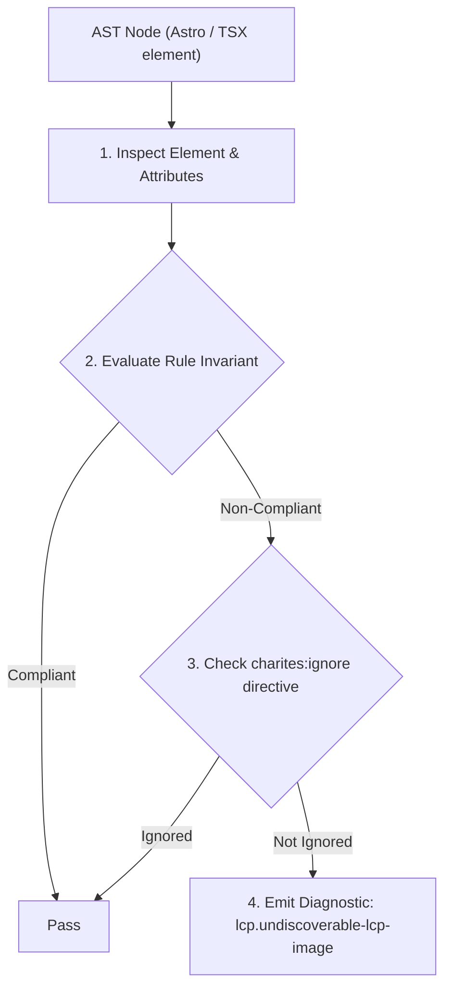
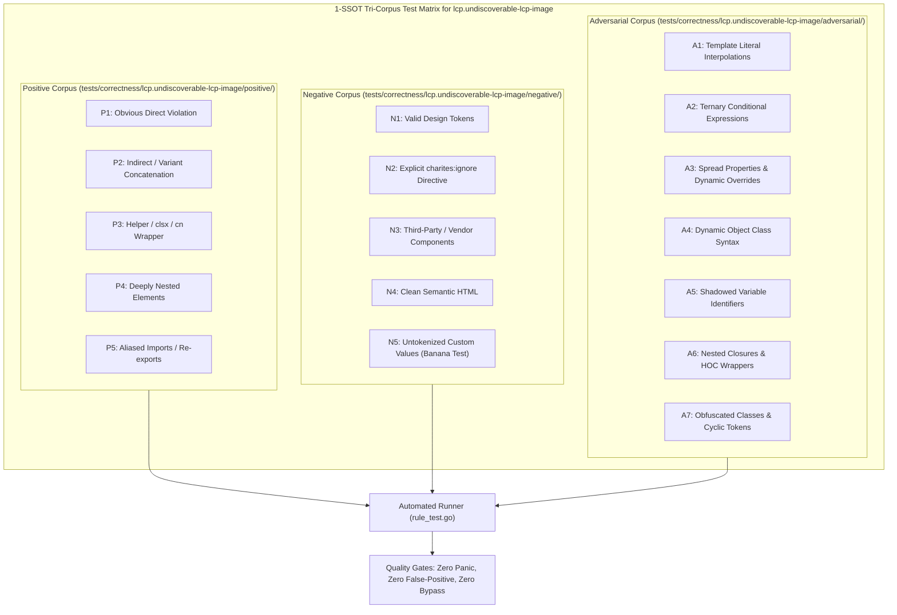

# lcp.undiscoverable-lcp-image

> **Rule ID:** `lcp.undiscoverable-lcp-image`
> **Severity:** `WARN`
> **Category:** `lcp`
> **Target Standards:** Google Chrome Core Web Vitals (Largest Contentful Paint Resource Load Delay), Chromium Speculative Preload Scanner Discovery Architecture, W3C Preload Specification (<link rel="preload" as="image">)

---

## 1. Overview & Core Invariant

Above-the-fold hero container loads primary image via CSS background without <link rel="preload"> in document head

### Core Invariant:
> **"Hero visual assets must not be embedded exclusively via CSS background-image without a corresponding '<link rel="preload">' in '<head>'; CSS-based images are undiscoverable by the HTML preload scanner."**

---
## 2. Technical Grounding & Engine Realities

When an image is referenced inside CSS ('background-image: url(...)' or Tailwind 'bg-[url(...)]'), the browser's speculative preload scanner cannot discover the asset URL while streaming the HTML.

The browser must first download all render-blocking CSS, parse the cascade, and run the style computation step before it even learns that the image URL exists. This creates massive Resource Load Delay for LCP.

Migrating the visual background to a native '' element (e.g. with 'absolute inset-0 w-full h-full object-cover -z-10') makes it immediately discoverable in HTML. If CSS background is necessary, injecting '<link rel="preload" as="image" href="..." fetchpriority="high">' into '<head>' bridges the discovery gap.

---
## 3. Vulnerability & Risk Taxonomy

| Risk Vector | Severity | Impact |
| :--- | :---: | :--- |
| **CSS Cascade Dependency Block** | HIGH | Hero image discovery is delayed until external CSS stylesheets are downloaded and parsed, adding 300ms-1000ms to LCP. |
| **Speculative Scanner Blindness** | HIGH | Lookahead scanner cannot prefetch the LCP asset during initial document TCP streaming. |

---
## 4. Non-Compliant Code Patterns (Bad Examples)
### TSX (Hero container using CSS background-image without head preload):
```tsx
<header className="w-full h-[480px] bg-[url('/hero.webp')] bg-cover" data-perf-role="hero">
  <h1 className="text-white">Galactic Exploration</h1>
</header>
```

---
## 5. Compliant Implementation Patterns (Good Examples)
### TSX (Native  with object-cover immediately discoverable by preload scanner):
```tsx
<header className="relative w-full h-[480px] overflow-hidden" data-perf-role="hero">
  
  <h1 className="relative z-10 text-white p-8">Galactic Exploration</h1>
</header>
```

---

## 6. Detection & Verification Pipeline (How The Rule Evaluates Code)
This rule evaluates source code through the standard AST inspection pipeline:



### Step-by-Step Evaluation:
1. **AST Traversal:** Visits normalized `ir.Node` structures during AST streaming.
2. **Invariant Check:** Compares node attributes against rule invariants.
3. **Directive Suppression Check:** Honors inline `charites:ignore lcp.undiscoverable-lcp-image` directives.
4. **Diagnostic Emission:** Emits compiler-grade diagnostic on invariant violation.

---

## 7. Verification & Test Harness (How The Test Works: 1-SSOT Tri-Corpus)

This rule is rigorously tested and validated across the canonical **1-SSOT Tri-Corpus** in `tests/correctness/lcp.undiscoverable-lcp-image/`:



- **Positive Fixtures (P1-P5):** Verified to trigger diagnostics at exact lines and column spans.
- **Negative Fixtures (N1-N5):** Verified to produce zero diagnostics on valid tokens and legitimate exemptions.
- **Adversarial Fixtures (A1-A7):** Verified to prevent evasion across dynamic expressions, string interpolations, and cyclic references.

---

## 8. How to Suppress (Ignore Directives)

If this pattern is required for an intentional exception, suppress the diagnostic using the canonical Charites Rule ID:

```astro
<!-- charites:ignore lcp.undiscoverable-lcp-image intentional exception -->
```

```tsx
// charites:ignore lcp.undiscoverable-lcp-image intentional exception
```

---

## 9. Configuration Reference (`charites.yaml`)

```yaml
rules:
  lcp.undiscoverable-lcp-image:
    severity: warn # error | warn | info | off
```

