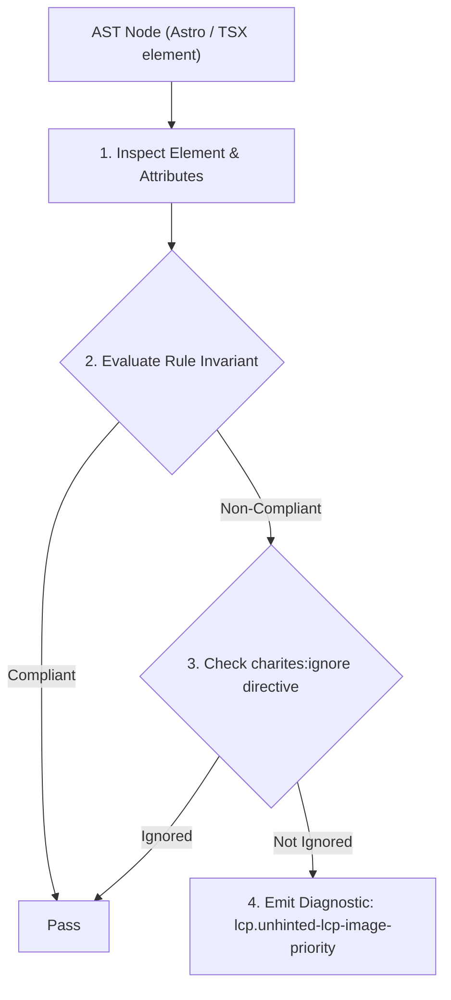
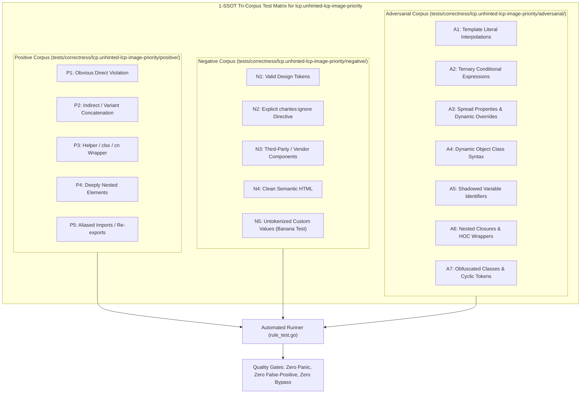

# lcp.unhinted-lcp-image-priority

> **Rule ID:** `lcp.unhinted-lcp-image-priority`
> **Severity:** `WARN`
> **Category:** `lcp`
> **Target Standards:** Google Chrome Core Web Vitals (Largest Contentful Paint Resource Load Delay), W3C Priority Hints Specification (fetchpriority attribute), Chrome Preload Scanner Network Bandwidth Scheduling

---

## 1. Overview & Core Invariant

Above-the-fold LCP candidate image lacks fetchpriority="high", delaying bandwidth allocation in early network stream

### Core Invariant:
> **"Above-the-fold LCP candidate images must declare 'fetchpriority="high"' to prioritize early network bandwidth ahead of non-critical stylesheets and scripts."**

---
## 2. Technical Grounding & Engine Realities

By default, browsers assign an initial fetch priority of 'Low' to image resources discovered in the HTML stream.

For the primary hero image (the LCP element), this default low priority forces the image download to compete with or yield to lower-priority scripts, stylesheets, and fonts.

Declaring 'fetchpriority="high"' instructs the speculative preload scanner to immediately elevate the resource to the highest network tier, initiating the TCP/TLS transfer with maximum allocated bandwidth.

---
## 3. Vulnerability & Risk Taxonomy

| Risk Vector | Severity | Impact |
| :--- | :---: | :--- |
| **Bandwidth Starvation by Non-Critical Assets** | HIGH | Hero image bytes are delayed behind non-critical deferred scripts and fonts, inflating LCP by 150ms-400ms. |
| **Sub-optimal Browser Network Scheduling** | MEDIUM | Browsers under HTTP/2 or HTTP/3 multiplexing prioritize other resources unless explicitly hinted. |

---
## 4. Non-Compliant Code Patterns (Bad Examples)
### TSX (Above-the-fold hero banner image lacking priority hint):
```tsx
<header className="hero-banner" data-perf-role="hero">
  
</header>
```

---
## 5. Compliant Implementation Patterns (Good Examples)
### TSX (Hero image explicitly prioritized with fetchpriority='high'):
```tsx
<header className="hero-banner" data-perf-role="hero">
  
</header>
```

---

## 6. Detection & Verification Pipeline (How The Rule Evaluates Code)
This rule evaluates source code through the standard AST inspection pipeline:



### Step-by-Step Evaluation:
1. **AST Traversal:** Visits normalized `ir.Node` structures during AST streaming.
2. **Invariant Check:** Compares node attributes against rule invariants.
3. **Directive Suppression Check:** Honors inline `charites:ignore lcp.unhinted-lcp-image-priority` directives.
4. **Diagnostic Emission:** Emits compiler-grade diagnostic on invariant violation.

---

## 7. Verification & Test Harness (How The Test Works: 1-SSOT Tri-Corpus)

This rule is rigorously tested and validated across the canonical **1-SSOT Tri-Corpus** in `tests/correctness/lcp.unhinted-lcp-image-priority/`:



- **Positive Fixtures (P1-P5):** Verified to trigger diagnostics at exact lines and column spans.
- **Negative Fixtures (N1-N5):** Verified to produce zero diagnostics on valid tokens and legitimate exemptions.
- **Adversarial Fixtures (A1-A7):** Verified to prevent evasion across dynamic expressions, string interpolations, and cyclic references.

---

## 8. How to Suppress (Ignore Directives)

If this pattern is required for an intentional exception, suppress the diagnostic using the canonical Charites Rule ID:

```astro
<!-- charites:ignore lcp.unhinted-lcp-image-priority intentional exception -->
```

```tsx
// charites:ignore lcp.unhinted-lcp-image-priority intentional exception
```

---

## 9. Configuration Reference (`charites.yaml`)

```yaml
rules:
  lcp.unhinted-lcp-image-priority:
    severity: warn # error | warn | info | off
```

