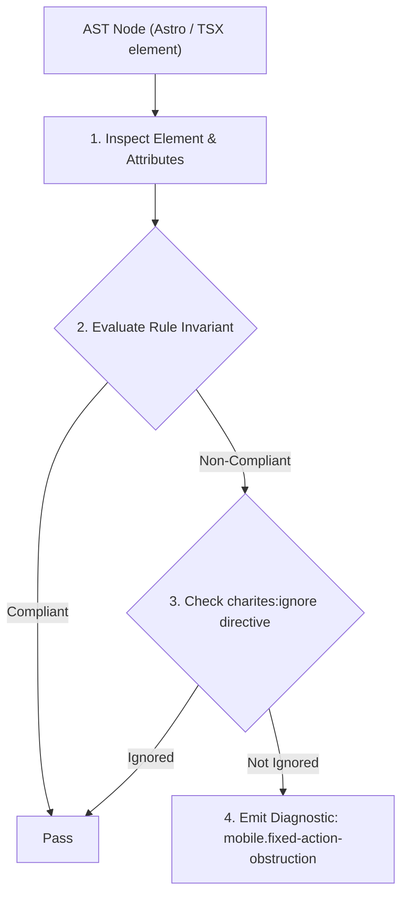
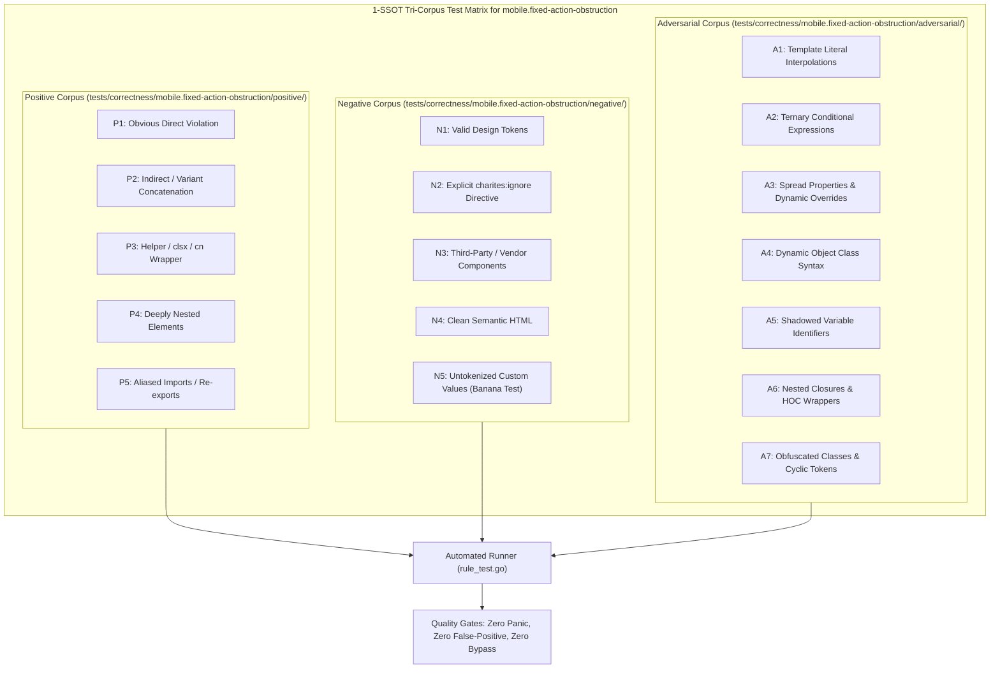

# mobile.fixed-action-obstruction

> **Rule ID:** `mobile.fixed-action-obstruction`
> **Severity:** `WARN`
> **Category:** `mobile`
> **Target Standards:** Apple Human Interface Guidelines (Bottom Toolbars & Screen Clearance), Google Material Design 3 (Bottom App Bars & Safe Content Boundaries), W3C CSS Positioned Layout Module Level 3 (Fixed Positioning)

---

## 1. Overview & Core Invariant

Warns when fixed bottom elements lack compensating bottom padding on parent or content siblings, risking content obstruction

### Core Invariant:
> **"Fixed bottom bars and floating action buttons must be accompanied by compensating bottom padding ('pb-16', 'pb-20', 'pb-24', 'pb-safe') on parent layouts or content siblings to prevent content obstruction."**

---
## 2. Technical Grounding & Engine Realities

Elements anchored with 'fixed bottom-0' float out of normal document flow, permanently covering the lower portion of the viewport.

Without compensating bottom padding (such as 'pb-24' or 'pb-[env(safe-area-inset-bottom)]') on the layout container or content siblings (<main>, <article>, <form>), the final rows of text, interactive inputs, or submit buttons will be permanently hidden behind the fixed bar.

---
## 3. Vulnerability & Risk Taxonomy

| Risk Vector | Severity | Impact |
| :--- | :---: | :--- |
| **Obstructed Content & Trapped Form Inputs** | MEDIUM | The bottom-most form fields or submit controls are occluded by the fixed bar, blocking user progress. |
| **Accidental Clicks on Fixed Bar** | LOW | Users attempting to tap the bottom of the page accidentally trigger bottom navigation items instead. |

---
## 4. Non-Compliant Code Patterns (Bad Examples)
### TSX (Fixed bottom nav without compensating bottom padding on main content):
```tsx
<div className="min-h-screen bg-background">
  <main className="p-4 space-y-4">
    <p>Konten formulir paling bawah...</p>
  </main>
  <nav className="fixed bottom-0 inset-x-0 h-16 bg-card border-t">
    <button type="button">Beranda</button>
  </nav>
</div>
```

---
## 5. Compliant Implementation Patterns (Good Examples)
### TSX (Compensating bottom padding (pb-24) ensures full content clearance):
```tsx
<div className="min-h-screen bg-background">
  <main className="p-4 space-y-4 pb-24">
    <p>Konten formulir paling bawah...</p>
  </main>
  <nav className="fixed bottom-0 inset-x-0 h-16 bg-card border-t pb-[env(safe-area-inset-bottom)]">
    <button type="button">Beranda</button>
  </nav>
</div>
```

---

## 6. Detection & Verification Pipeline (How The Rule Evaluates Code)
This rule evaluates source code through the standard AST inspection pipeline:



### Step-by-Step Evaluation:
1. **AST Traversal:** Visits normalized `ir.Node` structures during AST streaming.
2. **Invariant Check:** Compares node attributes against rule invariants.
3. **Directive Suppression Check:** Honors inline `charites:ignore mobile.fixed-action-obstruction` directives.
4. **Diagnostic Emission:** Emits compiler-grade diagnostic on invariant violation.

---

## 7. Verification & Test Harness (How The Test Works: 1-SSOT Tri-Corpus)

This rule is rigorously tested and validated across the canonical **1-SSOT Tri-Corpus** in `tests/correctness/mobile.fixed-action-obstruction/`:



- **Positive Fixtures (P1-P5):** Verified to trigger diagnostics at exact lines and column spans.
- **Negative Fixtures (N1-N5):** Verified to produce zero diagnostics on valid tokens and legitimate exemptions.
- **Adversarial Fixtures (A1-A7):** Verified to prevent evasion across dynamic expressions, string interpolations, and cyclic references.

---

## 8. How to Suppress (Ignore Directives)

If this pattern is required for an intentional exception, suppress the diagnostic using the canonical Charites Rule ID:

```astro
<!-- charites:ignore mobile.fixed-action-obstruction intentional exception -->
```

```tsx
// charites:ignore mobile.fixed-action-obstruction intentional exception
```

---

## 9. Configuration Reference (`charites.yaml`)

```yaml
rules:
  mobile.fixed-action-obstruction:
    severity: warn # error | warn | info | off
```

