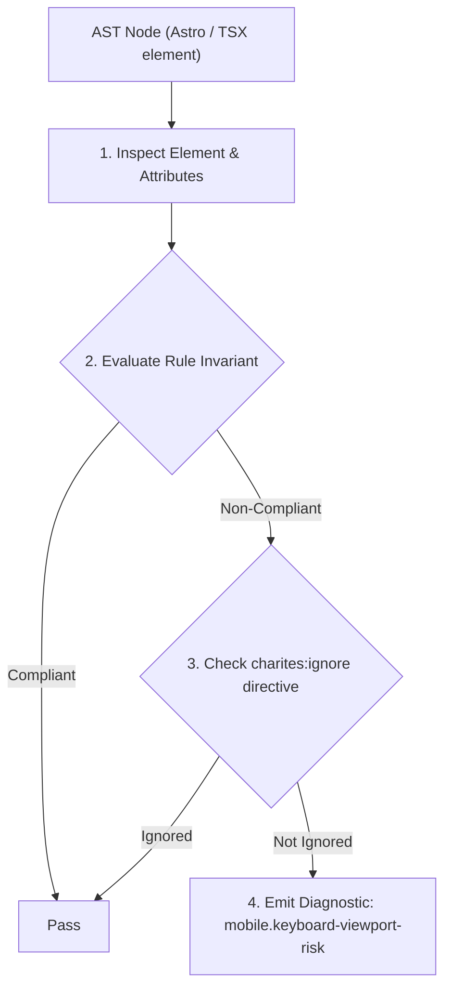
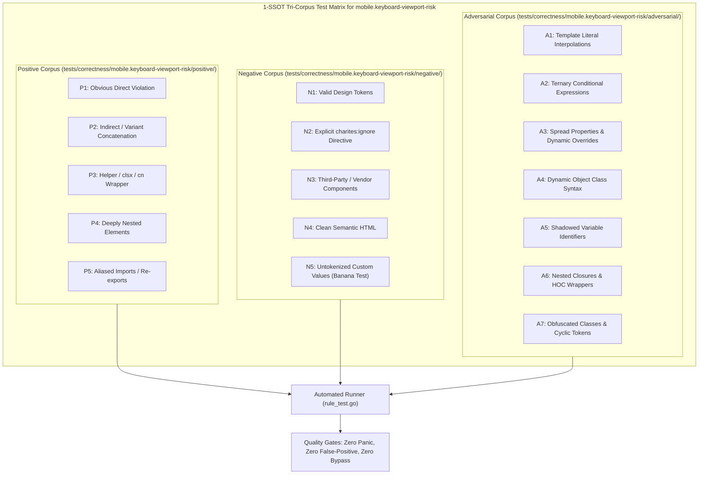

# mobile.keyboard-viewport-risk

> **Rule ID:** `mobile.keyboard-viewport-risk`
> **Severity:** `INFO`
> **Category:** `mobile`
> **Target Standards:** W3C CSS Values and Units Module Level 4 Section 6.1.2 (Small, Large, and Dynamic Viewport Units), Chromium Virtual Keyboard API & Resize Invariants, Apple WebKit Form Viewport Resilience Guidelines

---

## 1. Overview & Core Invariant

Advises using dynamic viewport units (dvh/svh) on containers with inputs and fixed controls to prevent layout breaking when virtual keyboard appears

### Core Invariant:
> **"Containers enclosing active text inputs alongside bottom-pinned actions must use dynamic viewport units ('min-h-dvh', 'svh') or sticky positioning instead of rigid 'h-screen' to prevent viewport clipping when virtual keyboard opens."**

---
## 2. Technical Grounding & Engine Realities

When a virtual keyboard appears on smartphone touchscreens, it consumes 40% to 50% of the display height, shrinking the browser visual viewport.

Containers locked to 'h-screen' or 'h-[100vh]' do not adjust dynamically to the reduced visual viewport, causing fixed bottom action buttons or active input fields to be pushed behind the keyboard or clipped.

Adopting dynamic viewport units (such as 'min-h-dvh' or 'min-h-svh') and sticky bottom positioning guarantees smooth, scrollable adaptation across Android and iOS keyboards.

---
## 3. Vulnerability & Risk Taxonomy

| Risk Vector | Severity | Impact |
| :--- | :---: | :--- |
| **Hidden Input Fields Behind Virtual Keyboard** | LOW | Mobile users cannot see what they are typing because inputs remain trapped behind the active keyboard. |
| **Inaccessible Fixed Bottom Submit Button** | LOW | Fixed bottom submit buttons get pushed below the visible viewport, preventing form completion. |

---
## 4. Non-Compliant Code Patterns (Bad Examples)
### TSX (Rigid h-screen container with input and fixed bottom button):
```tsx
<div className="fixed inset-0 h-screen flex flex-col justify-between">
  <input type="text" placeholder="Nama Lengkap" />
  <button className="fixed bottom-0 w-full py-3 bg-primary text-white">Simpan</button>
</div>
```

---
## 5. Compliant Implementation Patterns (Good Examples)
### TSX (Dynamic viewport height unit with sticky bottom button):
```tsx
<div className="min-h-dvh flex flex-col justify-between pb-[env(safe-area-inset-bottom)]">
  <input type="text" placeholder="Nama Lengkap" />
  <button className="sticky bottom-4 w-full py-3 bg-primary text-white rounded-xl">Simpan</button>
</div>
```

---

## 6. Detection & Verification Pipeline (How The Rule Evaluates Code)
This rule evaluates source code through the standard AST inspection pipeline:



### Step-by-Step Evaluation:
1. **AST Traversal:** Visits normalized `ir.Node` structures during AST streaming.
2. **Invariant Check:** Compares node attributes against rule invariants.
3. **Directive Suppression Check:** Honors inline `charites:ignore mobile.keyboard-viewport-risk` directives.
4. **Diagnostic Emission:** Emits compiler-grade diagnostic on invariant violation.

---

## 7. Verification & Test Harness (How The Test Works: 1-SSOT Tri-Corpus)

This rule is rigorously tested and validated across the canonical **1-SSOT Tri-Corpus** in `tests/correctness/mobile.keyboard-viewport-risk/`:



- **Positive Fixtures (P1-P5):** Verified to trigger diagnostics at exact lines and column spans.
- **Negative Fixtures (N1-N5):** Verified to produce zero diagnostics on valid tokens and legitimate exemptions.
- **Adversarial Fixtures (A1-A7):** Verified to prevent evasion across dynamic expressions, string interpolations, and cyclic references.

---

## 8. How to Suppress (Ignore Directives)

If this pattern is required for an intentional exception, suppress the diagnostic using the canonical Charites Rule ID:

```astro
<!-- charites:ignore mobile.keyboard-viewport-risk intentional exception -->
```

```tsx
// charites:ignore mobile.keyboard-viewport-risk intentional exception
```

---

## 9. Configuration Reference (`charites.yaml`)

```yaml
rules:
  mobile.keyboard-viewport-risk:
    severity: info # error | warn | info | off
```

