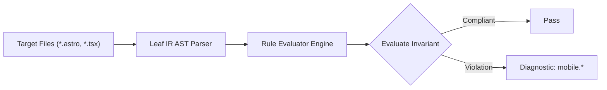

# Mobile Rules (`mobile`)

The `mobile` category contains static analysis rules for code quality, architectural constraints, and design system governance.

---

## Category Rule Index

| Rule ID | Severity | Summary | Full Specification | Status |
| :--- | :---: | :--- | :--- | :---: |
| `mobile.fixed-action-obstruction` | `WARN` | Warns when fixed bottom elements lack compensating bottom padding on parent or content siblings, risking content obstruction | [`mobile.fixed-action-obstruction`](mobile.fixed-action-obstruction) | `enabled` |
| `mobile.keyboard-viewport-risk` | `INFO` | Advises using dynamic viewport units (dvh/svh) on containers with inputs and fixed controls to prevent layout breaking when virtual keyboard appears | [`mobile.keyboard-viewport-risk`](mobile.keyboard-viewport-risk) | `enabled` |
| `mobile.modal-viewport-lock` | `ERROR` | Detects modal dialog containers locked with overflow-hidden without an internal scrollable region on mobile viewports | [`mobile.modal-viewport-lock`](mobile.modal-viewport-lock) | `enabled` |
| `mobile.orientation-lock-risk` | `INFO` | Advises against rigid screen orientation locking which restricts accessibility for mounted or assistive mobile setups (WCAG 2.2 SC 1.3.4) | [`mobile.orientation-lock-risk`](mobile.orientation-lock-risk) | `enabled` |
| `mobile.pointer-events-block` | `WARN` | Warns when an ancestor declares pointer-events-none over interactive children without restoring pointer-events-auto on mobile | [`mobile.pointer-events-block`](mobile.pointer-events-block) | `enabled` |

---
## How the Mobile Analysis Pipeline Works

The `mobile` engine applies static analysis checks against component source code:

### Pipeline Flow:
1. **AST Node Traversal:** Scans target template files into normalized intermediate representation.
2. **Invariant Assertion:** Validates structural and semantic invariants.
3. **Diagnostic Reporting:** Emits structured diagnostics for non-compliant patterns.

---

## How Mobile Tests Work (Verification Harness)

All rules in `mobile` are verified using the canonical 1-SSOT Tri-Corpus (`tests/correctness/mobile.*/`) encompassing Positive (P1-P5), Negative (N1-N5), and Adversarial (A1-A7) fixture matrices.
