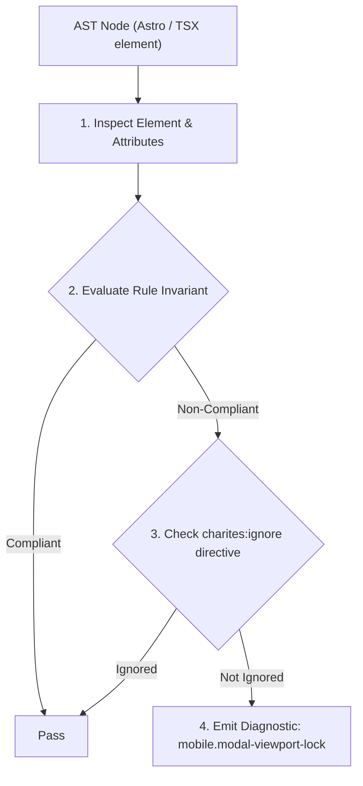
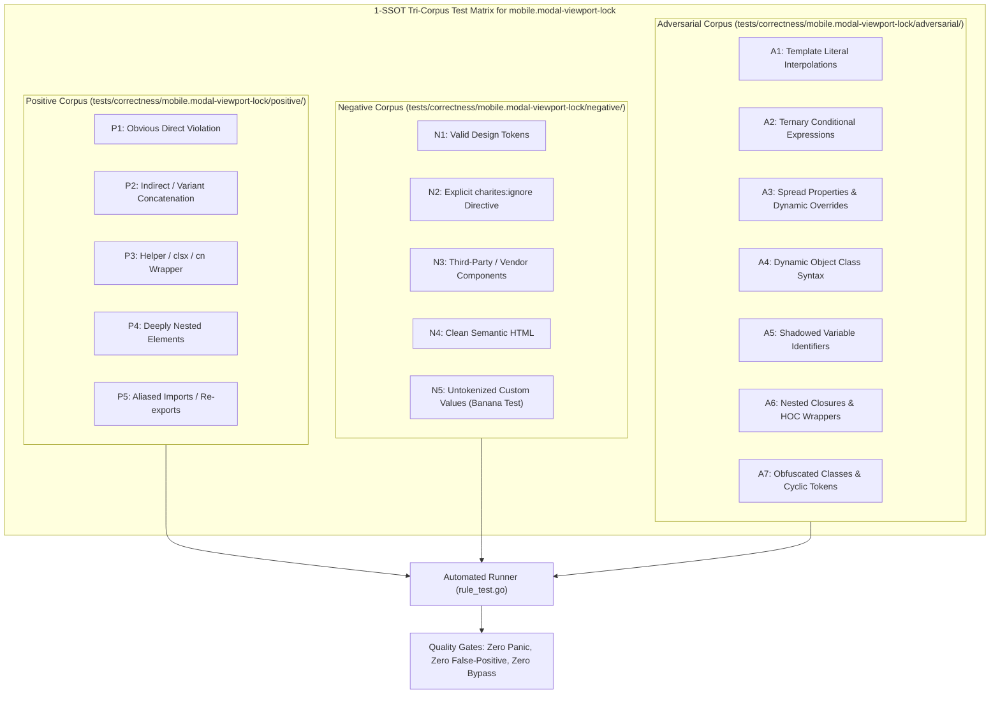

# mobile.modal-viewport-lock

> **Rule ID:** `mobile.modal-viewport-lock`
> **Severity:** `ERROR`
> **Category:** `mobile`
> **Target Standards:** W3C ARIA Authoring Practices Guide (Modal Dialog Design Pattern), WCAG 2.2 Success Criterion 2.1.2 (No Keyboard Trap), Apple Human Interface Guidelines (Modals and Sheets on Mobile)

---

## 1. Overview & Core Invariant

Detects modal dialog containers locked with overflow-hidden without an internal scrollable region on mobile viewports

### Core Invariant:
> **"Modal dialog containers declaring 'overflow-hidden' must provide an internal scrollable region ('overflow-y-auto') so content remains accessible on short mobile screens."**

---
## 2. Technical Grounding & Engine Realities

Full-screen modal dialogs or bottom sheets often lock body scrolling with 'overflow-hidden'.

If the modal container itself lacks an internal vertical scrollable container ('overflow-y-auto' or 'overflow-y-scroll'), content that exceeds the screen height (such as on short smartphones, landscape orientation, or when the virtual keyboard opens) is permanently cropped.

Users cannot scroll to reach bottom form inputs or confirm/cancel action buttons, resulting in a critical UX failure.

---
## 3. Vulnerability & Risk Taxonomy

| Risk Vector | Severity | Impact |
| :--- | :---: | :--- |
| **Unreachable Submit & Dismiss Actions** | HIGH | Users are locked in the modal with no ability to reach submission or close buttons on smaller mobile screens. |
| **Form Inaccessibility on Keyboard Activation** | HIGH | When virtual keyboard expands, form fields below the keyboard cannot be scrolled into view. |

---
## 4. Non-Compliant Code Patterns (Bad Examples)
### TSX (Modal dialog container locked with overflow-hidden without scrollable region):
```tsx
<div role="dialog" aria-modal="true" className="fixed inset-0 overflow-hidden flex items-center justify-center p-4">
  <div className="bg-card p-6 rounded-2xl w-full max-w-md h-screen">
    <h2>Form Permohonan Bantuan</h2>
    <div className="space-y-4">...isi form panjang...</div>
    <button type="submit">Kirim</button>
  </div>
</div>
```

---
## 5. Compliant Implementation Patterns (Good Examples)
### TSX (Internal scroll region (overflow-y-auto) allows smooth scrolling on mobile screens):
```tsx
<div role="dialog" aria-modal="true" className="fixed inset-0 overflow-y-auto flex items-center justify-center p-4">
  <div className="bg-card p-6 rounded-2xl w-full max-w-md my-auto">
    <h2>Form Permohonan Bantuan</h2>
    <div className="space-y-4">...isi form panjang...</div>
    <button type="submit">Kirim</button>
  </div>
</div>
```

---

## 6. Detection & Verification Pipeline (How The Rule Evaluates Code)
This rule evaluates source code through the standard AST inspection pipeline:



### Step-by-Step Evaluation:
1. **AST Traversal:** Visits normalized `ir.Node` structures during AST streaming.
2. **Invariant Check:** Compares node attributes against rule invariants.
3. **Directive Suppression Check:** Honors inline `charites:ignore mobile.modal-viewport-lock` directives.
4. **Diagnostic Emission:** Emits compiler-grade diagnostic on invariant violation.

---

## 7. Verification & Test Harness (How The Test Works: 1-SSOT Tri-Corpus)

This rule is rigorously tested and validated across the canonical **1-SSOT Tri-Corpus** in `tests/correctness/mobile.modal-viewport-lock/`:



- **Positive Fixtures (P1-P5):** Verified to trigger diagnostics at exact lines and column spans.
- **Negative Fixtures (N1-N5):** Verified to produce zero diagnostics on valid tokens and legitimate exemptions.
- **Adversarial Fixtures (A1-A7):** Verified to prevent evasion across dynamic expressions, string interpolations, and cyclic references.

---

## 8. How to Suppress (Ignore Directives)

If this pattern is required for an intentional exception, suppress the diagnostic using the canonical Charites Rule ID:

```astro
<!-- charites:ignore mobile.modal-viewport-lock intentional exception -->
```

```tsx
// charites:ignore mobile.modal-viewport-lock intentional exception
```

---

## 9. Configuration Reference (`charites.yaml`)

```yaml
rules:
  mobile.modal-viewport-lock:
    severity: error # error | warn | info | off
```

