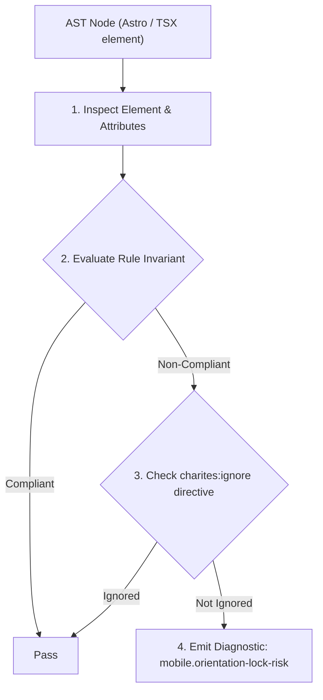
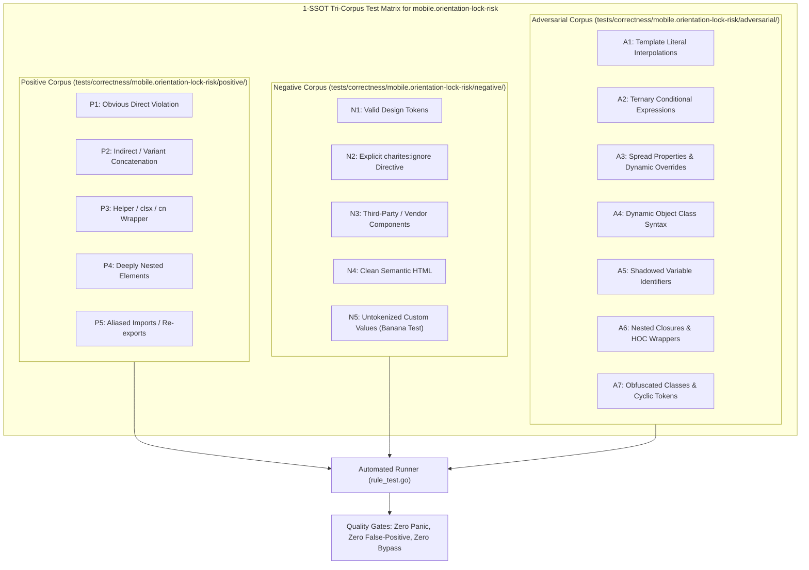

# mobile.orientation-lock-risk

> **Rule ID:** `mobile.orientation-lock-risk`
> **Severity:** `INFO`
> **Category:** `mobile`
> **Target Standards:** W3C Web Content Accessibility Guidelines (WCAG) 2.2 SC 1.3.4 (Orientation - Level AA), W3C Screen Orientation API (ScreenOrientation.lock), Google Web Accessibility (Orientation Invariants)

---

## 1. Overview & Core Invariant

Advises against rigid screen orientation locking which restricts accessibility for mounted or assistive mobile setups (WCAG 2.2 SC 1.3.4)

### Core Invariant:
> **"Applications must not rigidly lock display orientation to portrait or landscape unless essential to the core functionality (e.g. bank check capture or piano keyboard)."**

---
## 2. Technical Grounding & Engine Realities

Locking mobile orientation via 'screen.orientation.lock("portrait")' prevents users with assistive needs from accessing content.

Users who have smartphones mounted horizontally on wheelchairs, bed frames, or vehicle dashboards cannot rotate their devices.

Web interfaces should adapt fluidly using responsive CSS (e.g. 'landscape:flex-row') rather than programmatically forbidding device rotation.

---
## 3. Vulnerability & Risk Taxonomy

| Risk Vector | Severity | Impact |
| :--- | :---: | :--- |
| **Assistive Technology Exclusion** | LOW | Users with fixed horizontal device mounts are unable to view or operate the application naturally. |
| **Unintended Script Errors on Unsupported Browsers** | LOW | Calling orientation lock on Safari iOS or unsupported browsers triggers unhandled promise rejections. |

---
## 4. Non-Compliant Code Patterns (Bad Examples)
### TSX (Programmatic orientation lock forces portrait mode):
```tsx
useEffect(() => {
  if (screen.orientation && screen.orientation.lock) {
    screen.orientation.lock("portrait").catch(() => {});
  }
}, []);
```

---
## 5. Compliant Implementation Patterns (Good Examples)
### TSX (Fluid responsive layout adapting naturally to landscape orientation):
```tsx
<div className="flex flex-col landscape:flex-row gap-4 p-4">
  <aside className="w-full landscape:w-64">Navigasi</aside>
  <main className="flex-1">Konten Utama</main>
</div>
```

---

## 6. Detection & Verification Pipeline (How The Rule Evaluates Code)
This rule evaluates source code through the standard AST inspection pipeline:



### Step-by-Step Evaluation:
1. **AST Traversal:** Visits normalized `ir.Node` structures during AST streaming.
2. **Invariant Check:** Compares node attributes against rule invariants.
3. **Directive Suppression Check:** Honors inline `charites:ignore mobile.orientation-lock-risk` directives.
4. **Diagnostic Emission:** Emits compiler-grade diagnostic on invariant violation.

---

## 7. Verification & Test Harness (How The Test Works: 1-SSOT Tri-Corpus)

This rule is rigorously tested and validated across the canonical **1-SSOT Tri-Corpus** in `tests/correctness/mobile.orientation-lock-risk/`:



- **Positive Fixtures (P1-P5):** Verified to trigger diagnostics at exact lines and column spans.
- **Negative Fixtures (N1-N5):** Verified to produce zero diagnostics on valid tokens and legitimate exemptions.
- **Adversarial Fixtures (A1-A7):** Verified to prevent evasion across dynamic expressions, string interpolations, and cyclic references.

---

## 8. How to Suppress (Ignore Directives)

If this pattern is required for an intentional exception, suppress the diagnostic using the canonical Charites Rule ID:

```astro
<!-- charites:ignore mobile.orientation-lock-risk intentional exception -->
```

```tsx
// charites:ignore mobile.orientation-lock-risk intentional exception
```

---

## 9. Configuration Reference (`charites.yaml`)

```yaml
rules:
  mobile.orientation-lock-risk:
    severity: info # error | warn | info | off
```

