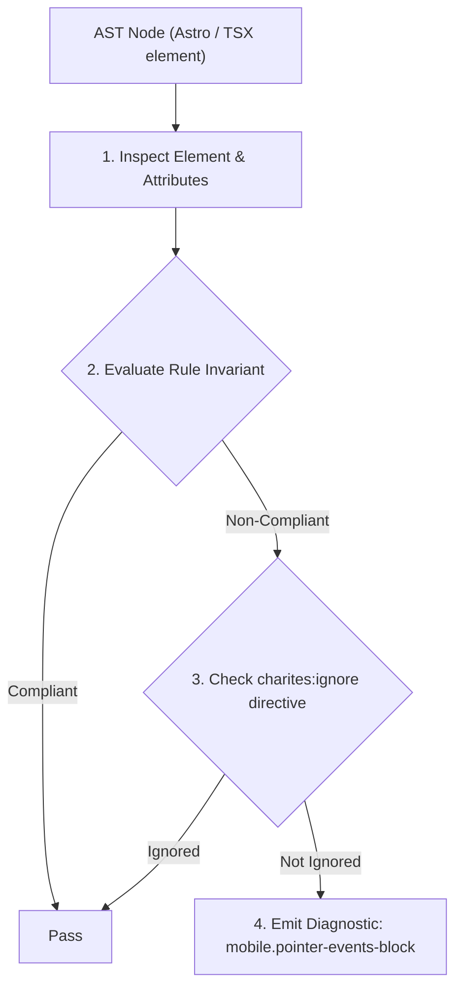
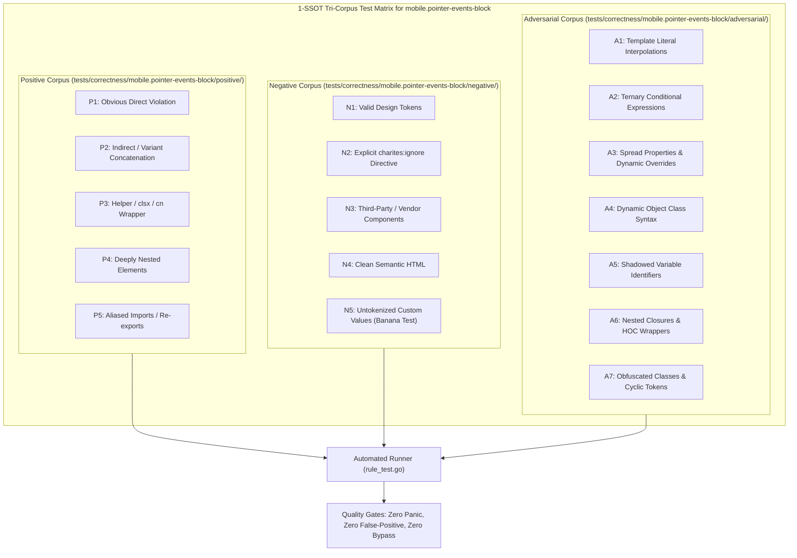

# mobile.pointer-events-block

> **Rule ID:** `mobile.pointer-events-block`
> **Severity:** `WARN`
> **Category:** `mobile`
> **Target Standards:** W3C Pointer Events Level 3 (Pointer Event Processing Model), CSS Basic User Interface Module Level 4 (The pointer-events Property), Chromium Touch Action & Pointer Hierarchy Engine

---

## 1. Overview & Core Invariant

Warns when an ancestor declares pointer-events-none over interactive children without restoring pointer-events-auto on mobile

### Core Invariant:
> **"Interactive descendants (<button>, <a>, <input>) nested under a 'pointer-events-none' ancestor must explicitly declare 'pointer-events-auto' so mobile touch taps are dispatched."**

---
## 2. Technical Grounding & Engine Realities

Applying CSS 'pointer-events-none' to an ancestor wrapper disables hit-testing for the element and all its children.

When developers nest interactive controls (<button>, <a>, <input>) inside such wrappers (often used for visual backdrop filters or transition overlays) without restoring 'pointer-events-auto', touchscreen taps and mouse clicks are completely ignored by the browser.

Restoring 'pointer-events-auto' directly on the interactive control re-enables event capture while preserving the pass-through behavior of the parent.

---
## 3. Vulnerability & Risk Taxonomy

| Risk Vector | Severity | Impact |
| :--- | :---: | :--- |
| **Completely Unresponsive Touch Buttons** | MEDIUM | Users tap buttons or links repeatedly with zero visual feedback or event dispatch on mobile browsers. |
| **Silently Broken Form Submissions** | MEDIUM | Submit controls become inactive, giving the illusion that the application is broken or frozen. |

---
## 4. Non-Compliant Code Patterns (Bad Examples)
### TSX (Interactive button blocked under pointer-events-none parent):
```tsx
<div className="pointer-events-none opacity-90 p-4">
  <button onClick={handleSave} className="bg-primary text-white px-4 py-2">
    Simpan Data
  </button>
</div>
```

---
## 5. Compliant Implementation Patterns (Good Examples)
### TSX (Explicit pointer-events-auto restores touch interactivity):
```tsx
<div className="pointer-events-none opacity-90 p-4">
  <button onClick={handleSave} className="pointer-events-auto bg-primary text-white px-4 py-2 rounded-xl">
    Simpan Data
  </button>
</div>
```

---

## 6. Detection & Verification Pipeline (How The Rule Evaluates Code)
This rule evaluates source code through the standard AST inspection pipeline:



### Step-by-Step Evaluation:
1. **AST Traversal:** Visits normalized `ir.Node` structures during AST streaming.
2. **Invariant Check:** Compares node attributes against rule invariants.
3. **Directive Suppression Check:** Honors inline `charites:ignore mobile.pointer-events-block` directives.
4. **Diagnostic Emission:** Emits compiler-grade diagnostic on invariant violation.

---

## 7. Verification & Test Harness (How The Test Works: 1-SSOT Tri-Corpus)

This rule is rigorously tested and validated across the canonical **1-SSOT Tri-Corpus** in `tests/correctness/mobile.pointer-events-block/`:



- **Positive Fixtures (P1-P5):** Verified to trigger diagnostics at exact lines and column spans.
- **Negative Fixtures (N1-N5):** Verified to produce zero diagnostics on valid tokens and legitimate exemptions.
- **Adversarial Fixtures (A1-A7):** Verified to prevent evasion across dynamic expressions, string interpolations, and cyclic references.

---

## 8. How to Suppress (Ignore Directives)

If this pattern is required for an intentional exception, suppress the diagnostic using the canonical Charites Rule ID:

```astro
<!-- charites:ignore mobile.pointer-events-block intentional exception -->
```

```tsx
// charites:ignore mobile.pointer-events-block intentional exception
```

---

## 9. Configuration Reference (`charites.yaml`)

```yaml
rules:
  mobile.pointer-events-block:
    severity: warn # error | warn | info | off
```

