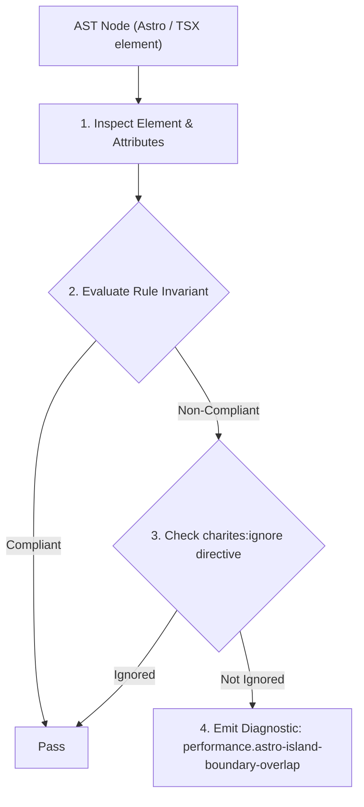
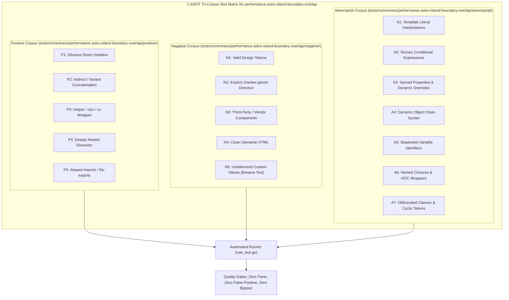

# performance.astro-island-boundary-overlap

> **Rule ID:** `performance.astro-island-boundary-overlap`
> **Severity:** `WARN`
> **Category:** `performance`
> **Target Standards:** Astro Component Composition & Slots Isolation Guidelines, Astro Multi-Framework Islands Architecture Invariants, W3C Web Components Hydration Boundary Isolation Standards

---

## 1. Overview & Core Invariant

Mencegah konflik batas hidrasi pulau (island boundary overlap) dengan mewajibkan isolasi slot pada penyarangan komponen pulau interaktif.

### Core Invariant:
> **"Interactive Astro islands must not directly nest secondary client islands without Astro slot isolation; direct nesting blurs hydration boundaries and triggers runtime desynchronization."**

---
## 2. Technical Grounding & Engine Realities

Astro islands are meant to be isolated units of interactivity that hydrate independently on the page.

When an interactive island (`client:*`) nests another client island directly as a child element, the parent framework's virtual DOM attempts to manage the subtree of the child framework.

This direct nesting causes hydration mismatches, duplicate runtime overhead, and event listener conflicts. Using Astro Slots (`<div slot="...">`) preserves clear HTML boundaries between distinct hydration contexts.

---
## 3. Vulnerability & Risk Taxonomy

| Risk Vector | Severity | Impact |
| :--- | :---: | :--- |
| **Hydration Mismatch & Failure** | HIGH | Parent framework virtual DOM reconciliation overwrites or destroys DOM nodes managed by child islands. |
| **Duplicated Runtime Overhead** | MEDIUM | Forces multiple distinct UI framework engines to run in overlapping memory spaces on the client. |

---
## 4. Non-Compliant Code Patterns (Bad Examples)
### ASTRO (Penyarangan pulau multi-framework langsung memicu konflik hidrasi):
```astro
<!-- Pelanggaran: Penyarangan pulau langsung -->
<ReactDashboardContainer client:load>
  <VueChartWidget client:idle />
</ReactDashboardContainer>
```

---
## 5. Compliant Implementation Patterns (Good Examples)
### ASTRO (Memanfaatkan Astro slot untuk mengisolasi batas hidrasi):
```astro
<!-- Patuh: Memisahkan pulau via slot terisolasi -->
<ReactDashboardContainer client:load>
  <div slot="chart-slot">
    <VueChartWidget client:idle />
  </div>
</ReactDashboardContainer>
```

---

## 6. Detection & Verification Pipeline (How The Rule Evaluates Code)
This rule evaluates source code through the standard AST inspection pipeline:



### Step-by-Step Evaluation:
1. **AST Traversal:** Visits normalized `ir.Node` structures during AST streaming.
2. **Invariant Check:** Compares node attributes against rule invariants.
3. **Directive Suppression Check:** Honors inline `charites:ignore performance.astro-island-boundary-overlap` directives.
4. **Diagnostic Emission:** Emits compiler-grade diagnostic on invariant violation.

---

## 7. Verification & Test Harness (How The Test Works: 1-SSOT Tri-Corpus)

This rule is rigorously tested and validated across the canonical **1-SSOT Tri-Corpus** in `tests/correctness/performance.astro-island-boundary-overlap/`:



- **Positive Fixtures (P1-P5):** Verified to trigger diagnostics at exact lines and column spans.
- **Negative Fixtures (N1-N5):** Verified to produce zero diagnostics on valid tokens and legitimate exemptions.
- **Adversarial Fixtures (A1-A7):** Verified to prevent evasion across dynamic expressions, string interpolations, and cyclic references.

---

## 8. How to Suppress (Ignore Directives)

If this pattern is required for an intentional exception, suppress the diagnostic using the canonical Charites Rule ID:

```astro
<!-- charites:ignore performance.astro-island-boundary-overlap intentional exception -->
```

```tsx
// charites:ignore performance.astro-island-boundary-overlap intentional exception
```

---

## 9. Configuration Reference (`charites.yaml`)

```yaml
rules:
  performance.astro-island-boundary-overlap:
    severity: warn # error | warn | info | off
```

