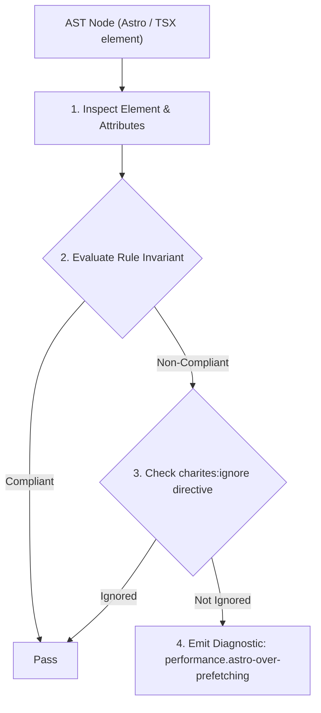
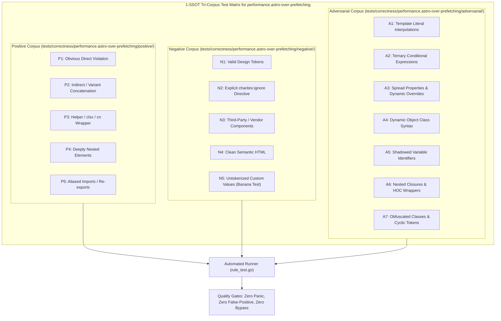

# performance.astro-over-prefetching

> **Rule ID:** `performance.astro-over-prefetching`
> **Severity:** `WARN`
> **Category:** `performance`
> **Target Standards:** Astro Prefetch Configuration Best Practices ('data-astro-prefetch'), W3C Resource Hints & Speculative Parsing Bandwidth Economy, Mobile Web Data Saver & Cellular Network Latency Guidelines

---

## 1. Overview & Core Invariant

Mencegah pemborosan kuota data seluler dengan melarang penempatan strategi prefetch agresif (viewport/load) pada tautan navigasi sekunder atau footer.

### Core Invariant:
> **"Aggressive 'viewport' or 'load' prefetch strategies must not be assigned to secondary or low-conversion navigation links; secondary links should use passive 'hover' or 'tap' prefetching."**

---
## 2. Technical Grounding & Engine Realities

Astro provides link prefetching via `data-astro-prefetch`.

Using aggressive strategies like `data-astro-prefetch="viewport"` causes the browser to immediately fetch all linked documents as soon as their anchors enter the viewport.

When applied to secondary links (such as legal terms, privacy policies, or footer menus), this aggressively consumes user bandwidth and saturates the network connection, starving critical assets such as images and analytical payloads on slow mobile networks.

---
## 3. Vulnerability & Risk Taxonomy

| Risk Vector | Severity | Impact |
| :--- | :---: | :--- |
| **Cellular Data Waste** | MEDIUM | Preemptively downloads full pages that users rarely click, depleting metered mobile data connections. |
| **Network Queue Contention** | MEDIUM | Prefetch network requests crowd the HTTP queue and delay high-priority above-the-fold assets. |

---
## 4. Non-Compliant Code Patterns (Bad Examples)
### ASTRO (Prefetch agresif pada tautan footer sekunder):
```astro
<footer>
  <a href="/terms" data-astro-prefetch="viewport">Syarat & Ketentuan</a>
  <a href="/privacy" data-astro-prefetch="viewport">Kebijakan Privasi</a>
</footer>
```

---
## 5. Compliant Implementation Patterns (Good Examples)
### ASTRO (Prefetch pasif saat hover untuk tautan footer):
```astro
<footer>
  <a href="/terms" data-astro-prefetch="hover">Syarat & Ketentuan</a>
  <a href="/privacy" data-astro-prefetch="hover">Kebijakan Privasi</a>
</footer>
```

---

## 6. Detection & Verification Pipeline (How The Rule Evaluates Code)
This rule evaluates source code through the standard AST inspection pipeline:



### Step-by-Step Evaluation:
1. **AST Traversal:** Visits normalized `ir.Node` structures during AST streaming.
2. **Invariant Check:** Compares node attributes against rule invariants.
3. **Directive Suppression Check:** Honors inline `charites:ignore performance.astro-over-prefetching` directives.
4. **Diagnostic Emission:** Emits compiler-grade diagnostic on invariant violation.

---

## 7. Verification & Test Harness (How The Test Works: 1-SSOT Tri-Corpus)

This rule is rigorously tested and validated across the canonical **1-SSOT Tri-Corpus** in `tests/correctness/performance.astro-over-prefetching/`:



- **Positive Fixtures (P1-P5):** Verified to trigger diagnostics at exact lines and column spans.
- **Negative Fixtures (N1-N5):** Verified to produce zero diagnostics on valid tokens and legitimate exemptions.
- **Adversarial Fixtures (A1-A7):** Verified to prevent evasion across dynamic expressions, string interpolations, and cyclic references.

---

## 8. How to Suppress (Ignore Directives)

If this pattern is required for an intentional exception, suppress the diagnostic using the canonical Charites Rule ID:

```astro
<!-- charites:ignore performance.astro-over-prefetching intentional exception -->
```

```tsx
// charites:ignore performance.astro-over-prefetching intentional exception
```

---

## 9. Configuration Reference (`charites.yaml`)

```yaml
rules:
  performance.astro-over-prefetching:
    severity: warn # error | warn | info | off
```

