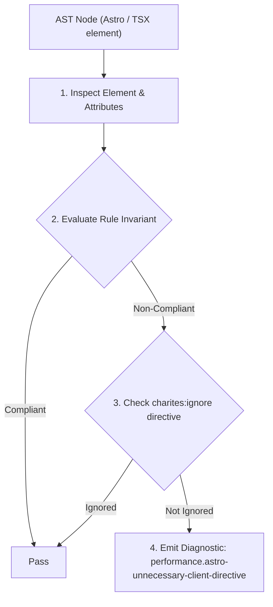
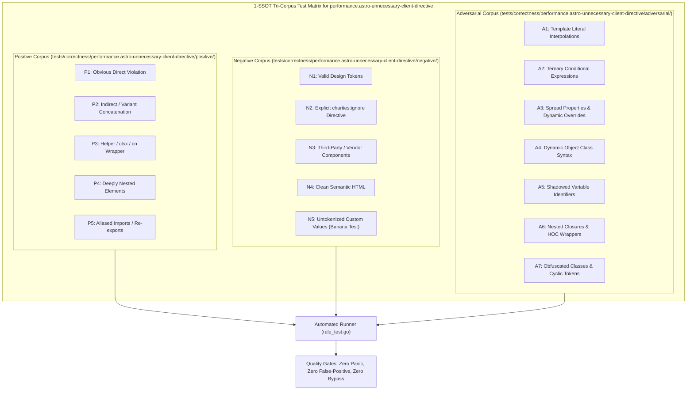

# performance.astro-unnecessary-client-directive

> **Rule ID:** `performance.astro-unnecessary-client-directive`
> **Severity:** `ERROR`
> **Category:** `performance`
> **Target Standards:** Astro Islands Architecture Specification (Zero-JS Baseline Principle), W3C Web Performance Client-Side Script Minimization Invariants, Astro Official Documentation ('Template Directives: client:*')

---

## 1. Overview & Core Invariant

Menegakkan prinsip Zero-JS Astro dengan melarang penambahan direktif hidrasi (client:*) pada komponen antarmuka yang murni statis.

### Core Invariant:
> **"Static UI components must not include 'client:*' hydration directives; adding hydration directives to non-interactive components forces the framework runtime and component bundle to be downloaded, violating Astro's Zero-JS guarantee."**

---
## 2. Technical Grounding & Engine Realities

Astro by default renders all components to pure, static HTML at build time with zero client-side JavaScript overhead.

When a developer unnecessarily adds a `client:*` directive (`client:load`, `client:idle`, `client:visible`) to a purely presentational component, Astro treats it as an interactive island.

This forces the bundler to extract the component into a separate client bundle and ship the framework runtime (such as React or Vue, weighing 30-50KB+) to the browser, needlessly delaying page interactivity and squandering network bandwidth.

---
## 3. Vulnerability & Risk Taxonomy

| Risk Vector | Severity | Impact |
| :--- | :---: | :--- |
| **Zero-JS Guarantee Violation** | HIGH | Transmits unnecessary framework runtimes and component code to the client, increasing page weight and parse time. |
| **Main Thread Hydration Lag** | MEDIUM | Wastes browser CPU cycles hydrating static DOM trees that have no event listeners or interactive state. |

---
## 4. Non-Compliant Code Patterns (Bad Examples)
### ASTRO (Header statis dipaksa terhidrasi ke peramban):
```astro
---
import HeaderStatic from '../components/HeaderStatic.tsx';
---
<HeaderStatic client:load title="Selamat Datang" />
```

---
## 5. Compliant Implementation Patterns (Good Examples)
### ASTRO (Dirender sebagai pure static HTML tanpa JavaScript):
```astro
---
import HeaderStatic from '../components/HeaderStatic.tsx';
---
<HeaderStatic title="Selamat Datang" />
```

---

## 6. Detection & Verification Pipeline (How The Rule Evaluates Code)
This rule evaluates source code through the standard AST inspection pipeline:



### Step-by-Step Evaluation:
1. **AST Traversal:** Visits normalized `ir.Node` structures during AST streaming.
2. **Invariant Check:** Compares node attributes against rule invariants.
3. **Directive Suppression Check:** Honors inline `charites:ignore performance.astro-unnecessary-client-directive` directives.
4. **Diagnostic Emission:** Emits compiler-grade diagnostic on invariant violation.

---

## 7. Verification & Test Harness (How The Test Works: 1-SSOT Tri-Corpus)

This rule is rigorously tested and validated across the canonical **1-SSOT Tri-Corpus** in `tests/correctness/performance.astro-unnecessary-client-directive/`:



- **Positive Fixtures (P1-P5):** Verified to trigger diagnostics at exact lines and column spans.
- **Negative Fixtures (N1-N5):** Verified to produce zero diagnostics on valid tokens and legitimate exemptions.
- **Adversarial Fixtures (A1-A7):** Verified to prevent evasion across dynamic expressions, string interpolations, and cyclic references.

---

## 8. How to Suppress (Ignore Directives)

If this pattern is required for an intentional exception, suppress the diagnostic using the canonical Charites Rule ID:

```astro
<!-- charites:ignore performance.astro-unnecessary-client-directive intentional exception -->
```

```tsx
// charites:ignore performance.astro-unnecessary-client-directive intentional exception
```

---

## 9. Configuration Reference (`charites.yaml`)

```yaml
rules:
  performance.astro-unnecessary-client-directive:
    severity: error # error | warn | info | off
```

