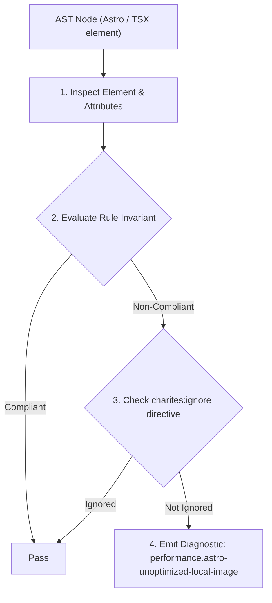
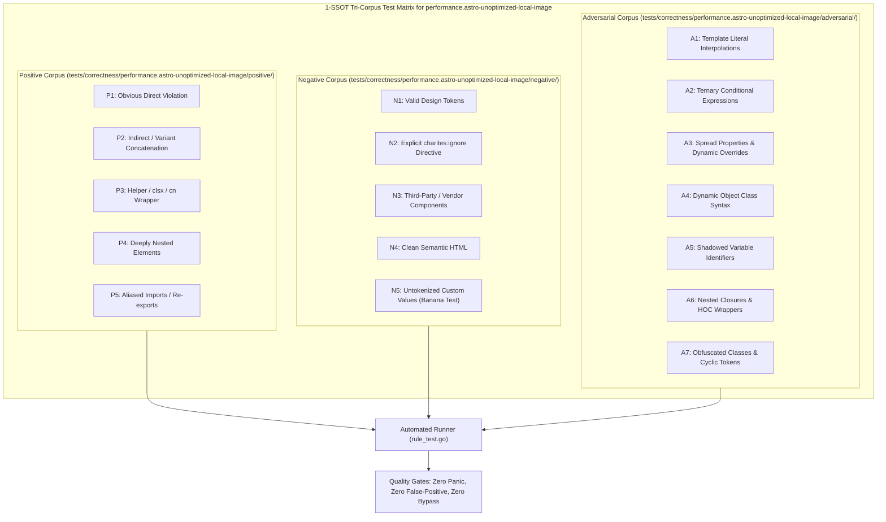

# performance.astro-unoptimized-local-image

> **Rule ID:** `performance.astro-unoptimized-local-image`
> **Severity:** `INFO`
> **Category:** `performance`
> **Target Standards:** Astro Asset Pipeline Best Practices ('astro:assets' Image & Picture), Core Web Vitals Largest Contentful Paint (LCP) Image Payload Optimization, W3C Next-Gen Responsive Image Delivery Standards (WebP/AVIF)

---

## 1. Overview & Core Invariant

Menganjurkan pemakaian komponen <Image /> dari astro:assets pada gambar lokal guna mengaktifkan konversi format modern dan kompresi build.

### Core Invariant:
> **"Local raster image assets in Astro templates should be rendered via '<Image />' from 'astro:assets' rather than raw '' tags to leverage automated build-time format conversion and dimension inference."**

---
## 2. Technical Grounding & Engine Realities

Astro provides a native image optimization pipeline through the `astro:assets` module.

Using a raw HTML `` tag pointing to a local file path (`src="../assets/banner.png"`) completely bypasses this pipeline, serving uncompressed, legacy formats (PNG/JPEG) with no automatic width/height dimension injection.

Migrating to `<Image />` allows Astro to automatically convert images to AVIF/WebP, generate responsive srcset attributes, and prevent Cumulative Layout Shift (CLS) by inferring exact dimensions at build time.

---
## 3. Vulnerability & Risk Taxonomy

| Risk Vector | Severity | Impact |
| :--- | :---: | :--- |
| **Inflated Asset Payload** | LOW | Serves unoptimized PNG/JPEG images that are 40-70% larger than modern WebP/AVIF equivalents. |
| **Missing Intrinsic Aspect Ratio** | LOW | Raw img tags without width and height attributes cause layout shifts during image load. |

---
## 4. Non-Compliant Code Patterns (Bad Examples)
### ASTRO (Tag img mentah melewatkan kompresi build-time Astro):
```astro
<!-- Advisory: Tag img mentah pada path lokal -->

```

---
## 5. Compliant Implementation Patterns (Good Examples)
### ASTRO (Memanfaatkan komponen Image bawaan astro:assets):
```astro
---
import { Image } from 'astro:assets';
import productImg from '../assets/product-hero.png';
---
<Image src={productImg} alt="Produk Baru" />
```

---

## 6. Detection & Verification Pipeline (How The Rule Evaluates Code)
This rule evaluates source code through the standard AST inspection pipeline:



### Step-by-Step Evaluation:
1. **AST Traversal:** Visits normalized `ir.Node` structures during AST streaming.
2. **Invariant Check:** Compares node attributes against rule invariants.
3. **Directive Suppression Check:** Honors inline `charites:ignore performance.astro-unoptimized-local-image` directives.
4. **Diagnostic Emission:** Emits compiler-grade diagnostic on invariant violation.

---

## 7. Verification & Test Harness (How The Test Works: 1-SSOT Tri-Corpus)

This rule is rigorously tested and validated across the canonical **1-SSOT Tri-Corpus** in `tests/correctness/performance.astro-unoptimized-local-image/`:



- **Positive Fixtures (P1-P5):** Verified to trigger diagnostics at exact lines and column spans.
- **Negative Fixtures (N1-N5):** Verified to produce zero diagnostics on valid tokens and legitimate exemptions.
- **Adversarial Fixtures (A1-A7):** Verified to prevent evasion across dynamic expressions, string interpolations, and cyclic references.

---

## 8. How to Suppress (Ignore Directives)

If this pattern is required for an intentional exception, suppress the diagnostic using the canonical Charites Rule ID:

```astro
<!-- charites:ignore performance.astro-unoptimized-local-image intentional exception -->
```

```tsx
// charites:ignore performance.astro-unoptimized-local-image intentional exception
```

---

## 9. Configuration Reference (`charites.yaml`)

```yaml
rules:
  performance.astro-unoptimized-local-image:
    severity: info # error | warn | info | off
```

