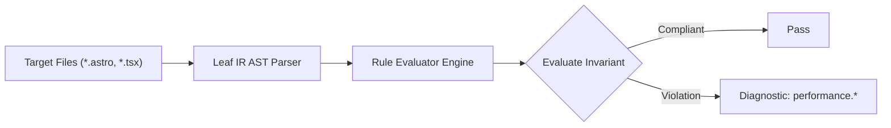

# Performance Rules (`performance`)

The `performance` category contains static analysis rules for code quality, architectural constraints, and design system governance.

---

## Category Rule Index

| Rule ID | Severity | Summary | Full Specification | Status |
| :--- | :---: | :--- | :--- | :---: |
| `performance.astro-island-boundary-overlap` | `WARN` | Mencegah konflik batas hidrasi pulau (island boundary overlap) dengan mewajibkan isolasi slot pada penyarangan komponen pulau interaktif. | [`performance.astro-island-boundary-overlap`](performance.astro-island-boundary-overlap) | `enabled` |
| `performance.astro-over-prefetching` | `WARN` | Mencegah pemborosan kuota data seluler dengan melarang penempatan strategi prefetch agresif (viewport/load) pada tautan navigasi sekunder atau footer. | [`performance.astro-over-prefetching`](performance.astro-over-prefetching) | `enabled` |
| `performance.astro-unnecessary-client-directive` | `ERROR` | Menegakkan prinsip Zero-JS Astro dengan melarang penambahan direktif hidrasi (client:*) pada komponen antarmuka yang murni statis. | [`performance.astro-unnecessary-client-directive`](performance.astro-unnecessary-client-directive) | `enabled` |
| `performance.astro-unoptimized-local-image` | `INFO` | Menganjurkan pemakaian komponen <Image /> dari astro:assets pada gambar lokal guna mengaktifkan konversi format modern dan kompresi build. | [`performance.astro-unoptimized-local-image`](performance.astro-unoptimized-local-image) | `enabled` |
| `performance.react-context-domain-coupling` | `WARN` | Context.Provider bundles over-coupled multi-domain state (> 5 fields), triggering cascading re-renders across all consumers on any property change | [`performance.react-context-domain-coupling`](performance.react-context-domain-coupling) | `enabled` |
| `performance.react-derived-state-in-effect` | `WARN` | Mencegah sinkronisasi derived state dari props atau state yang sudah ada melalui useEffect, yang memicu siklus perenderan sekunder ganda. | [`performance.react-derived-state-in-effect`](performance.react-derived-state-in-effect) | `enabled` |
| `performance.react-effect-missing-cleanup` | `ERROR` | Effect hook acquiring persistent resource (listener, interval, observer) lacks a symmetrical cleanup return function, causing memory leaks | [`performance.react-effect-missing-cleanup`](performance.react-effect-missing-cleanup) | `enabled` |
| `performance.react-index-as-key` | `WARN` | Using array index as 'key' in dynamic collection mapping breaks VDOM reconciliation when items reorder or mutate | [`performance.react-index-as-key`](performance.react-index-as-key) | `enabled` |
| `performance.react-inline-prop-memo` | `WARN` | Passing inline object, array, or function literal to memoized component bypasses shallow memoization on every parent render | [`performance.react-inline-prop-memo`](performance.react-inline-prop-memo) | `enabled` |
| `performance.react-redundant-function-memoization` | `INFO` | Mengaudit penggunaan useCallback pada callback yang hanya dikonsumsi oleh elemen native HTML tanpa konsumen peka identitas referensial. | [`performance.react-redundant-function-memoization`](performance.react-redundant-function-memoization) | `enabled` |
| `performance.react-static-heavy-import` | `WARN` | Mengaudit pernyataan impor statis modul berukuran besar di tingkat atas yang membengkakkan bundel JavaScript awal dan mewajibkan pemisahan kode via React.lazy() dan <Suspense>. | [`performance.react-static-heavy-import`](performance.react-static-heavy-import) | `enabled` |
| `performance.react-unstable-hook-reference` | `WARN` | Mengaudit custom hook yang mengembalikan referensi fungsi tidak stabil tanpa dibungkus useCallback, yang memicu re-render loop pada komponen konsumen. | [`performance.react-unstable-hook-reference`](performance.react-unstable-hook-reference) | `enabled` |
| `performance.tailwind-duplicate-arbitrary-rules` | `WARN` | Menganjurkan penggunaan utilitas skala inti bawaan Tailwind v4 alih-alih nilai arbitrary sembarang yang menghasilkan deklarasi CSS duplikat. | [`performance.tailwind-duplicate-arbitrary-rules`](performance.tailwind-duplicate-arbitrary-rules) | `enabled` |
| `performance.tailwind-duplicate-utility-definition` | `WARN` | Mencegah duplikasi deklarasi utilitas CSS kustom (@utility) yang properti dan nilainya sudah disediakan oleh utilitas core bawaan Tailwind CSS v4. | [`performance.tailwind-duplicate-utility-definition`](performance.tailwind-duplicate-utility-definition) | `enabled` |
| `performance.tailwind-dynamic-class-concatenation` | `ERROR` | Mencegah penggabungan string nama kelas dinamis parsial yang merusak deteksi compiler scanner Tailwind CSS v4 (Oxide engine). | [`performance.tailwind-dynamic-class-concatenation`](performance.tailwind-dynamic-class-concatenation) | `enabled` |
| `performance.tailwind-untracked-package-source` | `ERROR` | Mewajibkan pendaftaran direktif @source pada berkas CSS root Tailwind v4 ketika mengimpor paket workspace monorepo eksternal. | [`performance.tailwind-untracked-package-source`](performance.tailwind-untracked-package-source) | `enabled` |

---
## How the Performance Analysis Pipeline Works

The `performance` engine applies static analysis checks against component source code:

### Pipeline Flow:
1. **AST Node Traversal:** Scans target template files into normalized intermediate representation.
2. **Invariant Assertion:** Validates structural and semantic invariants.
3. **Diagnostic Reporting:** Emits structured diagnostics for non-compliant patterns.

---

## How Performance Tests Work (Verification Harness)

All rules in `performance` are verified using the canonical 1-SSOT Tri-Corpus (`tests/correctness/performance.*/`) encompassing Positive (P1-P5), Negative (N1-N5), and Adversarial (A1-A7) fixture matrices.
