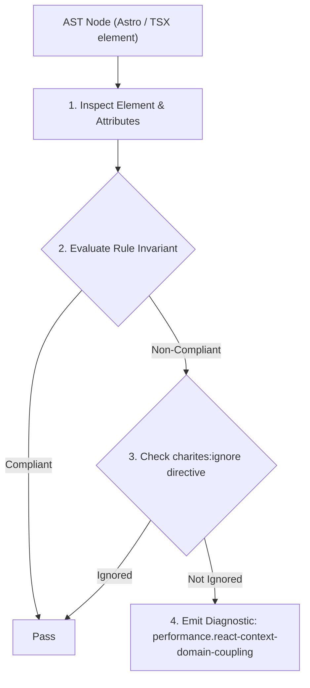
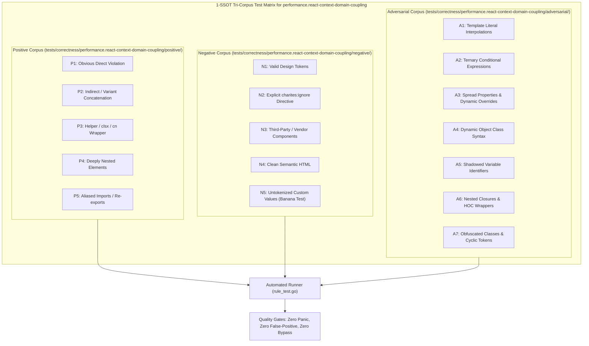

# performance.react-context-domain-coupling

> **Rule ID:** `performance.react-context-domain-coupling`
> **Severity:** `WARN`
> **Category:** `performance`
> **Target Standards:** React Official Architecture (Context Modularity & State Granularity Principles), React Virtual DOM Reconciliation Invariants (Consumer tree re-render pruning), Web Performance Working Group Main-Thread Optimization Guidelines

---

## 1. Overview & Core Invariant

Context.Provider bundles over-coupled multi-domain state (> 5 fields), triggering cascading re-renders across all consumers on any property change

### Core Invariant:
> **"React Context Providers must maintain fine-grained domain boundaries; bundling disparate application states into a monolithic 'God Context' forces all consumer components to re-render whenever any unrelated field updates."**

---
## 2. Technical Grounding & Engine Realities

React Context propagates state updates to all consumers without granular field-level selector filtering. When an application bundles multiple disparate domains (e.g. user authentication, shopping cart, UI modal state, notification badge count, and scroll position) into a single Provider, any update to a high-frequency field (such as a badge increment) triggers a re-render across every component subscribed to the context.

This monolithic coupling bypasses component memoization and saturates the main thread with unnecessary render passes.

Splitting state into focused, domain-specific contexts (e.g. `AuthContext`, `CartContext`, `UIContext`) ensures components only re-render when their specific domain data actually mutates.

---
## 3. Vulnerability & Risk Taxonomy

| Risk Vector | Severity | Impact |
| :--- | :---: | :--- |
| **Cascading Re-render Blast Radius** | HIGH | A change in a single property (e.g. notification count) forces dozens of unrelated UI components to re-render simultaneously. |
| **Severe Main-Thread Jitter** | MEDIUM | High-frequency state mutations throttle the main thread, resulting in dropped frames and delayed user interaction responses. |

---
## 4. Non-Compliant Code Patterns (Bad Examples)
### TSX (Monolithic God Context bundling 7 distinct domain properties in a single provider):
```tsx
<AppContext.Provider value={{
  user,
  cart,
  theme,
  notifications,
  activeModal,
  isSidebarOpen,
  locale,
}}>
  {children}
</AppContext.Provider>
```

---
## 5. Compliant Implementation Patterns (Good Examples)
### TSX (State decoupled into domain-specific, modular context providers):
```tsx
<AuthProvider value={authValue}>
  <CartProvider value={cartValue}>
    <UIProvider value={uiValue}>
      {children}
    </UIProvider>
  </CartProvider>
</AuthProvider>
```

---

## 6. Detection & Verification Pipeline (How The Rule Evaluates Code)
This rule evaluates source code through the standard AST inspection pipeline:



### Step-by-Step Evaluation:
1. **AST Traversal:** Visits normalized `ir.Node` structures during AST streaming.
2. **Invariant Check:** Compares node attributes against rule invariants.
3. **Directive Suppression Check:** Honors inline `charites:ignore performance.react-context-domain-coupling` directives.
4. **Diagnostic Emission:** Emits compiler-grade diagnostic on invariant violation.

---

## 7. Verification & Test Harness (How The Test Works: 1-SSOT Tri-Corpus)

This rule is rigorously tested and validated across the canonical **1-SSOT Tri-Corpus** in `tests/correctness/performance.react-context-domain-coupling/`:



- **Positive Fixtures (P1-P5):** Verified to trigger diagnostics at exact lines and column spans.
- **Negative Fixtures (N1-N5):** Verified to produce zero diagnostics on valid tokens and legitimate exemptions.
- **Adversarial Fixtures (A1-A7):** Verified to prevent evasion across dynamic expressions, string interpolations, and cyclic references.

---

## 8. How to Suppress (Ignore Directives)

If this pattern is required for an intentional exception, suppress the diagnostic using the canonical Charites Rule ID:

```astro
<!-- charites:ignore performance.react-context-domain-coupling intentional exception -->
```

```tsx
// charites:ignore performance.react-context-domain-coupling intentional exception
```

---

## 9. Configuration Reference (`charites.yaml`)

```yaml
rules:
  performance.react-context-domain-coupling:
    severity: warn # error | warn | info | off
```

