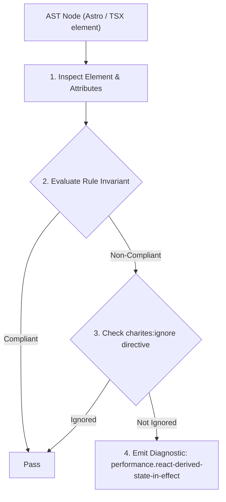
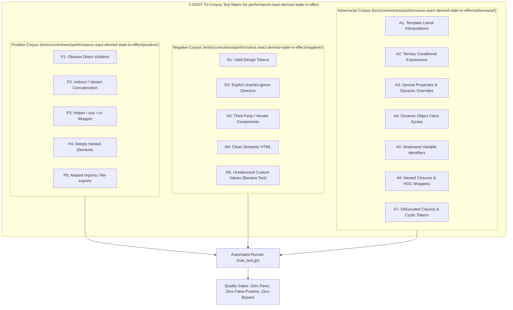

# performance.react-derived-state-in-effect

> **Rule ID:** `performance.react-derived-state-in-effect`
> **Severity:** `WARN`
> **Category:** `performance`
> **Target Standards:** React Official Documentation ('You Might Not Need an Effect'), React Reconciliation Lifecycle (Avoiding Cascading Secondary Renders), React Best Practices on Pure Render-Phase Computations

---

## 1. Overview & Core Invariant

Mencegah sinkronisasi derived state dari props atau state yang sudah ada melalui useEffect, yang memicu siklus perenderan sekunder ganda.

### Core Invariant:
> **"Derived values computed synchronously from props or existing state must be calculated directly in the component body during render; updating state inside 'useEffect' triggers redundant secondary render passes."**

---
## 2. Technical Grounding & Engine Realities

Updating state within a `useEffect` callback causes React to first render the component with the stale value, commit it to the DOM, and immediately schedule a second render pass to apply the updated state.

When derived state is calculated synchronously (e.g. concatenating names, filtering a list, or calculating a total), calculating it in an effect needlessly burns main thread time on layout calculations and DOM diffing twice per interaction.

Computing the value directly during the render pass completely eliminates the secondary render pass and keeps state management minimal.

---
## 3. Vulnerability & Risk Taxonomy

| Risk Vector | Severity | Impact |
| :--- | :---: | :--- |
| **Cascading Secondary Render Cycles** | HIGH | Forces React to run duplicate render and diff cycles on every prop change, directly degrading interaction responsiveness (INP). |
| **Visual Stutter / Layout Shift** | MEDIUM | May momentarily display stale computed values before the effect updates, causing brief content flicker or layout shifts. |

---
## 4. Non-Compliant Code Patterns (Bad Examples)
### TSX (Sinkronisasi derived state via useEffect memicu render ganda):
```tsx
const [fullName, setFullName] = useState('');
useEffect(() => {
  setFullName(firstName + ' ' + lastName);
}, [firstName, lastName]);
```

---
## 5. Compliant Implementation Patterns (Good Examples)
### TSX (Dihitung secara sinkron dalam satu kali fase render):
```tsx
const fullName = firstName + ' ' + lastName;
```

---

## 6. Detection & Verification Pipeline (How The Rule Evaluates Code)
This rule evaluates source code through the standard AST inspection pipeline:



### Step-by-Step Evaluation:
1. **AST Traversal:** Visits normalized `ir.Node` structures during AST streaming.
2. **Invariant Check:** Compares node attributes against rule invariants.
3. **Directive Suppression Check:** Honors inline `charites:ignore performance.react-derived-state-in-effect` directives.
4. **Diagnostic Emission:** Emits compiler-grade diagnostic on invariant violation.

---

## 7. Verification & Test Harness (How The Test Works: 1-SSOT Tri-Corpus)

This rule is rigorously tested and validated across the canonical **1-SSOT Tri-Corpus** in `tests/correctness/performance.react-derived-state-in-effect/`:



- **Positive Fixtures (P1-P5):** Verified to trigger diagnostics at exact lines and column spans.
- **Negative Fixtures (N1-N5):** Verified to produce zero diagnostics on valid tokens and legitimate exemptions.
- **Adversarial Fixtures (A1-A7):** Verified to prevent evasion across dynamic expressions, string interpolations, and cyclic references.

---

## 8. How to Suppress (Ignore Directives)

If this pattern is required for an intentional exception, suppress the diagnostic using the canonical Charites Rule ID:

```astro
<!-- charites:ignore performance.react-derived-state-in-effect intentional exception -->
```

```tsx
// charites:ignore performance.react-derived-state-in-effect intentional exception
```

---

## 9. Configuration Reference (`charites.yaml`)

```yaml
rules:
  performance.react-derived-state-in-effect:
    severity: warn # error | warn | info | off
```

