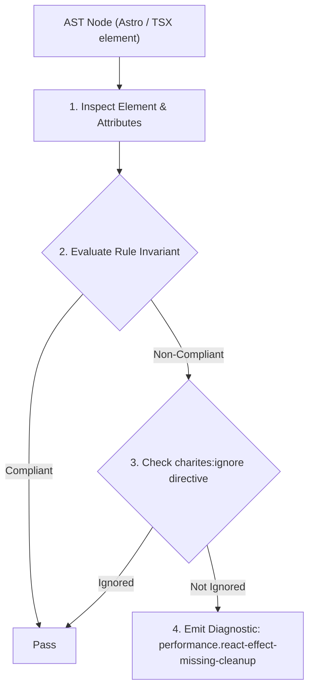
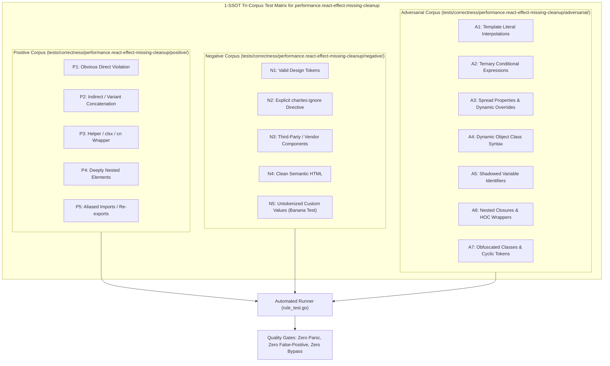

# performance.react-effect-missing-cleanup

> **Rule ID:** `performance.react-effect-missing-cleanup`
> **Severity:** `ERROR`
> **Category:** `performance`
> **Target Standards:** React Official Documentation (Synchronizing with Effects & Effect Cleanup Invariants), W3C EventTarget and Observer Lifecycle Specifications, Google Chrome Memory Profiling Guidelines (Retained DOM Detached Node Prevention)

---

## 1. Overview & Core Invariant

Effect hook acquiring persistent resource (listener, interval, observer) lacks a symmetrical cleanup return function, causing memory leaks

### Core Invariant:
> **"React effect hooks ('useEffect', 'useLayoutEffect') that acquire persistent resources (event listeners, intervals, observers, WebSockets) must return a symmetrical cleanup function to release references upon unmount or dependency changes."**

---
## 2. Technical Grounding & Engine Realities

When an effect registers an external subscription (such as `window.addEventListener`, `setInterval`, or an `IntersectionObserver`) without returning a cleanup function, that subscription remains active in the browser memory even after the component is unmounted.

The orphaned subscription retains references to component state, props, and closures, preventing the JavaScript garbage collector from reclaiming the component tree's memory.

Furthermore, triggered callbacks continue attempting to execute against unmounted components, causing unhandled errors, stale state updates, and compounding memory leaks during client-side navigation.

---
## 3. Vulnerability & Risk Taxonomy

| Risk Vector | Severity | Impact |
| :--- | :---: | :--- |
| **Persistent Memory Leaks** | CRITICAL | Orphaned event listeners and observers retain unmounted component closures, leading to runaway heap memory growth in single-page applications. |
| **Zombie Handler Execution** | HIGH | Callbacks trigger state updates on unmounted components, causing React warnings and erratic background behavior. |

---
## 4. Non-Compliant Code Patterns (Bad Examples)
### TSX (Window event listener registered in useEffect without cleanup return function):
```tsx
useEffect(() => {
  const onResize = () => setWidth(window.innerWidth);
  window.addEventListener('resize', onResize);
}, []);
```

---
## 5. Compliant Implementation Patterns (Good Examples)
### TSX (Symmetrical cleanup function returned to remove listener on unmount):
```tsx
useEffect(() => {
  const onResize = () => setWidth(window.innerWidth);
  window.addEventListener('resize', onResize);
  return () => window.removeEventListener('resize', onResize);
}, []);
```

---

## 6. Detection & Verification Pipeline (How The Rule Evaluates Code)
This rule evaluates source code through the standard AST inspection pipeline:



### Step-by-Step Evaluation:
1. **AST Traversal:** Visits normalized `ir.Node` structures during AST streaming.
2. **Invariant Check:** Compares node attributes against rule invariants.
3. **Directive Suppression Check:** Honors inline `charites:ignore performance.react-effect-missing-cleanup` directives.
4. **Diagnostic Emission:** Emits compiler-grade diagnostic on invariant violation.

---

## 7. Verification & Test Harness (How The Test Works: 1-SSOT Tri-Corpus)

This rule is rigorously tested and validated across the canonical **1-SSOT Tri-Corpus** in `tests/correctness/performance.react-effect-missing-cleanup/`:



- **Positive Fixtures (P1-P5):** Verified to trigger diagnostics at exact lines and column spans.
- **Negative Fixtures (N1-N5):** Verified to produce zero diagnostics on valid tokens and legitimate exemptions.
- **Adversarial Fixtures (A1-A7):** Verified to prevent evasion across dynamic expressions, string interpolations, and cyclic references.

---

## 8. How to Suppress (Ignore Directives)

If this pattern is required for an intentional exception, suppress the diagnostic using the canonical Charites Rule ID:

```astro
<!-- charites:ignore performance.react-effect-missing-cleanup intentional exception -->
```

```tsx
// charites:ignore performance.react-effect-missing-cleanup intentional exception
```

---

## 9. Configuration Reference (`charites.yaml`)

```yaml
rules:
  performance.react-effect-missing-cleanup:
    severity: error # error | warn | info | off
```

