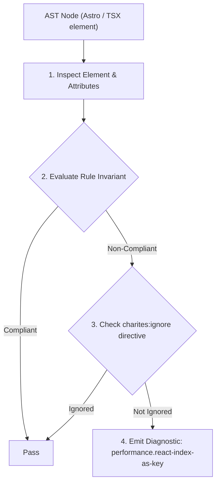
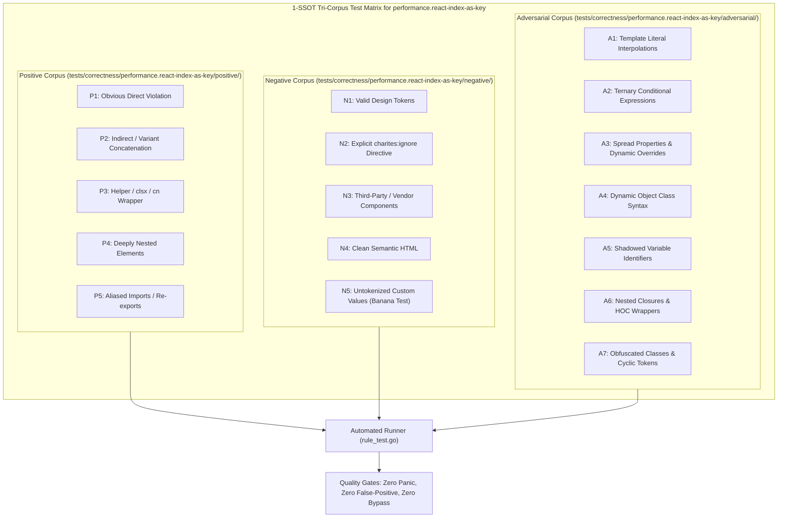

# performance.react-index-as-key

> **Rule ID:** `performance.react-index-as-key`
> **Severity:** `WARN`
> **Category:** `performance`
> **Target Standards:** React Official Documentation (Lists and Keys Invariants), React Reconciliation Algorithm Specification (Diffing with stable keys), Robin Pokorny Guidelines ('Index as a key is an anti-pattern')

---

## 1. Overview & Core Invariant

Using array index as 'key' in dynamic collection mapping breaks VDOM reconciliation when items reorder or mutate

### Core Invariant:
> **"Dynamic collections mapped with '.map()' must use stable, unique item identifiers (e.g. 'item.id') as the 'key' attribute rather than numeric array indexes."**

---
## 2. Technical Grounding & Engine Realities

React relies on the `key` attribute to identify which items in a list have changed, been added, or been removed during reconciliation.

When an array index is used (`key={index}`), rearranging, filtering, prepending, or deleting items shifts the indexes of subsequent elements.

This index drift causes React to confuse element identities, erroneously preserving local uncontrolled state (such as form inputs, focus, and CSS transitions) on the wrong items and forcing redundant re-renders of the entire subtree.

---
## 3. Vulnerability & Risk Taxonomy

| Risk Vector | Severity | Impact |
| :--- | :---: | :--- |
| **Component State Desynchronization** | HIGH | Internal component state (e.g. input values, selection states) remains bound to the array position rather than the underlying data entity. |
| **Unnecessary Subtree DOM Repaints** | MEDIUM | React fails to recognize moved nodes and completely remounts DOM subtrees instead of performing lightweight repositioning. |

---
## 4. Non-Compliant Code Patterns (Bad Examples)
### TSX (Dynamic transactions list using array index as key):
```tsx
{transactions.map((tx, index) => (
  <TransactionRow key={index} data={tx} />
))}
```

---
## 5. Compliant Implementation Patterns (Good Examples)
### TSX (Persistent unique entity identifier used as reconciliation key):
```tsx
{transactions.map((tx) => (
  <TransactionRow key={tx.id} data={tx} />
))}
```

---

## 6. Detection & Verification Pipeline (How The Rule Evaluates Code)
This rule evaluates source code through the standard AST inspection pipeline:



### Step-by-Step Evaluation:
1. **AST Traversal:** Visits normalized `ir.Node` structures during AST streaming.
2. **Invariant Check:** Compares node attributes against rule invariants.
3. **Directive Suppression Check:** Honors inline `charites:ignore performance.react-index-as-key` directives.
4. **Diagnostic Emission:** Emits compiler-grade diagnostic on invariant violation.

---

## 7. Verification & Test Harness (How The Test Works: 1-SSOT Tri-Corpus)

This rule is rigorously tested and validated across the canonical **1-SSOT Tri-Corpus** in `tests/correctness/performance.react-index-as-key/`:



- **Positive Fixtures (P1-P5):** Verified to trigger diagnostics at exact lines and column spans.
- **Negative Fixtures (N1-N5):** Verified to produce zero diagnostics on valid tokens and legitimate exemptions.
- **Adversarial Fixtures (A1-A7):** Verified to prevent evasion across dynamic expressions, string interpolations, and cyclic references.

---

## 8. How to Suppress (Ignore Directives)

If this pattern is required for an intentional exception, suppress the diagnostic using the canonical Charites Rule ID:

```astro
<!-- charites:ignore performance.react-index-as-key intentional exception -->
```

```tsx
// charites:ignore performance.react-index-as-key intentional exception
```

---

## 9. Configuration Reference (`charites.yaml`)

```yaml
rules:
  performance.react-index-as-key:
    severity: warn # error | warn | info | off
```

