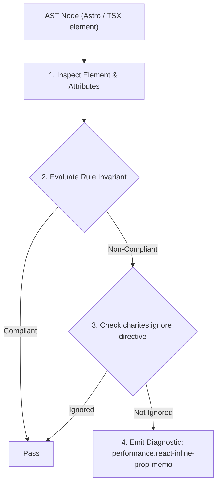
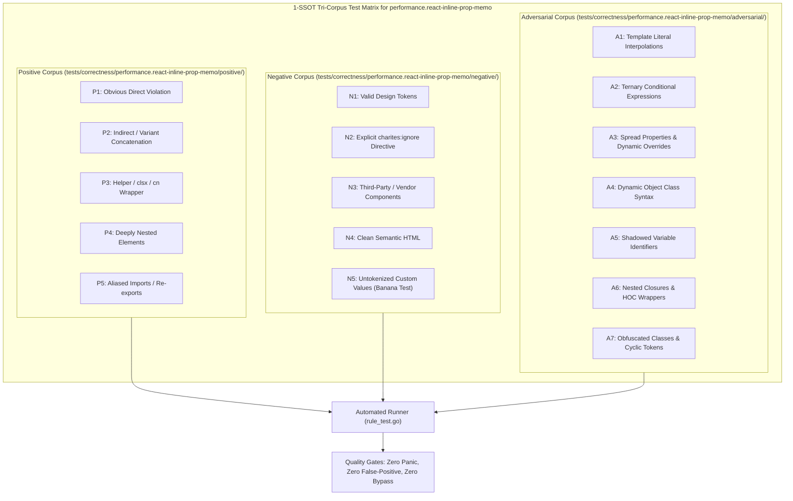

# performance.react-inline-prop-memo

> **Rule ID:** `performance.react-inline-prop-memo`
> **Severity:** `WARN`
> **Category:** `performance`
> **Target Standards:** React Official Architecture (Reconciliation Identity & Referential Equality Invariants), React Memoization Contract ('React.memo' shallow prop comparison specification), Web Performance Working Group VDOM Re-render Minimization Guidelines

---

## 1. Overview & Core Invariant

Passing inline object, array, or function literal to memoized component bypasses shallow memoization on every parent render

### Core Invariant:
> **"Memoized React components must receive referentially stable props; inline object literals, array literals, and arrow functions allocate new heap memory on each parent render pass, completely nullifying 'React.memo'."**

---
## 2. Technical Grounding & Engine Realities

When a component is wrapped in `React.memo()`, React evaluates whether to skip rendering by performing shallow equality checks (`prevProps[key] === nextProps[key]`) across all incoming props.

Passing an inline object literal (`prop={{ ... }}`), inline array (`prop={[ ... ]}`), or arrow function (`prop={() => ...}`) directly at the JSX call-site instantiates a brand-new memory reference on every parent render.

Because `===` on different object references always evaluates to `false`, React is forced to re-render the memoized component every time, incurring the performance penalty of shallow comparison without receiving any of its caching benefits.

---
## 3. Vulnerability & Risk Taxonomy

| Risk Vector | Severity | Impact |
| :--- | :---: | :--- |
| **Bypassed Component Memoization** | HIGH | Forces expensive memoized component trees to re-render unnecessarily on every parent state mutation. |
| **Garbage Collection Churn** | MEDIUM | Allocates short-lived transient objects and closures in heap memory during rapid interaction loops. |

---
## 4. Non-Compliant Code Patterns (Bad Examples)
### TSX (Memoized UserCard receives inline object and arrow function props):
```tsx
const UserCard = React.memo(({ user, config, onSelect }: UserCardProps) => {
  return <div>{user.name}</div>;
});

function Parent({ currentUser }: { currentUser: User }) {
  return (
    <UserCard
      user={currentUser}
      config={{ theme: 'dark', compact: true }}
      onSelect={() => console.log('selected')}
    />
  );
}
```

---
## 5. Compliant Implementation Patterns (Good Examples)
### TSX (Props stabilized via external constants or useCallback/useMemo hooks):
```tsx
const USER_CONFIG = { theme: 'dark', compact: true } as const;

function Parent({ currentUser }: { currentUser: User }) {
  const handleSelect = useCallback(() => {
    console.log('selected');
  }, []);

  return (
    <UserCard
      user={currentUser}
      config={USER_CONFIG}
      onSelect={handleSelect}
    />
  );
}
```

---

## 6. Detection & Verification Pipeline (How The Rule Evaluates Code)
This rule evaluates source code through the standard AST inspection pipeline:



### Step-by-Step Evaluation:
1. **AST Traversal:** Visits normalized `ir.Node` structures during AST streaming.
2. **Invariant Check:** Compares node attributes against rule invariants.
3. **Directive Suppression Check:** Honors inline `charites:ignore performance.react-inline-prop-memo` directives.
4. **Diagnostic Emission:** Emits compiler-grade diagnostic on invariant violation.

---

## 7. Verification & Test Harness (How The Test Works: 1-SSOT Tri-Corpus)

This rule is rigorously tested and validated across the canonical **1-SSOT Tri-Corpus** in `tests/correctness/performance.react-inline-prop-memo/`:



- **Positive Fixtures (P1-P5):** Verified to trigger diagnostics at exact lines and column spans.
- **Negative Fixtures (N1-N5):** Verified to produce zero diagnostics on valid tokens and legitimate exemptions.
- **Adversarial Fixtures (A1-A7):** Verified to prevent evasion across dynamic expressions, string interpolations, and cyclic references.

---

## 8. How to Suppress (Ignore Directives)

If this pattern is required for an intentional exception, suppress the diagnostic using the canonical Charites Rule ID:

```astro
<!-- charites:ignore performance.react-inline-prop-memo intentional exception -->
```

```tsx
// charites:ignore performance.react-inline-prop-memo intentional exception
```

---

## 9. Configuration Reference (`charites.yaml`)

```yaml
rules:
  performance.react-inline-prop-memo:
    severity: warn # error | warn | info | off
```

