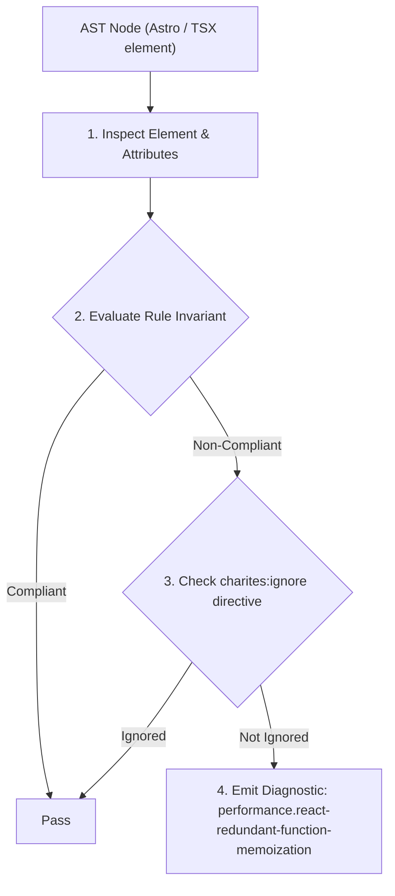
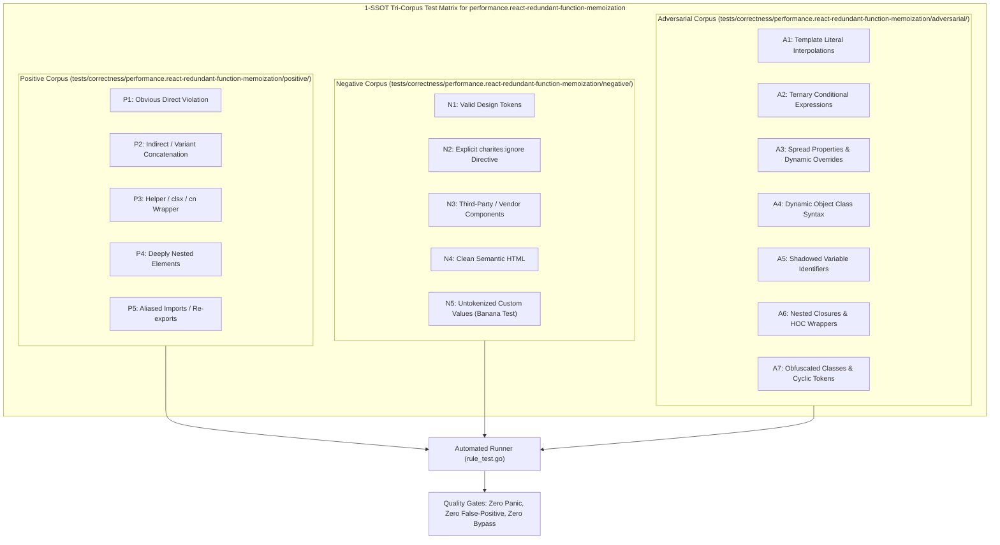

# performance.react-redundant-function-memoization

> **Rule ID:** `performance.react-redundant-function-memoization`
> **Severity:** `INFO`
> **Category:** `performance`
> **Target Standards:** React Official Documentation (When to use useCallback & Hook Overhead), React Compiler Architecture Specification (Automated Memoization Economy), Dan Abramov Architecture Notes ('A Complete Guide to useEffect & useCallback')

---

## 1. Overview & Core Invariant

Mengaudit penggunaan useCallback pada callback yang hanya dikonsumsi oleh elemen native HTML tanpa konsumen peka identitas referensial.

### Core Invariant:
> **"Functions passed exclusively to native HTML elements (<button>, <input>) must not be wrapped in 'useCallback'; native DOM elements do not perform shallow equality checks, making hook allocation a net negative overhead."**

---
## 2. Technical Grounding & Engine Realities

A common misconception among React developers is that wrapping every function in `useCallback` improves performance.

In reality, `useCallback` requires allocating an internal Hook cell, preserving a dependency array in memory, and executing array comparisons on every render cycle.

Native HTML elements (`<button onClick={...}>`) do not inspect prop referential equality; they simply attach or update event listeners. Unless a callback is passed to a `React.memo` component or included in another hook's dependency list, `useCallback` introduces pure overhead with zero performance benefit.

---
## 3. Vulnerability & Risk Taxonomy

| Risk Vector | Severity | Impact |
| :--- | :---: | :--- |
| **Hook Memory & GC Overhead** | LOW | Increases memory footprint and garbage collector pressure by retaining closures and dependency arrays across component lifecycles. |
| **Codebase Complexity & Clutter** | LOW | Obscures real optimization sites and complicates eventual migration to automatic compiler memoization (React Compiler). |

---
## 4. Non-Compliant Code Patterns (Bad Examples)
### TSX (Membungkus handler tombol native dengan useCallback adalah pemborosan hook):
```tsx
const handleClick = useCallback(() => {
  setOpen(true);
}, []);

return <button onClick={handleClick}>Buka Modal</button>;
```

---
## 5. Compliant Implementation Patterns (Good Examples)
### TSX (Gunakan deklarasi fungsi reguler untuk elemen DOM biasa):
```tsx
const handleClick = () => {
  setOpen(true);
};

return <button onClick={handleClick}>Buka Modal</button>;
```

---

## 6. Detection & Verification Pipeline (How The Rule Evaluates Code)
This rule evaluates source code through the standard AST inspection pipeline:



### Step-by-Step Evaluation:
1. **AST Traversal:** Visits normalized `ir.Node` structures during AST streaming.
2. **Invariant Check:** Compares node attributes against rule invariants.
3. **Directive Suppression Check:** Honors inline `charites:ignore performance.react-redundant-function-memoization` directives.
4. **Diagnostic Emission:** Emits compiler-grade diagnostic on invariant violation.

---

## 7. Verification & Test Harness (How The Test Works: 1-SSOT Tri-Corpus)

This rule is rigorously tested and validated across the canonical **1-SSOT Tri-Corpus** in `tests/correctness/performance.react-redundant-function-memoization/`:



- **Positive Fixtures (P1-P5):** Verified to trigger diagnostics at exact lines and column spans.
- **Negative Fixtures (N1-N5):** Verified to produce zero diagnostics on valid tokens and legitimate exemptions.
- **Adversarial Fixtures (A1-A7):** Verified to prevent evasion across dynamic expressions, string interpolations, and cyclic references.

---

## 8. How to Suppress (Ignore Directives)

If this pattern is required for an intentional exception, suppress the diagnostic using the canonical Charites Rule ID:

```astro
<!-- charites:ignore performance.react-redundant-function-memoization intentional exception -->
```

```tsx
// charites:ignore performance.react-redundant-function-memoization intentional exception
```

---

## 9. Configuration Reference (`charites.yaml`)

```yaml
rules:
  performance.react-redundant-function-memoization:
    severity: info # error | warn | info | off
```

