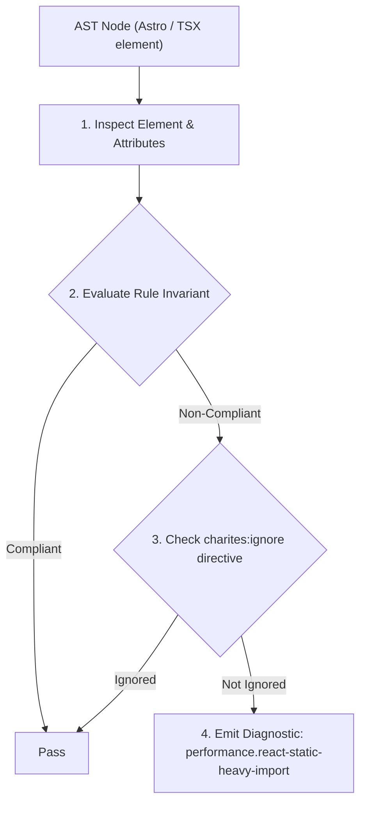
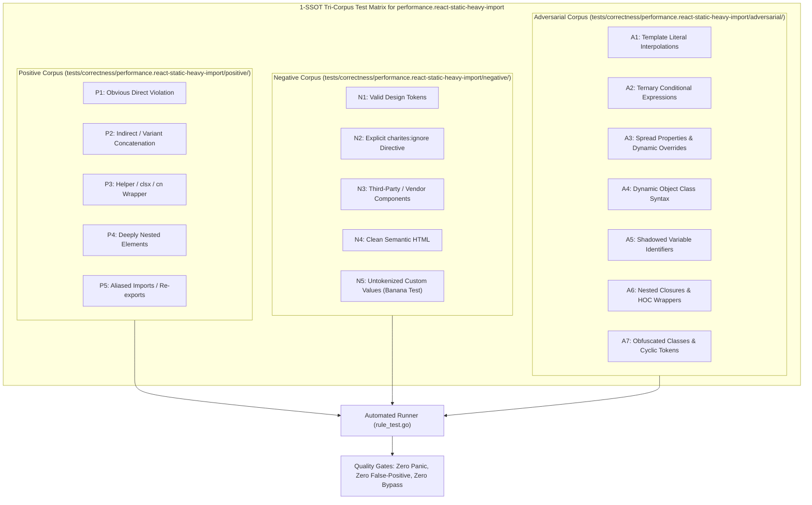

# performance.react-static-heavy-import

> **Rule ID:** `performance.react-static-heavy-import`
> **Severity:** `WARN`
> **Category:** `performance`
> **Target Standards:** W3C Web Performance & Initial Route Code Splitting Best Practices, React Official Documentation (Code-Splitting with React.lazy and Suspense), Chrome DevTools Lighthouse JavaScript Bundle Size Optimization Guidelines

---

## 1. Overview & Core Invariant

Mengaudit pernyataan impor statis modul berukuran besar di tingkat atas yang membengkakkan bundel JavaScript awal dan mewajibkan pemisahan kode via React.lazy() dan <Suspense>.

### Core Invariant:
> **"Heavy visualization, editing, and utility libraries must be asynchronously loaded via 'React.lazy()' and wrapped in '<Suspense>'; top-level static imports bloat critical initial bundles and degrade FCP/TBT."**

---
## 2. Technical Grounding & Engine Realities

Top-level static import statements (`import { Chart } from 'chart.js'`) force modern JavaScript bundlers (Webpack, Vite, Rollup, esbuild) to include the imported module directly in the entry-point chunk.

Heavy third-party libraries such as `monaco-editor`, `chart.js`, `echarts`, `quill`, `pdfjs-dist`, `three`, or `xlsx` often weigh several hundreds of kilobytes compressed.

Because these libraries are typically secondary to initial above-the-fold content, loading them synchronously forces mobile devices to spend hundreds of milliseconds downloading, parsing, and compiling JavaScript before the user can interact with the page.

---
## 3. Vulnerability & Risk Taxonomy

| Risk Vector | Severity | Impact |
| :--- | :---: | :--- |
| **Initial Bundle Size Bloat** | HIGH | Drastically increases First Contentful Paint (FCP) and Total Blocking Time (TBT) due to massive synchronous script downloads. |
| **Mobile CPU Decompression Bottlenecks** | MEDIUM | Consumes limited mobile device CPU and memory parsing large scripts that are not immediately rendered on initial screen view. |

---
## 4. Non-Compliant Code Patterns (Bad Examples)
### TSX (Mengimpor modul grafik berat secara statis di tingkat atas):
```tsx
import { Chart } from 'chart.js';

export function Dashboard() {
  return <Chart data={stats} />;
}
```

---
## 5. Compliant Implementation Patterns (Good Examples)
### TSX (Memisahkan modul grafik menggunakan React.lazy() dan Suspense):
```tsx
import { Suspense, lazy } from 'react';
const Chart = lazy(() => import('chart.js'));

export function Dashboard() {
  return (
    <Suspense fallback={<ChartSkeleton />}>
      <Chart data={stats} />
    </Suspense>
  );
}
```

---

## 6. Detection & Verification Pipeline (How The Rule Evaluates Code)
This rule evaluates source code through the standard AST inspection pipeline:



### Step-by-Step Evaluation:
1. **AST Traversal:** Visits normalized `ir.Node` structures during AST streaming.
2. **Invariant Check:** Compares node attributes against rule invariants.
3. **Directive Suppression Check:** Honors inline `charites:ignore performance.react-static-heavy-import` directives.
4. **Diagnostic Emission:** Emits compiler-grade diagnostic on invariant violation.

---

## 7. Verification & Test Harness (How The Test Works: 1-SSOT Tri-Corpus)

This rule is rigorously tested and validated across the canonical **1-SSOT Tri-Corpus** in `tests/correctness/performance.react-static-heavy-import/`:



- **Positive Fixtures (P1-P5):** Verified to trigger diagnostics at exact lines and column spans.
- **Negative Fixtures (N1-N5):** Verified to produce zero diagnostics on valid tokens and legitimate exemptions.
- **Adversarial Fixtures (A1-A7):** Verified to prevent evasion across dynamic expressions, string interpolations, and cyclic references.

---

## 8. How to Suppress (Ignore Directives)

If this pattern is required for an intentional exception, suppress the diagnostic using the canonical Charites Rule ID:

```astro
<!-- charites:ignore performance.react-static-heavy-import intentional exception -->
```

```tsx
// charites:ignore performance.react-static-heavy-import intentional exception
```

---

## 9. Configuration Reference (`charites.yaml`)

```yaml
rules:
  performance.react-static-heavy-import:
    severity: warn # error | warn | info | off
```

