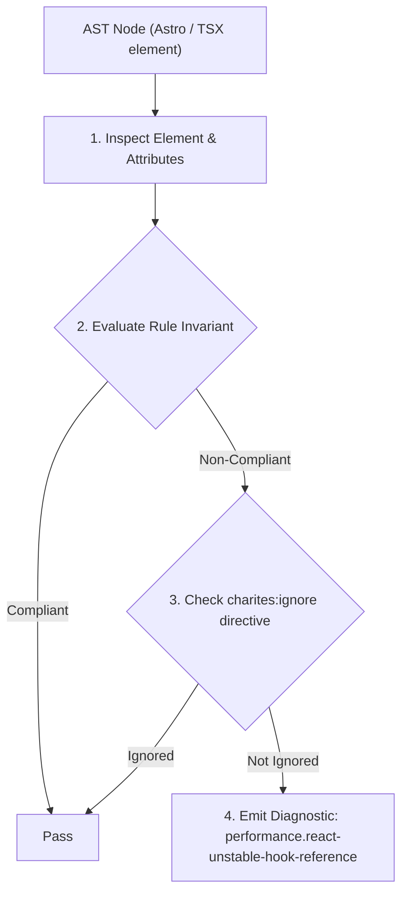
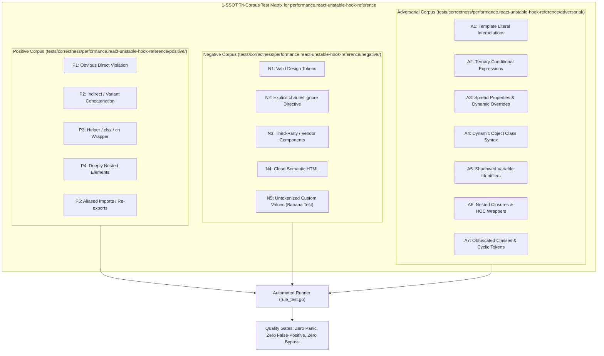

# performance.react-unstable-hook-reference

> **Rule ID:** `performance.react-unstable-hook-reference`
> **Severity:** `WARN`
> **Category:** `performance`
> **Target Standards:** React Official Documentation (Building Your Own Custom Hooks), React Hooks Referential Integrity & Stable Function Contracts, React Hooks Exhaustive Dependencies Safety Guidelines

---

## 1. Overview & Core Invariant

Mengaudit custom hook yang mengembalikan referensi fungsi tidak stabil tanpa dibungkus useCallback, yang memicu re-render loop pada komponen konsumen.

### Core Invariant:
> **"Custom React hooks exposing helper functions must stabilize them with 'useCallback'; returning fresh function instances causes downstream consumers using them in effect dependencies to trigger infinite render loops."**

---
## 2. Technical Grounding & Engine Realities

Custom hooks frequently return an object containing state and mutation functions (e.g. `{ data, refetch, reset }`).

If these functions are defined as regular arrow functions without `useCallback`, a brand-new function reference is created in memory on every render pass of the consuming component.

When the consuming component passes this function into the dependency array of `useEffect` or `useMemo`, or passes it down to a memoized child component, the newly allocated reference violates referential equality, defeating memoization and in many cases causing uncontrollable infinite re-render loops.

---
## 3. Vulnerability & Risk Taxonomy

| Risk Vector | Severity | Impact |
| :--- | :---: | :--- |
| **Downstream Infinite Render Loops** | HIGH | Triggers continuous re-execution of downstream useEffect hooks that list the unmemoized helper function in their dependency arrays. |
| **Bypassed Child Memoization** | MEDIUM | Breaks shallow prop comparison (React.memo) across all child components consuming functions returned from the custom hook. |

---
## 4. Non-Compliant Code Patterns (Bad Examples)
### TSX (refetch dialokasikan sebagai fungsi baru di setiap pemanggilan hook):
```tsx
export function useProfile(userId: string) {
  const [data, setData] = useState(null);
  const refetch = () => { fetchProfile(userId).then(setData); };
  return { data, refetch };
}
```

---
## 5. Compliant Implementation Patterns (Good Examples)
### TSX (Menstabilkan referensi fungsi dengan useCallback):
```tsx
export function useProfile(userId: string) {
  const [data, setData] = useState(null);
  const refetch = useCallback(() => {
    fetchProfile(userId).then(setData);
  }, [userId]);
  return { data, refetch };
}
```

---

## 6. Detection & Verification Pipeline (How The Rule Evaluates Code)
This rule evaluates source code through the standard AST inspection pipeline:



### Step-by-Step Evaluation:
1. **AST Traversal:** Visits normalized `ir.Node` structures during AST streaming.
2. **Invariant Check:** Compares node attributes against rule invariants.
3. **Directive Suppression Check:** Honors inline `charites:ignore performance.react-unstable-hook-reference` directives.
4. **Diagnostic Emission:** Emits compiler-grade diagnostic on invariant violation.

---

## 7. Verification & Test Harness (How The Test Works: 1-SSOT Tri-Corpus)

This rule is rigorously tested and validated across the canonical **1-SSOT Tri-Corpus** in `tests/correctness/performance.react-unstable-hook-reference/`:



- **Positive Fixtures (P1-P5):** Verified to trigger diagnostics at exact lines and column spans.
- **Negative Fixtures (N1-N5):** Verified to produce zero diagnostics on valid tokens and legitimate exemptions.
- **Adversarial Fixtures (A1-A7):** Verified to prevent evasion across dynamic expressions, string interpolations, and cyclic references.

---

## 8. How to Suppress (Ignore Directives)

If this pattern is required for an intentional exception, suppress the diagnostic using the canonical Charites Rule ID:

```astro
<!-- charites:ignore performance.react-unstable-hook-reference intentional exception -->
```

```tsx
// charites:ignore performance.react-unstable-hook-reference intentional exception
```

---

## 9. Configuration Reference (`charites.yaml`)

```yaml
rules:
  performance.react-unstable-hook-reference:
    severity: warn # error | warn | info | off
```

