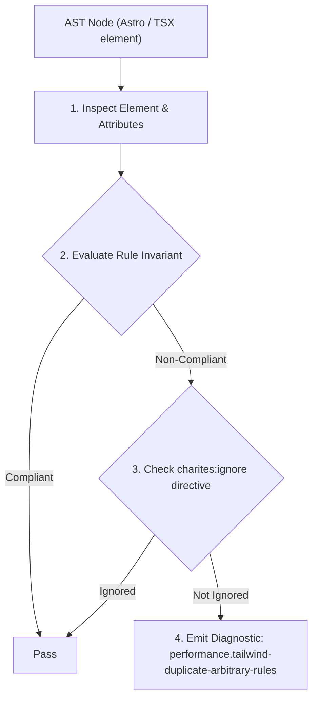
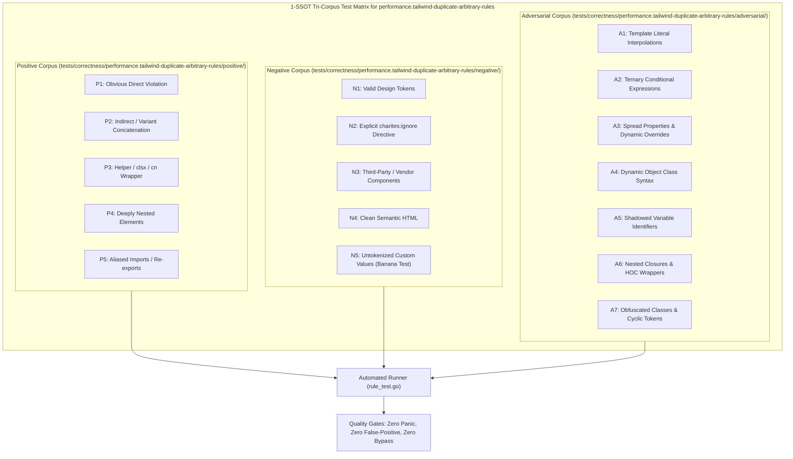

# performance.tailwind-duplicate-arbitrary-rules

> **Rule ID:** `performance.tailwind-duplicate-arbitrary-rules`
> **Severity:** `WARN`
> **Category:** `performance`
> **Target Standards:** Tailwind CSS v4 Design Tokens & Spacing Scale Standards, Compiled CSS Output Deduplication & Payload Economy, W3C Stylesheet Declarative Optimization Guidelines

---

## 1. Overview & Core Invariant

Menganjurkan penggunaan utilitas skala inti bawaan Tailwind v4 alih-alih nilai arbitrary sembarang yang menghasilkan deklarasi CSS duplikat.

### Core Invariant:
> **"Arbitrary value utilities (e.g. 'p-[16px]', 'mt-[1rem]') that match standard Tailwind core scale tokens should use the canonical core utility (e.g. 'p-4', 'mt-4') to avoid duplicate CSS rule generation in compiled bundles."**

---
## 2. Technical Grounding & Engine Realities

Tailwind CSS includes a refined, consistent default spacing and sizing scale.

When developers write ad-hoc arbitrary values like `p-[16px]` alongside `p-4` (which also resolves to `padding: 1rem / 16px`), Tailwind generates separate unique CSS selector rules for both.

Consolidating arbitrary values to their core scale equivalents eliminates redundant rule definitions, shrinks the production CSS footprint, and ensures consistent visual rhythm across the application.

---
## 3. Vulnerability & Risk Taxonomy

| Risk Vector | Severity | Impact |
| :--- | :---: | :--- |
| **Compiled CSS Bloat** | MEDIUM | Inflates stylesheet size with duplicate CSS selector blocks that declare identical CSS properties and values. |
| **Visual Rhythm Inconsistency** | LOW | Ad-hoc arbitrary values drift away from the design system's cohesive 4px/8px modular grid. |

---
## 4. Non-Compliant Code Patterns (Bad Examples)
### TSX (Menggunakan nilai arbitrary yang menduplikasi utilitas core p-4 dan mt-4):
```tsx
<div className="p-[16px] mt-[1rem]">Konten</div>
```

---
## 5. Compliant Implementation Patterns (Good Examples)
### TSX (Menggunakan utilitas skala core standar):
```tsx
<div className="p-4 mt-4">Konten</div>
```

---

## 6. Detection & Verification Pipeline (How The Rule Evaluates Code)
This rule evaluates source code through the standard AST inspection pipeline:



### Step-by-Step Evaluation:
1. **AST Traversal:** Visits normalized `ir.Node` structures during AST streaming.
2. **Invariant Check:** Compares node attributes against rule invariants.
3. **Directive Suppression Check:** Honors inline `charites:ignore performance.tailwind-duplicate-arbitrary-rules` directives.
4. **Diagnostic Emission:** Emits compiler-grade diagnostic on invariant violation.

---

## 7. Verification & Test Harness (How The Test Works: 1-SSOT Tri-Corpus)

This rule is rigorously tested and validated across the canonical **1-SSOT Tri-Corpus** in `tests/correctness/performance.tailwind-duplicate-arbitrary-rules/`:



- **Positive Fixtures (P1-P5):** Verified to trigger diagnostics at exact lines and column spans.
- **Negative Fixtures (N1-N5):** Verified to produce zero diagnostics on valid tokens and legitimate exemptions.
- **Adversarial Fixtures (A1-A7):** Verified to prevent evasion across dynamic expressions, string interpolations, and cyclic references.

---

## 8. How to Suppress (Ignore Directives)

If this pattern is required for an intentional exception, suppress the diagnostic using the canonical Charites Rule ID:

```astro
<!-- charites:ignore performance.tailwind-duplicate-arbitrary-rules intentional exception -->
```

```tsx
// charites:ignore performance.tailwind-duplicate-arbitrary-rules intentional exception
```

---

## 9. Configuration Reference (`charites.yaml`)

```yaml
rules:
  performance.tailwind-duplicate-arbitrary-rules:
    severity: warn # error | warn | info | off
```

