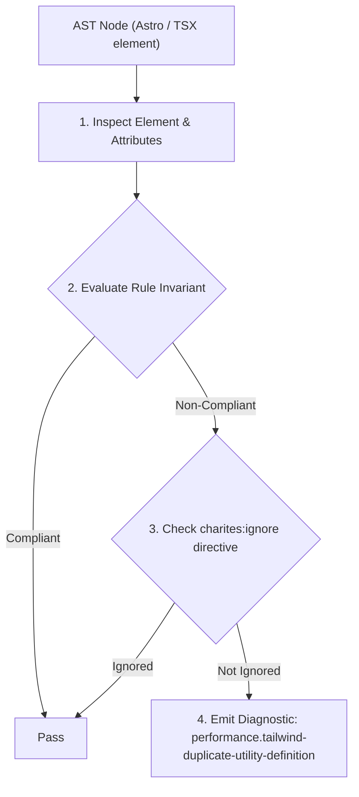
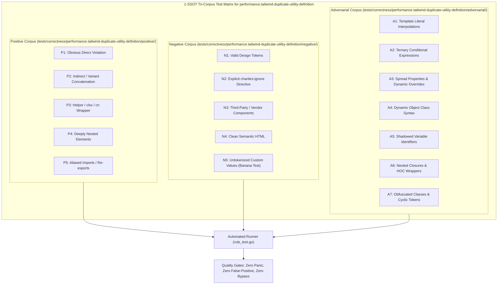

# performance.tailwind-duplicate-utility-definition

> **Rule ID:** `performance.tailwind-duplicate-utility-definition`
> **Severity:** `WARN`
> **Category:** `performance`
> **Target Standards:** Tailwind CSS v4 '@utility' Directive Specification, Compiled CSS Output Deduplication & Bundle Hygiene, Atomic CSS Design Invariants

---

## 1. Overview & Core Invariant

Mencegah duplikasi deklarasi utilitas CSS kustom (@utility) yang properti dan nilainya sudah disediakan oleh utilitas core bawaan Tailwind CSS v4.

### Core Invariant:
> **"Custom '@utility' declarations must not duplicate built-in Tailwind CSS core utilities; redundant definitions generate unnecessary stylesheet bytes and break atomic CSS composability."**

---
## 2. Technical Grounding & Engine Realities

The `@utility` directive in Tailwind CSS v4 is designed to register brand-new utilities for modern or proprietary CSS features not yet included in core Tailwind.

Defining custom `@utility` blocks for combinations already covered by core utilities (such as `@utility center-flex { display: flex; align-items: center; }`) produces duplicate CSS rules in the compiled stylesheet.

Composing canonical core utilities (`flex items-center`) directly in markup preserves atomic stylesheet economy and avoids redundant selector bloat.

---
## 3. Vulnerability & Risk Taxonomy

| Risk Vector | Severity | Impact |
| :--- | :---: | :--- |
| **Compiled Stylesheet Bloat** | MEDIUM | Adds unnecessary custom CSS rules to the production build that duplicate pre-existing atomic utilities. |
| **Bypassed Utility Composability** | LOW | Custom wrapper utilities fracture atomic consistency and make component classes harder to refactor. |

---
## 4. Non-Compliant Code Patterns (Bad Examples)
### CSS (Mendefinisikan @utility yang menduplikasi utilitas core flexbox):
```css
@utility center-flex {
  display: flex;
  align-items: center;
}
```

---
## 5. Compliant Implementation Patterns (Good Examples)
### TSX (Menggunakan kombinasi utilitas core native langsung di markup):
```tsx
<div className="flex items-center">Konten</div>
```

---

## 6. Detection & Verification Pipeline (How The Rule Evaluates Code)
This rule evaluates source code through the standard AST inspection pipeline:



### Step-by-Step Evaluation:
1. **AST Traversal:** Visits normalized `ir.Node` structures during AST streaming.
2. **Invariant Check:** Compares node attributes against rule invariants.
3. **Directive Suppression Check:** Honors inline `charites:ignore performance.tailwind-duplicate-utility-definition` directives.
4. **Diagnostic Emission:** Emits compiler-grade diagnostic on invariant violation.

---

## 7. Verification & Test Harness (How The Test Works: 1-SSOT Tri-Corpus)

This rule is rigorously tested and validated across the canonical **1-SSOT Tri-Corpus** in `tests/correctness/performance.tailwind-duplicate-utility-definition/`:



- **Positive Fixtures (P1-P5):** Verified to trigger diagnostics at exact lines and column spans.
- **Negative Fixtures (N1-N5):** Verified to produce zero diagnostics on valid tokens and legitimate exemptions.
- **Adversarial Fixtures (A1-A7):** Verified to prevent evasion across dynamic expressions, string interpolations, and cyclic references.

---

## 8. How to Suppress (Ignore Directives)

If this pattern is required for an intentional exception, suppress the diagnostic using the canonical Charites Rule ID:

```astro
<!-- charites:ignore performance.tailwind-duplicate-utility-definition intentional exception -->
```

```tsx
// charites:ignore performance.tailwind-duplicate-utility-definition intentional exception
```

---

## 9. Configuration Reference (`charites.yaml`)

```yaml
rules:
  performance.tailwind-duplicate-utility-definition:
    severity: warn # error | warn | info | off
```

