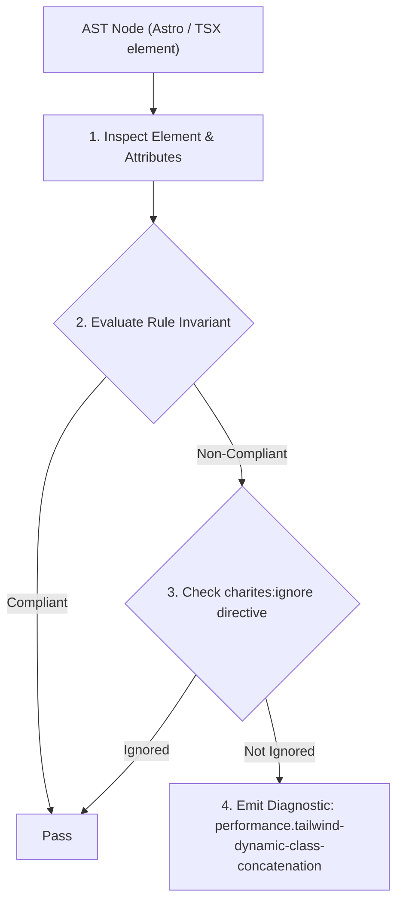
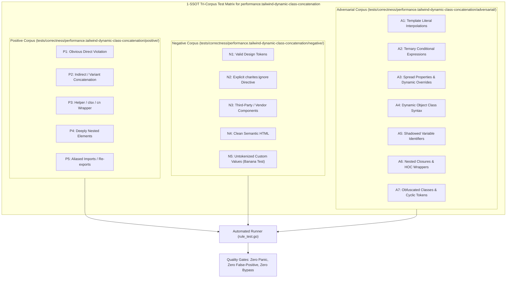

# performance.tailwind-dynamic-class-concatenation

> **Rule ID:** `performance.tailwind-dynamic-class-concatenation`
> **Severity:** `ERROR`
> **Category:** `performance`
> **Target Standards:** Tailwind CSS v4 Compiler Scanner Specification (Oxide Static Extraction), Tailwind CSS Official Architecture ('Dynamic Class Names Limitations'), Zero-Runtime CSS Extraction Invariants

---

## 1. Overview & Core Invariant

Mencegah penggabungan string nama kelas dinamis parsial yang merusak deteksi compiler scanner Tailwind CSS v4 (Oxide engine).

### Core Invariant:
> **"Tailwind CSS utility classes must be written as complete, static string literals; dynamic string interpolation on partial class prefixes prevents the static scanner from detecting classes, resulting in missing styles in production."**

---
## 2. Technical Grounding & Engine Realities

Tailwind CSS v4 uses a high-performance static scanner (Oxide engine) that scans source code for complete class tokens without executing JavaScript runtime.

Constructing utility names dynamically via template literals or string concatenation (e.g. `bg-${color}-100` or `'text-' + size`) breaks static extraction completely.

Because the scanner never evaluates runtime variables, it never sees the complete utility string (like `bg-red-100`), causing the required CSS rules to be omitted from the compiled stylesheet.

---
## 3. Vulnerability & Risk Taxonomy

| Risk Vector | Severity | Impact |
| :--- | :---: | :--- |
| **Missing Production Stylesheet Rules** | HIGH | Utility classes generated through string concatenation are completely missing from the production CSS bundle, causing broken UI visuals. |
| **Silent Runtime Failures** | HIGH | Classes appear functional in local environments if the class was previously cached or generated elsewhere, but fail silently upon clean production builds. |

---
## 4. Non-Compliant Code Patterns (Bad Examples)
### TSX (Penggabungan string parsial tidak dapat diekstrak oleh compiler):
```tsx
function Badge({ color }: { color: 'red' | 'blue' }) {
  return <span className={`bg-${color}-100 text-${color}-800`}>Status</span>;
}
```

---
## 5. Compliant Implementation Patterns (Good Examples)
### TSX (Menuliskan nama kelas secara utuh dalam kamus statis):
```tsx
const COLOR_MAP = {
  red: 'bg-red-100 text-red-800',
  blue: 'bg-blue-100 text-blue-800',
} as const;

function Badge({ color }: { color: 'red' | 'blue' }) {
  return <span className={COLOR_MAP[color]}>Status</span>;
}
```

---

## 6. Detection & Verification Pipeline (How The Rule Evaluates Code)
This rule evaluates source code through the standard AST inspection pipeline:



### Step-by-Step Evaluation:
1. **AST Traversal:** Visits normalized `ir.Node` structures during AST streaming.
2. **Invariant Check:** Compares node attributes against rule invariants.
3. **Directive Suppression Check:** Honors inline `charites:ignore performance.tailwind-dynamic-class-concatenation` directives.
4. **Diagnostic Emission:** Emits compiler-grade diagnostic on invariant violation.

---

## 7. Verification & Test Harness (How The Test Works: 1-SSOT Tri-Corpus)

This rule is rigorously tested and validated across the canonical **1-SSOT Tri-Corpus** in `tests/correctness/performance.tailwind-dynamic-class-concatenation/`:



- **Positive Fixtures (P1-P5):** Verified to trigger diagnostics at exact lines and column spans.
- **Negative Fixtures (N1-N5):** Verified to produce zero diagnostics on valid tokens and legitimate exemptions.
- **Adversarial Fixtures (A1-A7):** Verified to prevent evasion across dynamic expressions, string interpolations, and cyclic references.

---

## 8. How to Suppress (Ignore Directives)

If this pattern is required for an intentional exception, suppress the diagnostic using the canonical Charites Rule ID:

```astro
<!-- charites:ignore performance.tailwind-dynamic-class-concatenation intentional exception -->
```

```tsx
// charites:ignore performance.tailwind-dynamic-class-concatenation intentional exception
```

---

## 9. Configuration Reference (`charites.yaml`)

```yaml
rules:
  performance.tailwind-dynamic-class-concatenation:
    severity: error # error | warn | info | off
```

