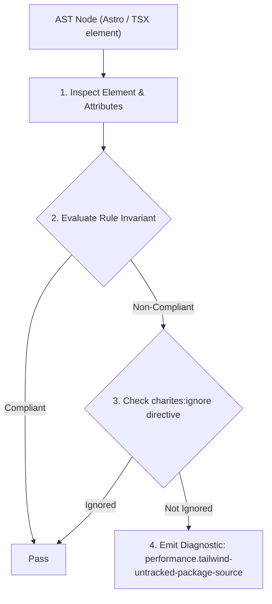
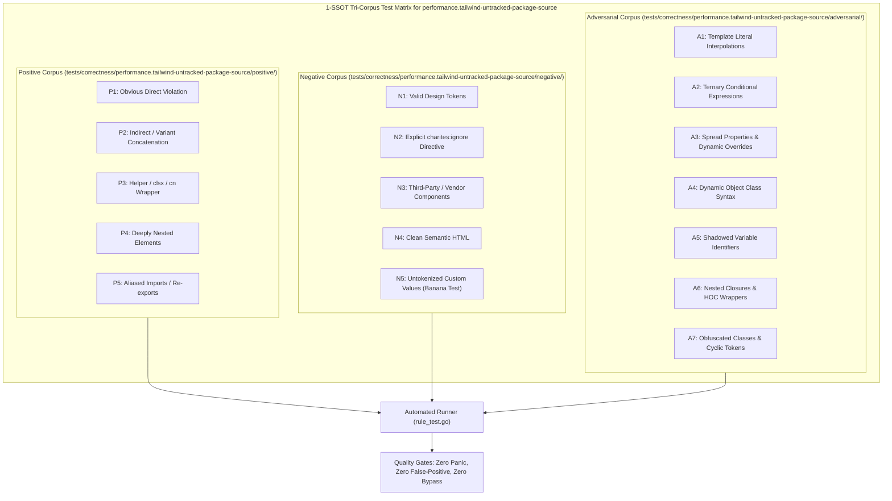

# performance.tailwind-untracked-package-source

> **Rule ID:** `performance.tailwind-untracked-package-source`
> **Severity:** `ERROR`
> **Category:** `performance`
> **Target Standards:** Tailwind CSS v4 Configuration Architecture (@source Directive Specification), Monorepo Multi-Package Style Discovery Standards, Oxide Engine Workspace Scanning Invariants

---

## 1. Overview & Core Invariant

Mewajibkan pendaftaran direktif @source pada berkas CSS root Tailwind v4 ketika mengimpor paket workspace monorepo eksternal.

### Core Invariant:
> **"Tailwind CSS v4 root stylesheets importing external monorepo packages must declare '@source' path directives; without '@source', the Oxide scanner skips external package directories, silently dropping all utility styles from compiled builds."**

---
## 2. Technical Grounding & Engine Realities

In Tailwind CSS v4, the legacy `tailwind.config.js` `content` array is replaced by CSS-first `@source` directives in the main stylesheet.

By default, Tailwind v4 only scans files in the immediate project directory. If the project imports components from external workspace packages (e.g. `@repo/ui` or `../../packages/...`), those package directories are ignored by default.

Failing to add `@source "../../packages/ui";` causes all Tailwind utility classes used inside those shared packages to be completely absent from the final CSS bundle.

---
## 3. Vulnerability & Risk Taxonomy

| Risk Vector | Severity | Impact |
| :--- | :---: | :--- |
| **Missing Monorepo Component Styles** | HIGH | Shared monorepo UI components render completely unstyled in production because utility classes inside them were never scanned. |
| **Silent Build Failures** | HIGH | No build errors are thrown; stylesheets simply compile without the required utility declarations. |

---
## 4. Non-Compliant Code Patterns (Bad Examples)
### CSS (Berkas CSS root tidak menyertakan direktif @source untuk paket monorepo):
```css
/* Pelanggaran: Mengimpor tailwindcss tanpa @source untuk monorepo packages */
@import "tailwindcss";
```

---
## 5. Compliant Implementation Patterns (Good Examples)
### CSS (Mendaftarkan path paket eksternal via @source):
```css
/* Patuh: Menyertakan direktif @source untuk paket monorepo */
@import "tailwindcss";
@source "../../packages/ui";
```

---

## 6. Detection & Verification Pipeline (How The Rule Evaluates Code)
This rule evaluates source code through the standard AST inspection pipeline:



### Step-by-Step Evaluation:
1. **AST Traversal:** Visits normalized `ir.Node` structures during AST streaming.
2. **Invariant Check:** Compares node attributes against rule invariants.
3. **Directive Suppression Check:** Honors inline `charites:ignore performance.tailwind-untracked-package-source` directives.
4. **Diagnostic Emission:** Emits compiler-grade diagnostic on invariant violation.

---

## 7. Verification & Test Harness (How The Test Works: 1-SSOT Tri-Corpus)

This rule is rigorously tested and validated across the canonical **1-SSOT Tri-Corpus** in `tests/correctness/performance.tailwind-untracked-package-source/`:



- **Positive Fixtures (P1-P5):** Verified to trigger diagnostics at exact lines and column spans.
- **Negative Fixtures (N1-N5):** Verified to produce zero diagnostics on valid tokens and legitimate exemptions.
- **Adversarial Fixtures (A1-A7):** Verified to prevent evasion across dynamic expressions, string interpolations, and cyclic references.

---

## 8. How to Suppress (Ignore Directives)

If this pattern is required for an intentional exception, suppress the diagnostic using the canonical Charites Rule ID:

```astro
<!-- charites:ignore performance.tailwind-untracked-package-source intentional exception -->
```

```tsx
// charites:ignore performance.tailwind-untracked-package-source intentional exception
```

---

## 9. Configuration Reference (`charites.yaml`)

```yaml
rules:
  performance.tailwind-untracked-package-source:
    severity: error # error | warn | info | off
```

